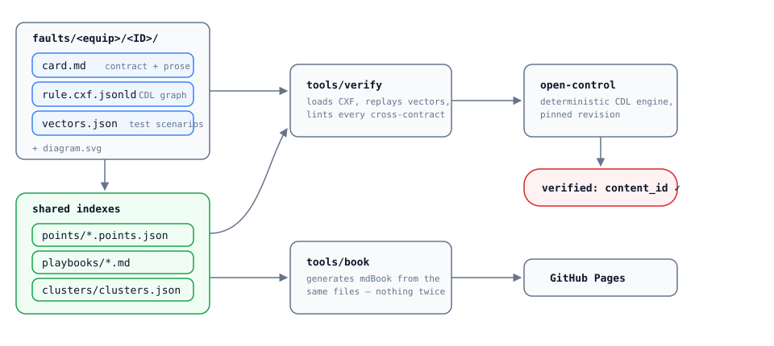
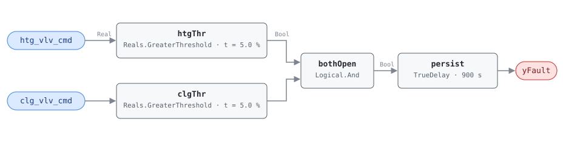

# open-control-library

**An engine-verified library of HVAC fault detection rules, written as CDL
block graphs and shipped as CXF JSON-LD the
[open-control engine](https://github.com/jscott3201/open-control-engine) loads
directly.**

> **Status: early access.** Shared for review ahead of a broader release;
> content and contracts may still change.



## What this is

Most fault detection and diagnostics (FDD) libraries are papers, spreadsheets,
or vendor black boxes. This one is executable and auditable end to end. Every
fault rule is four files that travel together:

| File | Audience | What it carries |
|---|---|---|
| `card.md` | humans **and** machines | YAML frontmatter (points, params, severity, suppression, preconditions) + grounded prose: detection logic, diagnoses, energy/emissions impact, and an honest **Deviations** section for every place the rule departs from its source |
| `rule.cxf.jsonld` | the engine | the detection logic as a CDL composite block — elementary comparison/logic/timing blocks, no code |
| `vectors.json` | the verifier | executable scenarios that pin every threshold boundary, delay edge, and evaluability gate from both sides |
| `diagram.svg` | humans | the block graph, drawn |

A rule is only marked **verified** when the engine at a pinned revision replays
every vector green and the schema lint passes every cross-contract check; the
engine's exported `content_id` is recorded in the card so the verified bytes
are identifiable forever.

Here is a real one — AHU-FC-050, simultaneous heating and cooling:



## What's inside

- **69 verified fault rules** across ten equipment families: air handlers
  (`faults/ahu/`, all 31 reference faults), rooftop units (6), hot water
  plants (8 — the reference's 3 plus 5 library-authored loop rules grounded
  in PNNL-27338), VAV terminal boxes (6), fan coil units (5), chilled water
  plants (4), heat pumps (3), energy recovery ventilators (2), VFDs (2), and
  hydronic pumps (2) — every fully specified fault in the reference, plus
  the library's first grounded extensions beyond it.
- **Point dictionaries** (`points/`) grounding every canonical point name in
  Brick 1.4.4 and ASHRAE 223P, so binding a rule to a real building is
  mechanical.
- **Remediation playbooks** (`playbooks/`) — verify → remote fix → on-site
  service → confirm resolution, with typical costs and times.
- **Fault clusters** (`clusters/`) — syndromes that share a root cause, with a
  trigger rule and a fix order.
- **A conformance harness** (`tools/verify`) and **CI** that re-verifies every
  rule against the pinned engine on every push.
- **A generated book** (`tools/book` + mdBook) publishing all of the above —
  nothing is authored twice.

## Design stance

The graph computes *fault-given-valid-data*, and only that. Data quality
(NO_EVAL), operating-state gating, suppression, and energy accumulation are
host concerns, declared in card frontmatter for the host to enforce — never
encoded in the block graph. The engine stays deliberately status-blind, rules
stay portable, and every judgment call is written down where a reviewer can
disagree with it.

Grounding: ASHRAE Guideline 36 §5.16.14 (via its public-review addendum text),
the HVAC FDD Reference v1.0 (a PNNL/LBNL research consolidation), NISTIR 7365
defaults, and the APAR rule lineage (Schein et al. 2006) — cited per card, with
transcription gaps and adopted defaults called out explicitly.

## Quick start

```sh
# read the contracts
$EDITOR SCHEMA.md

# run one rule's vectors against the engine (sibling checkout of open-control required)
cargo run --manifest-path tools/verify/Cargo.toml -- faults/ahu/AHU-FC-050

# run everything
cargo run --manifest-path tools/verify/Cargo.toml -- --all

# build the book locally
python3 tools/book/generate.py && mdbook serve book --open
```

## Layout

- **`SCHEMA.md`** — the normative layout and file contracts. Read this first.
- **`faults/<equip>/<FAULT-ID>/`** — one folder per rule.
- **`points/`** — canonical point dictionaries (Brick + 223P tags).
- **`playbooks/`**, **`clusters/`** — remediation workflows and fault syndromes.
- **`tools/verify`** — engine-backed conformance runner.
- **`tools/book`**, **`book/`** — documentation generator and mdBook config.
- **`_research/`** — source digests (CDL/CXF specs, FDD reference, repo landscape).

## License

Licensed under either of

- Apache License, Version 2.0 ([LICENSE-APACHE](LICENSE-APACHE))
- MIT license ([LICENSE-MIT](LICENSE-MIT))

at your option. Unless you explicitly state otherwise, any contribution
intentionally submitted for inclusion in the work by you, as defined in the
Apache-2.0 license, shall be dual licensed as above, without any additional
terms or conditions.
