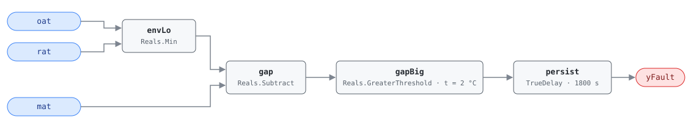

## Description

Mixed air is a blend of outdoor and return air, so it cannot be colder than
both streams. When MAT reads more than combined sensor accuracy below the
colder of OAT and RAT, the reading is impossible and something is wrong with
the measurement or the mixing plenum: a sensor out of calibration, or outdoor
air leaking past the mixing box straight onto the MAT sensor.

This is G36 §5.16.14 FC#2, the low half of the mixed-air envelope check.
AHU-0003 is its mirror on the high side; both sit in cluster CLU-09 (Sensor
Integrity Failure), whose trigger AHU-0028 tests the envelope in both
directions at once. Roughly 15% of buildings have at least one AHU with a
temperature sensor this far out.

## Detection Logic

```
yFault = mat < min(oat, rat) − mat_tolerance,
         sustained continuously for alarm_delay
```

Block graph (`rule.cxf.jsonld`):



`Min` rather than a fixed OAT-below-RAT assumption, because which stream is
colder flips with the season. The threshold comparison is strict, so a MAT
sitting exactly 2.0 °C below the bound is healthy and 2.1 °C below is not.
`persist` requires 30 minutes of continuous violation — a MAT that dips out and
recovers during a damper stroke never alarms, and any interruption restarts the
timer — while recovery is immediate on the tick MAT climbs back inside the
bound. Nothing above the envelope can trip this rule: a MAT 4 °C above both
sources violates the same physics and reads healthy here, because that case is
AHU-0003's.

## Possible Diagnoses

1. MAT sensor out of calibration, reading low
2. OAT sensor out of calibration, reading high
3. RAT sensor out of calibration, reading high
4. Cold air leakage into the mixing plenum — outdoor air short-circuiting to
   the sensor rather than mixing

## Energy Impact

COMFORT_ENERGY, LOW confidence, QUALITATIVE_ONLY. A mis-read temperature costs
nothing directly; the cost is downstream. A MAT biased low reads as excess cold
in the mixture, so the mixed-air loop closes outdoor air below what the mixture
needs — giving up free cooling in mild weather — and can call for preheat that
nothing requires. PNNL-25985 EEM-01 (sensor recalibration) puts the recoverable
range at 0–5% of site energy across a whole sensor population, sensor-dependent
and climate-neutral. Prevalence ~15% of buildings have sensor faults.

## Emissions Impact

QUALITATIVE_EMISSIONS, LOW confidence; no direct emissions. Scope is `1|2`
because it depends on which subsystem the bad reading distorts: unnecessary
preheat lands in Scope 1 (on-site combustion), a disabled economizer calling
for mechanical cooling lands in Scope 2 (purchased electricity). The same
drifted sensor can do both in different seasons, so no single scope is correct
year-round. Avoided-emissions basis: N/A.

## Deviations

- **Single combined tolerance instead of G36's per-sensor error bands.** G36's
  precise form is `MAT_AVG + eps_MAT < min[(RAT_AVG − eps_RAT), (OAT_AVG −
  eps_OAT)]`; the HVAC FDD Reference collapses that to one `eps_MAT` applied
  once and this card inherits the simplification. One combined band needs a
  larger true error before it fires — fewer false positives, less sensitivity
  to drift in any individual sensor. The G36 form would need three parameters
  and an offset block on each sensor path ahead of the `Min`.
- **Instantaneous samples instead of averaged signals.** G36 compares
  time-averaged temperatures; this rule compares raw samples and leans on the
  30-minute `persist` delay to reject noise. The two are not equivalent —
  averaging tolerates a signal that crosses the bound repeatedly while its mean
  stays outside, whereas persistence resets on every tick inside the envelope
  and can hide an oscillating MAT indefinitely. Steady drift, the fault this
  rule is for, reads the same either way.
- **Bound comparison rewritten as gap comparison.** `min − mat > tol ⟺
  mat < min − tol`, algebraically identical, but it keeps `mat_tolerance` a
  single positive `set_param` value instead of a negative offset in the graph.
  Same rewrite as AHU-0028.
- **Strict inequality at the threshold.** `GreaterThreshold` is `u > t`, so a
  sensor sitting precisely at its rated accuracy stays off the alarm list; CDL
  `Reals` offers no greater-or-equal comparison, so this is also the only
  available spelling.
- **Suppression is declared, not encoded.** AHU-0028 tests the same envelope
  with a shorter delay and suppresses this rule while active. The block graph
  cannot express that — the engine is status-blind and each rule is an
  independent composite — so it lives in `suppressed_by` and CLU-09 for the
  host to enforce.
- **Operating states and preconditions are frontmatter, not graph.** Freeze
  protection and the minutes after an economizer mode change are periods when
  MAT legitimately disagrees with the steady-state mixture; all of it is
  host-enforced, per the library's stance.
- `persist.delayOnInit = true` (Modelica/CDL default is `false`): a violation
  already present at load waits out the full 30 minutes rather than alarming on
  the first tick after a controller restart.
- Severity 3 (warning) comes from the reference's chapter 9 card, its only
  severity statement for this fault — the §5.8.1 index carries no severity
  column.

## Notes

The rule finds a contradiction between three sensors; it cannot say which one is
lying. Direction narrows the list — a low MAT means MAT reads low or one of its
bounds reads high — which is why the diagnoses mirror AHU-0003's rather than
copy them. Step 1 of the
[sensor-drift](../../../playbooks/sensor-drift.md) playbook resolves the
ambiguity one sensor at a time; fix is on-site recalibration or replacement
($30–$80), and if all three check out, look at the mixing box for a leakage path
onto the sensor. AHU-0028 runs a 15-minute delay against this pair's 30, so
the operator sees the integrity alarm first and this rule confirms which side of
the envelope the reading fell on.
