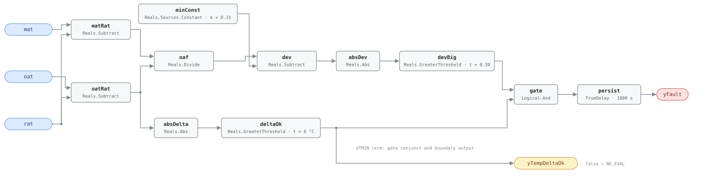

## Description

The unit should be sitting at its minimum outdoor-air setpoint, and the
mixing-box energy balance says it is not. Too much outdoor air costs money:
every extra cubic metre is heated or cooled to supply temperature for no
ventilation benefit. Too little has no energy signature at all — the building
is under-ventilated, an indoor-air-quality finding rather than a waste one. G36
tests both directions with one absolute value, so this rule alarms on either.

This is G36 §5.16.14 FC#6, evaluated in the two operating states where the
damper is supposed to be at minimum — OS#1 (heating) and OS#4 (mechanical
cooling on minimum outdoor air). In OS#2 and OS#3 the damper is opening
deliberately and the same three temperatures would read as a fault, so the host
gate matters more here than the equation does. The fraction is inferred from
three temperatures rather than measured, which is what makes the diagnostic
cheap and what makes it conditional: when outdoor and return air are close, the
quotient's denominator collapses and sensor error becomes an arbitrary answer.

## Detection Logic

```
oaf          = (mat − rat) / (oat − rat)                      (G36 %OA)
yTempDeltaOk = |rat − oat| > delta_min                        (false ⇒ host reports NO_EVAL)
yFault       = (|oaf − min_oa_fraction| > oa_fraction_tolerance) AND yTempDeltaOk,
               sustained for alarm_delay
```

Block graph (`rule.cxf.jsonld`):



`minConst` holds `%OAmin` in a `Reals.Sources.Constant` rather than folded into
the threshold, so `min_oa_fraction` and `oa_fraction_tolerance` stay
independent single-value `set_param` paths — which matters here because the
setpoint is the parameter a host is expected to move at runtime.

The dTMIN branch goes to two places: into `gate` as G36's second conjunct, and
out of the block as `yTempDeltaOk`. A host that ignores the output still gets
the right verdict; a host that reads it learns the difference between "not
faulted" and "cannot tell". That arrangement is also what makes the division
safe. CDL `Divide` follows IEEE-754, so `oat = rat` yields ±∞ or NaN rather
than an error, and a near-zero denominator inflates sensor noise into a
fraction of any magnitude. NaN compares false everywhere and can never raise
`devBig`; ±∞ and a noise-inflated finite fraction both can, and `gate` stops
them, because a denominator small enough to misbehave is by construction below
`delta_min`. Garbage arithmetic cannot assert a fault — only report the rule
unevaluable.

Both comparisons are strict. The fraction is signed consistently across the
year (winter, both differences negative; summer, both positive), so no seasonal
branch is needed. `persist` requires 30 continuous minutes and any interruption
restarts the timer; recovery is immediate on the tick the deviation falls back
inside tolerance.

## Possible Diagnoses

Transcribed from G36 §5.16.14 FC#6:

1. RAT sensor error
2. MAT sensor error
3. OAT sensor error
4. Leaking or stuck economizer damper or actuator

Three of the four are sensor errors, and the reason is arithmetic: a 1 °C bias
in MAT moves the apparent outdoor air by 5 percentage points across a 20 °C
outdoor-to-return spread, and by 17 points on a spread sitting at dTMIN. A
sensor within its rated accuracy can account for most of a deviation this rule
reports.

## Energy Impact

EXCESS_CONSUMPTION, MEDIUM confidence, DIRECT_MEASUREMENT, savings 2–10% of the
subsystem — the §5.8.1 index row, the only energy statement the reference makes
here. The high branch is directly computable from live data, with the excess
fraction already on the wire as `dev.y`:

```
excess_oa_kw = (oaf − min_oa_fraction) × supply_airflow_m3s × 1.2 × 1.005 × |oat − rat|
```

Payback lands in the upper half of the range in heating-dominant climates,
where every extra cubic metre costs most. The index maps the fault to
PNNL-25985 EEM-06 (OA damper faults) and EEM-17 (demand control ventilation).
MEDIUM rather than AHU-0021's HIGH on the same quotient, because a low-side
alarm has no energy term at all — under-ventilating saves energy while failing
the occupants, so a host must check the sign of `dev.y` before banking anything
— and because three of the four diagnoses are sensor errors, which waste
nothing.

## Emissions Impact

Scope 1 + 2, PROXY_EMISSIONS, MEDIUM confidence. On the high branch the split
follows the season, as for AHU-0021: excess outdoor air burns Scope 1 fuel at
the heating coil in winter, draws Scope 2 electricity at the chiller in summer,
and collapses to Scope 2 on an all-electric unit. The low branch has nothing to
attribute. PROXY where the index says DIRECT because the fraction is measured
but the mass flow it must be multiplied by is not — this rule is worth
deploying precisely on units with three temperature sensors and no airflow
station. Avoided-emissions basis: marginal operating emissions rate (MOER) for
the electric half, static combustion factor for the fuel half.

## Deviations

- **The reference card is abbreviated; G36 is the normative text.** The HVAC
  FDD Reference carries AHU-0006 only as a §5.8.1 index row — a name and an
  energy profile. Detection logic, internal-variable defaults, and the
  diagnosis list are transcribed from ASHRAE Guideline 36 §5.16.14 FC#6 as it
  appears in Addendum u to Guideline 36-2018 (First Public Review, 2021).
- **`%OAmin` is a static parameter, not the active setpoint.** G36 defines it
  as the *active* minimum-OA setpoint divided by *actual* total airflow, which
  a VAV system recomputes continuously; binding it as a constant (as AHU-0021
  does) keeps this a three-temperature diagnostic instead of one needing a flow
  station or zone-flow rollup. Hosts should retune `min_oa_fraction` through
  `set_param` as the reset moves it: left static, an active setpoint above the
  design minimum makes a correctly ventilating unit read high and measures an
  under-ventilating one against too low a bar. G36's defaults absorb up to 0.30
  of fraction before either error surfaces.
- **The low branch is nearly unreachable at G36's defaults, and that is G36's
  arithmetic.** With `%OAmin` = 0.15 and eF = 0.30 the low-side alarm point is
  a fraction below −0.15, which no physical mixing box can produce — not even a
  fully shut damper delivering zero ventilation. It fires only when the
  *inferred* fraction goes negative (MAT outside the OAT/RAT interval, so a
  sensor is lying) or when a host has retuned `min_oa_fraction` above the
  tolerance. A real under-ventilation alarm at a 15% minimum needs
  `oa_fraction_tolerance` well below eF, and the false-alarm rate NISTIR 7365
  chose eF to avoid.
- **G36's `≥` on the dTMIN conjunct becomes a strict `>`.** FC#6 mixes
  inequalities (`|RAT − OAT| ≥ dTMIN`, `|%OA − %OAmin| > eF`) and CDL `Reals`
  offers only strict comparisons, so the deviation term transcribes exactly
  while a spread of exactly 6.000 °C is evaluable to G36 and unevaluable here.
  Measure zero on a real signal, and it errs toward silence on the one term
  whose purpose is to suppress meaningless verdicts.
- **The high-side deviation boundary is not representable in binary.** A
  nominal 0.45 fraction against a 0.15 setpoint and 0.30 tolerance computes one
  ulp above 0.30, so the rule alarms where decimal arithmetic says it should
  not; no double gives a deviation of exactly 0.30 on the high side. The low
  side is exact, because the double nearest 0.15 doubles exactly into the
  double nearest 0.30. Read nothing into a fraction sitting on the threshold,
  especially with coarsely quantized temperatures.
- **Instantaneous samples instead of 5-minute rolling averages.** G36 defines
  rolling averages for measured points and writes the dTMIN conjunct on them,
  but writes `%OA` on unsubscripted MAT, RAT, and OAT in the same clause; this
  library consumes instantaneous points and lets the 30-minute AlarmDelay stand
  in. Not equivalent — persistence resets on every compliant tick, so an
  oscillating deviation (a hunting damper) can hide indefinitely, while a stuck
  damper or drifted sensor reads the same either way. The gap is wider here
  than on a single-signal rule: averaging the three inputs and averaging the
  quotient give different numbers.
- **Operating states and ModeDelay are host-side preconditions.** G36 scopes
  FC#6 to OS#1 and OS#4 and suspends evaluation for ModeDelay (30 min) after a
  mode change in a served zone group; none of it is in the graph, per the
  library's stance (precedent AHU-0029). The stakes are higher here than on
  most rules — a high outdoor-air fraction is the correct answer in OS#2 and
  OS#3, so a host that evaluates while the unit is economizing gets a sustained
  fault of its own making.
- **Severity 3 is the library's.** No chapter card exists to state one and the
  §5.8.1 index carries no severity column. G36 §5.16.14 makes every reported
  fault condition a Level 3 alarm, but that is an alarm-priority scheme rather
  than this library's 1–4 severity scale, so it corroborates without supplying.
- **The energy profile is the index row's; the emissions block and runtime
  formula are the library's.** `category`, `confidence`, `estimation_method`,
  `savings_range`, and the EEM mapping are copied from §5.8.1; scope `1+2` and
  `PROXY_EMISSIONS` follow AHU-0021's reading of the same physics, and the
  formula is mirrored from AHU-0021 with the sign check added.
- `persist.delayOnInit = true` (Modelica/CDL default is `false`), the library's
  standing choice: a deviation already present at load waits out the full 30
  minutes instead of alarming on the first tick after a controller restart.

## Notes

This rule and AHU-0021 measure the same quotient and are not redundant.
AHU-0021 is a one-sided energy test with a 0.10 tolerance in any
non-economizing occupied hour; AHU-0006 is G36's symmetric test in the two
minimum-OA states, and its contribution is the low branch — which at G36's
defaults catches a fraction gone *negative*, a sensor or mixing-box
contradiction that AHU-0028 tests directly with a shorter delay. Expect the
pair to fire together and read AHU-0028 first; a genuine under-ventilation
alarm needs CO₂ or a measured outdoor-air flow. Check the minimum position
setpoint before sending anyone to the roof — a minimum dialled up during a
ventilation complaint is the most common high-side cause and a $0 desk fix,
ahead of the [economizer-failure](../../../playbooks/economizer-failure.md)
playbook's damper steps. If commanding the damper closed does not move the
fraction, measure building pressure: an oversized exhaust fan reads the same as
a stuck damper from these three points.
