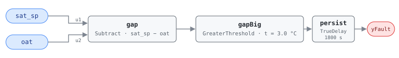

## Description

The unit is running mechanical cooling on top of a fully open outdoor air
damper while outdoor air is already colder than the supply setpoint by more
than the fan will add back. In OS#3 the dampers sit at 100% and the chiller
trims what the economizer cannot deliver, which is legitimate — until OAT is
more than `dTSF` below setpoint, at which point free cooling alone would
overshoot and the unit belongs in OS#2 modulating back toward a blend.

Something is holding the machine in the wrong state: the sequence never changed
over, a sensor is lying about which side of setpoint the air is on, or a
heating coil is leaking warmth into a stream the chiller then removes — the
expensive version, two subsystems paying to cancel each other. Within CLU-03
(Economizer Failure) this is the third face of the same changeover problem:
AHU-0017 catches a damper that stays shut when outdoor air is useful,
AHU-0009 an economizer still modulating after outdoor air stopped being
useful, and this one mechanical cooling still running when the economizer alone
had it covered.

## Detection Logic

```
G36 §5.16.14 FC#11, applies to OS#3:

    OAT_AVG + eOAT < SATSP − dTSF − eSAT

rearranged to gap form:

    sat_sp − oat > eOAT + eSAT + dTSF = 1 + 1 + 1 = 3.0 °C

yFault = (sat_sp − oat > oat_deficit_threshold), sustained for alarm_delay
```

Block graph (`rule.cxf.jsonld`):



G36 spreads the two sensor error bands and the fan-heat correction across both
sides of the inequality; the rearrangement collapses them into the single
positive `gapBig.t`, so a host retunes one parameter instead of tracking which
side each term sits on. Note the operand order: `gap` is `sat_sp − oat`, the
reverse of AHU-0009's, because the two rules look at opposite ends of the
same band and each wants its own end positive.

G36's comparison is already strict, so the rearranged `GreaterThreshold`
reproduces it exactly and a gap of exactly 3.0 °C reads healthy in both.
`persist` requires 30 minutes of continuous violation and any interruption
restarts the timer; recovery is immediate on the tick the gap falls back under
the threshold. Either input can open the gap — raising the supply setpoint does
it as surely as a cold front.

## Possible Diagnoses

Per G36 §5.16.14 Table 5.16.14.8, FC#11:

1. SAT sensor error — a supply reading biased high keeps the cooling loop
   calling for capacity the air does not need
2. OAT sensor error — a sensor reading high keeps the changeover logic from
   recognizing that free cooling would now overshoot
3. Heating coil valve leaking or stuck open — warmth upstream of the cooling
   coil is heat the chiller then removes, and the reason the unit needs
   mechanical cooling on air that arrived cold. The most expensive diagnosis
   here, and the one that also lights up FC#15 where that rule is deployed
4. Leaking or stuck economizer damper or actuator — a damper reported at 100%
   but physically short of it, or a return damper that will not close, delivers
   a warmer mixture than OAT implies

## Energy Impact

COMFORT_ENERGY, LOW confidence, QUALITATIVE_ONLY — the reference's §5.8.1 index
row, which maps the fault to PNNL-25985 EEM-06 (OA damper faults). Mechanical
cooling is doing free cooling's job: every kilowatt at the chiller buys a
temperature drop the outdoor air had already made. The waste is real and
continuous but not computable here — two temperatures carry no airflow, no coil
load, and no counterfactual for the correct state. An upper bound is the
cooling energy spent over the fault's duration; a host with airflow and coil
data can substitute the direct measurement AHU-0017 uses. Cooling-dominant,
and most common in shoulder seasons when outdoor air swings across the
changeover point.

## Emissions Impact

QUALITATIVE_EMISSIONS, LOW confidence, Scope 2. The waste is chiller or DX
compressor electricity plus fan energy already being spent. Diagnosis 3 adds
on-site combustion at the boiler, which would be Scope 1 — but that heat is
inferred rather than observed, and the coil it feeds is commanded shut in OS#3,
so the emissions this rule can honestly claim are the purchased-electricity
ones. Avoided-emissions basis: N/A.

## Deviations

- **The reference card is an index row, so this card is built from G36.**
  §5.8.1 gives the code and the name and nothing else. The equation, OS#3
  applicability, four diagnoses, and internal-variable defaults are transcribed
  from ASHRAE Guideline 36 §5.16.14 as it appears in Addendum u to Guideline
  36-2018 (first public review, 2021).
- **Severity 3 is library-assigned.** The reference publishes none; the value
  matches this chapter's scaffold row and every other G36 001-range card here.
  G36's Level 3 alarm grading (§5.16.14.16) is a reporting priority rather than
  a ranking, but it points the same direction.
- **Energy profile follows the §5.8.1 index row** (COMFORT_ENERGY / LOW / QUAL,
  EEM-06, savings "sensor-dependent"), and the published row wins where one
  exists. EXCESS_CONSUMPTION is a defensible alternative — setpoint is being
  met, so the unit is comfortable and wasteful rather than uncomfortable — and
  is recorded, not adopted. The emissions block is library-assigned.
- **Combined-epsilon threshold.** G36 puts `eOAT` on the measured side and
  `dTSF` and `eSAT` on the setpoint side, which would bind one card parameter
  to three block parameters. `sat_sp − oat > eOAT + eSAT + dTSF` puts one
  positive number on one CXF path, algebraically identical, with the
  composition recorded in the parameter description. Same move as AHU-0028
  and AHU-0009.
- **The default assumes a local OAT sensor.** G36 gives eOAT as 1 °C at the
  unit and 3 °C for a global sensor. A site feeding this rule from a campus or
  weather-service OAT must set `oat_deficit_threshold` to 5.0 °C (3 + 1 + 1);
  leaving it at 3.0 makes the rule fire on sensor disagreement G36 considers
  within tolerance.
- **No boundary deviation for this fault.** FC#11's comparison is already
  strict (`<`), unlike the `≥`/`≤` forms elsewhere in Table 5.16.14.8 (FC#5,
  FC#12, FC#14, FC#15), so `GreaterThreshold` on the rearranged gap reproduces
  the source exactly.
- **Instantaneous samples instead of averaged signals.** G36 compares 5-minute
  rolling averages sampled at 1-minute intervals; this rule compares raw
  samples and leans on the 30-minute `persist` delay. Not equivalent —
  persistence resets on every compliant tick, so an oscillating OAT can hide
  indefinitely, while the steady offset this rule is for reads the same either
  way. (Honesty note carried from AHU-0002.)
- **Operating-state gating and NO_EVAL are frontmatter, not graph.** G36 scopes
  FC#11 to OS#3 (§5.16.14.9c), suspends evaluation for ModeDelay after a mode
  change, and suspends it entirely when the AHU is off (§5.16.14.11). The
  engine is status-blind and the graph computes fault-given-valid-data only
  (precedent AHU-0029). A host that evaluates in OS#2 will see this rule
  assert on every cold morning — cold outdoor air with the dampers modulating
  is free cooling working.
- `persist.delayOnInit = true` (Modelica/CDL default is `false`): a gap already
  open at load waits out the full 30 minutes rather than alarming on the first
  tick after a controller restart. Library-wide choice, per AHU-0016.

## Notes

The instructive property of this rule is only visible next to its pair.
AHU-0009 and AHU-0011 test the same two points against the same epsilons
and both account for the same 1 °C fan rise, but FC#9 **subtracts** fan heat
(threshold 1.0 °C) while FC#11 **adds** it (3.0 °C): fan heat narrows the
usable free-cooling band from the top and widens it from the bottom. A site on a
global OAT sensor recomputes both — 5.0 °C here, 3.0 °C for AHU-0009 — and
they do not scale together. The two cannot fire at once, since one needs OS#2
and the other OS#3; a unit that alternates between them across a day is saying
the changeover point is in the wrong place or the OAT sensor is unreliable.
Check that sensor before anyone edits changeover logic — step 1.2 of the
[economizer-failure](../../../playbooks/economizer-failure.md) playbook.
