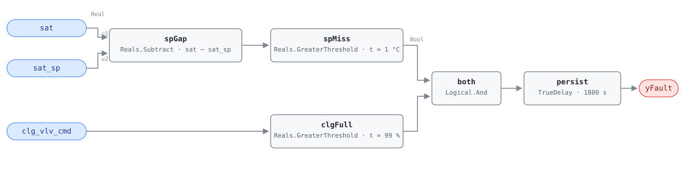

## Description

The cooling valve is wide open and the supply air is still above setpoint. The
control loop has already asked for everything it has, so whatever is wrong is
not tuning: either the coil cannot deliver, the chilled water or refrigerant
behind it cannot deliver, or the sensor reporting the miss is wrong. Downstream
the effect is the ordinary one — zones that cannot get cold enough, VAV boxes
opening toward maximum flow, and a fan pushing more air to make up the degrees
the coil failed to remove.

This is G36 §5.16.14 FC#13, the exact mirror of AHU-0007 on the heating side.
Both rules make the same statement: an actuator at its stop with the controlled
variable still on the wrong side of its target is evidence of a defect, and
until the actuator saturates it is evidence of nothing.

## Detection Logic

```
sp_gap = sat − sat_sp
yFault = (sp_gap      > sat_error_threshold)   SAT above setpoint by more than sensor accuracy
     AND (clg_vlv_cmd > cc_full_threshold)     cooling loop has nothing left to ask for
         sustained continuously for alarm_delay
```

Block graph (`rule.cxf.jsonld`):



The gap form is G36's `SAT_AVG > SATSP + eSAT` rearranged so the allowance
stays a single positive number at one CXF path. `clgFull` is the half that
gives the miss its meaning: SAT above setpoint at a part-open valve is a
control loop doing its job, and only a loop that has run out of coil is
evidence of a defect. Both comparisons are strict, so a miss sitting exactly on
1.0 °C and a command parked exactly on 99.0% both read healthy. `persist`
requires 30 minutes of continuous violation and any interruption restarts the
timer, which separates a failed coil from a morning pulldown or the minutes
after a large block of zones opens at once.

## Possible Diagnoses

Transcribed from G36 §5.16.14 FC#13:

1. SAT sensor error
2. Cooling coil valve stuck closed or actuator failure
3. Fouled or undersized cooling coil
4. CHW temperature too high or CHW unavailable
5. DX cooling unavailable
6. Gas or electric heat stuck on
7. Heating coil valve leaking or stuck open

The list is FC#12's minus the MAT sensor, which this rule does not read.
Entries 6 and 7 are heat sources fighting the coil, so a unit that trips this
rule and AHU-0012 together is pointing at those two rather than at the coil.

## Energy Impact

EXCESS_CONSUMPTION, MEDIUM confidence, PROXY_ESTIMATION, savings 2–5% of AHU
energy — the §5.8.1 index row, the only energy statement the reference makes
here (no EEM mapped). The estimate is branched because the rule does not say
which branch you are in. If a heat source is fighting the coil, the waste is
immediate and AHU-0016's term sizes it. If the coil, the chilled water, or
the compressor is simply not delivering, the AHU wastes nothing at the coil and
the cost lands downstream:
`shortfall_kw = supply_airflow_m3s × 1.2 × 1.005 × (sat − sat_sp)`, made up by
extra airflow at fan power if it is made up at all. Design airflow substituting
for a measured one keeps it a proxy. Cooling-dominant, since the rule is
evaluated only in mechanical-cooling states.

## Emissions Impact

PROXY_EMISSIONS, MEDIUM confidence. Scope 2: everything this fault spends is
purchased electricity — the chiller or DX compressor running longer, and the
fan power moving extra air. Diagnoses 6 and 7 can put a combustion stream
behind the fault, but that is heat this rule cannot see; AHU-0012 measures it
and carries the Scope 1 half. Emissions can rise rather than fall when the
fault is fixed, since a coil restored to capacity finally delivers the cooling
the building has been asking for — this rule buys comfort and diagnosis, and
the avoided-emissions claim belongs to whatever waste the repair uncovers.
Avoided-emissions basis: marginal operating emissions rate (MOER), applicable
only to the fighting-heat-source branch.

## Deviations

- **The reference card is abbreviated; G36 is the normative text.** The HVAC
  FDD Reference carries AHU-0013 only as a §5.8.1 index row — no equation,
  internal variables, vectors, severity, diagnoses, or preconditions. Detection
  logic and the diagnosis list are transcribed from ASHRAE Guideline 36
  §5.16.14 FC#13 as it appears in Addendum u to Guideline 36-2018 (First Public
  Review, 2021).
- **Setpoint comparison rewritten as gap comparison.** Subtracting first and
  testing `sat − sat_sp > eSAT` keeps the allowance the positive number G36
  publishes at one CXF path, instead of an offset added to the setpoint ahead
  of a two-signal comparison. Same rearrangement as AHU-0001 and AHU-0028.
  The threshold is a single G36 constant rather than a composition — eSAT =
  1 °C, the NISTIR 7365 supply-air sensor accuracy — so recalibrating that
  sensor changes `sat_error_threshold` directly, with no arithmetic.
- **`CC >= 99%` becomes a strict `> 99.0`.** CDL `Reals` offers only strict
  comparisons, so a command parked at exactly 99.000% reads as not-saturated
  and the rule stays silent where G36 would evaluate it. Same deviation and
  retune hint as AHU-0001 and AHU-0007: a host binding a coarsely quantized
  command should set `cc_full_threshold` to 98.9 rather than rely on the signal
  overshooting.
- **Instantaneous samples instead of 5-minute rolling averages.** G36 computes
  every §5.16.14 signal as a 5-minute rolling average with 1-minute sampling;
  this library consumes instantaneous points and lets the 30-minute AlarmDelay
  stand in. Not equivalent — persistence resets on every compliant tick, so an
  oscillating signal can hide indefinitely; the realistic instance here is a
  hunting SAT loop, which is AHU-0022's fault to report. A steady miss
  against a saturated valve reads the same either way. (Honesty note from
  AHU-0002.)
- **Operating states and ModeDelay are host-side preconditions.** G36 scopes
  FC#13 to OS#3–#4, suspends evaluation for ModeDelay (30 min) after a mode
  change in a served zone group, and suspends it entirely while the AHU is off;
  none of it is in the graph, per the library's stance (precedent AHU-0029).
  `CC > 0` is part of both applicable state definitions, so the host's gate
  already implies a cooling call — the graph's `clgFull` test is the stronger
  statement that the call has saturated.
- **Severity 3 is the library's.** No chapter card states one and the §5.8.1
  index carries no severity column. G36's Level 3 alarm grading is a reporting
  priority rather than this library's 1–4 scale, so it corroborates without
  supplying.
- **The energy profile is the index row's; the runtime formula and scope are
  the library's.** `category`, `confidence`, `estimation_method`, and
  `savings_range` are copied from §5.8.1 — the identical row the reference
  gives AHU-0007, this rule's heating-side mirror. The branched formula is
  mirrored from FC-007's, but the scope departs from it: FC-007 records `1|2`
  because the heat making up its deficit may be gas or electric, while nothing
  on the cooling side burns fuel, so this card records `2` and leaves the
  Scope 1 half of the shared diagnoses to AHU-0012.
- `persist.delayOnInit = true` (Modelica/CDL default is `false`), the library's
  standing choice: a violation already present at load waits out the full 30
  minutes instead of alarming on the first tick after a controller restart.

## Notes

The setpoint this rule compares against is the one the sequence is actually
holding, which makes it quietly dependent on the reset strategy. Where SAT
reset has been disabled or never commissioned — the condition AHU-0023
detects — the active setpoint may be a design-day value, and a coil that cannot
reach it in August is being asked for capacity nobody budgeted. Read this rule
together with AHU-0012: every diagnosis here appears there, and what differs
is that FC#12 finds heat entering the stream while FC#13 finds heat failing to
leave it. A coil that has lost capacity trips this rule alone; a heat source
fighting the coil trips both, which is the cheapest discriminator available
before anyone opens an access panel.
