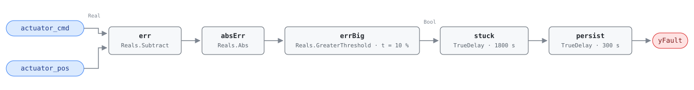

## Description

An actuator's command and its measured position disagree by more than the
tracking allowance and stay disagreed for half an hour. Whatever the sequence
told the device to do, it is not doing: the linkage has come off, the motor has
failed, the stem is seized in scale or debris, or the control signal never
reaches the actuator at all. This is the chapter's one template rule —
`actuator_cmd` and `actuator_pos` are a command/feedback pair the host binds per
actuated device, so a typical AHU carries three instances (outdoor air damper,
heating valve, cooling valve). Severity 2 because a stuck actuator defeats
whatever sequence commands it: when this fires alongside AHU-0016, AHU-0017,
or AHU-0025 on the same subsystem, those rules are reporting the symptom and
this one is naming the cause.

## Detection Logic

```
yFault = |actuator_cmd − actuator_pos| > position_error_threshold
         sustained continuously for stuck_duration,
         then held for a further alarm_delay
```

Block graph (`rule.cxf.jsonld`):



`err` takes the signed difference and `absErr` strips the sign, so the test is
direction-blind: an actuator that will not open, one that will not close, and a
reverse-wired feedback reporting 80% against a 20% command all trip the same
threshold. `errBig` compares strictly, so a delta sitting exactly on 10% reads
healthy — the threshold is a tracking allowance, and an actuator at the edge of
it is within spec. The two timers chain rather than merge: `stuck` requires 30
minutes of continuous mistracking, longer than any real stroke (full 0–100%
damper travel takes 90–150 s), and `persist` adds the reference's 5-minute
debounce on top, putting worst-case time to alarm at 2100 s. Either timer resets
the moment feedback comes back inside the allowance, so recovery is immediate.
`delayOnInit = true` holds the full window across a controller restart.

## Possible Diagnoses

1. Actuator mechanical failure — motor, gear train, or spring return
2. Actuator linkage disconnected (the most common finding, and the cheapest fix)
3. Incorrect wiring — command and feedback bound to different devices
4. Valve or damper seized by corrosion or debris
5. Control signal not reaching the actuator (broken wire, blown fuse, failed
   pneumatic transducer)

## Energy Impact

CRITICAL_WASTE, MEDIUM confidence, PROXY_ESTIMATION. The waste depends on which
actuator is stuck and where it stopped: a heating valve stuck at 40% burns fuel
year-round; stuck closed it costs nothing in energy and shows up as a comfort
complaint. Estimating the loss means falling back on the affected subsystem's
formula — AHU-0014/AHU-0015 for a coil valve, AHU-0021/AHU-0026 for an OA damper —
with the stuck position read from `actuator_pos` rather than the command, which
is why this card is PROXY_ESTIMATION. Repairing a stuck actuator returns 5–20%
of the affected subsystem's energy (PNNL retuning measures EEM-03 for leaking
coil valves, EEM-06 for OA damper faults). Climate sensitivity follows the
device.

## Emissions Impact

PROXY_EMISSIONS, MEDIUM confidence; typical 200–2,000 kg CO₂e/yr, the wide band
reflecting the same device dependence as the energy estimate. Scope is recorded
as `1|2` because it follows the affected subsystem rather than the fault: a
stuck heating valve wastes on-site combustion (scope 1), a stuck cooling valve
or a damper feeding the chiller outdoor air wastes purchased electricity
(scope 2), and a stuck OA damper in a gas-heated building can do both across a
year. Hosts should attribute against the subsystem the bound device serves, not
against this rule. Avoided-emissions basis: MOER.

## Deviations

- NO_EVAL is a host precondition, not an output. The reference's data-absence
  case (command 50%, feedback missing) is not representable in a status-blind
  block graph — nothing here distinguishes "no feedback" from "feedback reads
  0", and an unbound point held at 0 against a 50% command alarms in 35 minutes.
  The host must confirm both points are present, fresh, and bound to the same
  device before interpreting `yFault`.
- `actuator_cmd` and `actuator_pos` are the dictionary's first template entries,
  bound per device by the host rather than forked into per-device rule variants
  that would triple the card count. Their entries carry no Brick or 223P class
  because the class differs per instance (`Damper_Position_Command` on one,
  `Valve_Position_Command` on another); the cost is that the CXF document alone
  does not say which device it watches — the host binding does.
- `stuck_duration` and `alarm_delay` stay separate timers rather than one 2100 s
  `TrueDelay`, because the reference tunes them separately and they answer
  different questions: when an actuator counts as stuck, versus how much
  alarm-noise suppression the site wants on top.
- `errBig` uses `GreaterThreshold` (`u > t`), so a 10.0% delta is healthy and
  10.1% is not; the reference writes `> threshold`.
- `absErr` implements the reference's `|actuator_cmd − actuator_pos|` literally,
  so over-travel and reversed feedback wiring alarm on the same schedule as a
  jam — diagnosis 3 depends on it.
- The reference tags this fault for AHU, RTU, VAV, and FCU. This is the
  AHU-family instance; the other families reuse the block graph unchanged, since
  the template points carry no equipment-specific semantics.
- `delayOnInit = true` on both timers (Modelica/CDL default is `false`), the
  library's standing choice: an actuator already mistracking at load waits out
  the full 35 minutes rather than alarming after a controller restart.

## Notes

Deploy the three AHU instances together — the diagnosis often depends on which
one fired. Sites without position feedback on an actuator simply do not
instantiate the rule there; there is no degraded mode.

Remote fixes are limited to releasing overrides and checking for demand-limiting
that clamps the command range (playbook `stuck-actuator`, step 2). Everything
else is on-site: $0–$50 to reconnect a linkage, $200–$800 for an actuator,
$500–$2,000 for a seized valve body. After the repair, stroke the device
0 → 100 → 0 and confirm feedback tracks within 5%.
