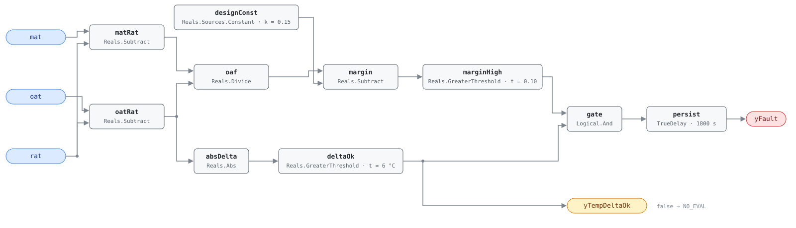

## Description

The unit is pulling in more outdoor air than its design minimum ventilation
requires, and it is not economizing — every extra cubic metre has to be heated
or cooled to supply temperature for no ventilation benefit. Unlike a failed
economizer, this fault is invisible from the zone: the space stays comfortable,
the coils simply work harder to keep it that way, through every occupied hour.
The outdoor air fraction is inferred from the mixing-box energy balance rather
than measured, which makes the diagnostic cheap — three temperatures, no airflow
station — and conditional, since the inference only holds when outdoor and
return air differ enough to locate the fraction; hence the explicit evaluability
output. AHU-0030 is the same measurement narrowed to heating operation, where
the excess is most expensive. Present in roughly 15% of buildings.

## Detection Logic

```
oaf          = (mat − rat) / (oat − rat)
yTempDeltaOk = |oat − rat| > oaf_temp_threshold     (false ⇒ host reports NO_EVAL)
yFault       = (oaf − desired_oaf > oaf_threshold) AND yTempDeltaOk,
               sustained for alarm_delay
```

Block graph (`rule.cxf.jsonld`):



`matRat` and `oatRat` form the two differences, `oaf` divides them, and
`margin` subtracts the design fraction so that `marginHigh` tests the excess
against a single positive threshold. `oatRat` fans out a second time into
`absDelta` and `deltaOk`, whose output is both the boundary output
`yTempDeltaOk` and the second input of `gate` — so `yFault` is held down over
exactly the interval the host is told to disregard it. That matters because the
division is unguarded: CDL `Divide` follows IEEE-754, so `oat = rat` yields ±∞
or NaN rather than an error, and a near-zero denominator amplifies ordinary
sensor noise into a fraction of any magnitude. NaN compares false everywhere,
but ±∞ and a noise-inflated finite fraction can both raise `marginHigh`, and
`gate` is what stops them. Both comparisons are strict: a fraction sitting
exactly at `desired_oaf + oaf_threshold` is not a fault, and a temperature
difference of exactly `oaf_temp_threshold` is not evaluable. The fraction is
signed consistently across the year — summer both differences positive, winter
both negative — so no seasonal branch is needed. `persist` requires 30
continuous minutes, riding out damper strokes and the mixing transient after a
mode change; `delayOnInit = true` holds that window across a restart.

## Possible Diagnoses

1. OA damper minimum position set too high
2. OA damper not closing to minimum — stuck, or the sequence never commands it
   back down after a purge or economizer period
3. Damper actuator issue: failed actuator, slipped linkage, or a position
   feedback that disagrees with the blade
4. Exhaust fan creating negative building pressure that pulls outdoor air in
   past the minimum position

## Energy Impact

EXCESS_CONSUMPTION, HIGH confidence, DIRECT_MEASUREMENT. The waste is
computable from live data: `excess_oa_kw = (actual_oaf − desired_oaf) ×
airflow × cp × |oat − rat|`, with the excess fraction already on the wire as
`oaf − designConst.k`. Correcting minimum ventilation saves 2–10% of AHU
thermal energy (PNNL-27338), the upper half of that range in heating-dominant
climates. PNNL EEM-17 (demand control ventilation) is the related retrofit and
this rule is its screening test: a unit already over its design fraction with
the dampers at minimum will not benefit from CO₂ control until the mechanical
problem is fixed.

## Emissions Impact

Scope 1 + 2, DIRECT_EMISSIONS, HIGH confidence; typical 500–4,000 kg CO₂e/yr
for the excess ventilation thermal load. The split follows the season: excess
outdoor air in winter usually burns scope 1 fuel at the heating coil, in
summer it draws scope 2 electricity at the chiller. Avoided-emissions basis:
marginal operating emissions rate (MOER).

## Deviations

- The reference's `AND NOT econ_favorable` term is not in the block graph.
  Economizer operation is an operating state, not a measurement, and this
  library keeps operating-state gating host-side (precedent: AHU-0017's OS-4
  restriction), so the term lives in `operating_states` and `preconditions`
  instead. A host that evaluates this rule during economizing will get a fault,
  and it will be the host's bug.
- The reference writes the test as `oaf > (desired_oaf + oaf_threshold)`, which
  would force the two tunables into one summed threshold. Feeding `desired_oaf`
  as `Reals.Sources.Constant.k` and comparing the remaining margin against
  `oaf_threshold` is algebraically identical and keeps both retunable alone.
- Evaluability is an output, not just a precondition: the `|oat − rat|` test is
  computable from this rule's own inputs, so SCHEMA.md requires exposing it as
  `yTempDeltaOk` (PNNL-27338 uses 5 °F for the same computation; the
  reference's 6 °C default is adopted). A false `yFault` under a false
  `yTempDeltaOk` means "unknown", not "healthy".
- Both comparisons are strict (`>`); the reference does not specify boundary
  behavior, so the library's strict convention applies.
- `persist.delayOnInit = true` (Modelica/CDL default is `false`), the
  library's standing choice: an excess already present at load waits out the
  full 30 minutes instead of alarming on the first tick after a controller
  restart.

## Notes

Check the minimum position setpoint before sending anyone to the roof — the
most common cause is a minimum dialled up during a ventilation complaint or a
commissioning shortcut, and it is a $0 desk fix. The
[economizer-failure](../../../playbooks/economizer-failure.md) playbook's damper
and linkage steps come after that.

The rule is deliberately blind to why the fraction is high. A damper stuck at
40% and a building held under negative pressure by an oversized exhaust fan
produce the same number, and the second is invisible from the AHU's own points:
if commanding the damper closed does not move the fraction, measure building
pressure before replacing the actuator.
