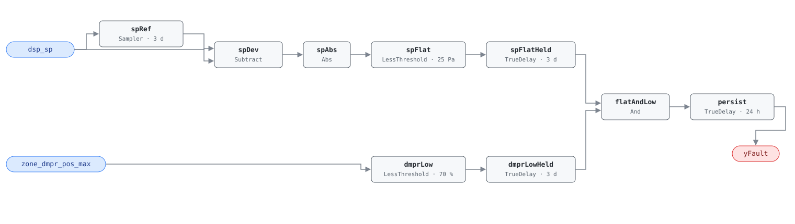

## Description

The duct static pressure setpoint remains fixed despite varying zone demand.
A functioning DSP reset (G36 §5.16.1 trim-and-respond) lowers the setpoint
when zone dampers are not widely open; because fan power scales with the cube
of pressure, even small reductions produce outsized savings. The other half of
the "74% problem" with AHU-0023 — absent in 74% of buildings (PNNL
151-building study) — and a member of cluster CLU-02 with the same $0
desk-only fix.

## Detection Logic

```
baseline(dsp_sp) = dsp_sp sampled and held every evaluation_window (3 days)
sp_flat          = |dsp_sp − baseline(dsp_sp)| < sp_flat_tolerance,
                   continuously for evaluation_window
low_demand       = zone_dmpr_pos_max < high_damper_threshold,
                   continuously for evaluation_window

yFault = sp_flat AND low_demand, sustained for alarm_delay
```

Block graph (`rule.cxf.jsonld`):



The setpoint chain mirrors AHU-0023's sampled-baseline flatness detector.
The demand condition needs no baseline at all: the reference's
`max(zone_dmpr_pos_all) < 70%` over the window is *exactly* equivalent to
"the highest zone damper stays below 70% continuously," which is one
`LessThreshold` plus a dwell `TrueDelay` on the host-aggregated maximum.
Worst-case time to alarm from cold start: `evaluation_window + alarm_delay`
(4 days).

## Possible Diagnoses

1. DSP reset never programmed in the BAS
2. DSP reset disabled by an operator
3. Trim-and-respond parameters misconfigured
4. Zone damper feedback not connected to the AHU controller

## Energy Impact

EXCESS_CONSUMPTION, HIGH confidence, PROXY_ESTIMATION (EEM-12). Fan energy
scales with the cube of duct pressure: a 20% setpoint reduction yields ~49%
fan energy savings. Savings 1–3% of site energy; climate-neutral. Prevalence:
74% of buildings.

## Emissions Impact

Scope 2, PROXY_EMISSIONS, HIGH confidence; typical 400–3,000 kg CO₂e/yr
(excess fan energy, cubic law). Avoided-emissions basis: MOER.

## Deviations

- **`zone_dmpr_pos_all` (array) → host-derived `zone_dmpr_pos_max`
  (scalar).** The reference consumes every zone damper position; library v1
  avoids array boundary points, so the host aggregates the maximum across the
  zones served and feeds one scalar (flagged `derived` in the point
  dictionary). The zone-side underlying points get their semantic tags when
  the VAV dictionary lands.
- **Windowed range → sampled-baseline flatness** on the setpoint chain, as
  AHU-0023 (`sp_flat_tolerance = min_expected_sp_range/2`; same
  `MovingAverage` ring-capacity rationale). The damper condition is an exact
  transformation, not an approximation: `max over window < t` ⇔ `continuously
  below t`.
- `delayOnInit = true` on all `TrueDelay`s (startup conservatism per
  AHU-0016).

## Notes

Evaluate together with AHU-0023: both fire → CLU-02 confirmed, one
trim-and-respond programming visit fixes both. The reference's PNNL-27338
AIRCx corollary — DSP > 0.2 in. w.g. during unoccupied hours — is covered
separately by the after-hours rules (AHU-0018 family).
