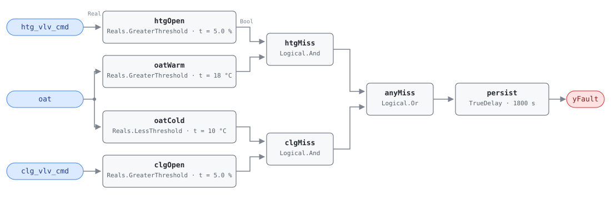

## Description

A coil is running on the wrong side of its outdoor-air lockout: the heating
valve is open while outdoor air is warm, or the cooling valve is open while
outdoor air is cold. Either way the lockout that should have disabled that coil
is missing, overridden, or defeated by a valve that will not close. Out-of-season
coil operation is pure waste — the load it serves is either nonexistent or
better met by outdoor air — and it usually runs for months before anyone notices,
because nothing about it is uncomfortable. Present in roughly 15% of buildings;
a member fault of CLU-01 (Simultaneous Heating & Cooling), whose trigger is
AHU-0016.

## Detection Logic

```
yFault = (htg_vlv_cmd > valve_open_threshold AND oat > heating_lockout_temp)
      OR (clg_vlv_cmd > valve_open_threshold AND oat < cooling_lockout_temp)
      sustained continuously for alarm_delay
```

Block graph (`rule.cxf.jsonld`):



The two branches are independent tests that share one persistence timer: `oat`
fans out to `oatWarm` and `oatCold`, each valve gets its own open test at the
same threshold, and `anyMiss` raises either finding. All three comparisons are
strict, so a valve parked at exactly 5% or an OAT sitting exactly on 18 °C or
10 °C does not trip the rule. Between the two lockout temperatures — the 10–18 °C
band where economizer operation belongs — neither branch can fire regardless of
valve position; judging coil operation inside that band is AHU-0016's job, not
this rule's. `persist` requires 30 minutes of continuous violation, which rides
out mode changes, morning warmup tails, and short manual valve strokes.

## Possible Diagnoses

1. Lockout sequence never programmed in the BAS
2. Lockout overridden or disabled (often during a comfort complaint, then left)
3. Valve stuck open — mechanical failure, failed actuator, or a
   normally-open valve with no signal
4. Incorrect OAT sensor reading (sun-exposed or wall-heated sensor reads warm;
   a sensor in an exhaust path reads warm year-round)

## Energy Impact

CRITICAL_WASTE, MEDIUM confidence, DIRECT_MEASUREMENT. Waste is computable from
the live valve command and the coil's design capacity: heating branch
`waste_kw = htg_vlv_cmd/100 × ahu_htg_capacity_kw`, cooling branch
`waste_kw = clg_vlv_cmd/100 × ahu_clg_capacity_kw`. Correcting the lockout
saves 5–15% of the affected subsystem's energy while the fault is active
(PNNL-25985 EEM-38). Confidence is MEDIUM rather than HIGH because the lockout
temperatures are site-specific: a building with a genuine year-round reheat load
or a heat-recovery scheme may legitimately hold a coil open outside the default
band. Sensitive to both climates — the heating branch bites in shoulder seasons
and summer, the cooling branch in winter.

## Emissions Impact

Scope 1 + 2, DIRECT_EMISSIONS, MEDIUM confidence; typical 500–4,000 kg CO₂e/yr.
The two branches land in different inventories: out-of-season heating is usually
scope 1 gas at the boiler, out-of-season cooling is scope 2 electricity at the
chiller. Avoided-emissions basis: marginal operating emissions rate (MOER).

## Deviations

- Severity 3 (warning), per the reference's chapter 9 card — its only severity
  statement for this fault, since the §5.8.1 index carries no severity column.
  This chapter's README previously mistranscribed it as 2, corrected alongside
  this card.
- The reference tags this fault for both AHU and RTU. This card is the
  AHU-family instance; an RTU-family sibling would restate it against staged
  compressor and gas-valve commands rather than modulating valve positions.
- All three comparisons are strict (`>`, `>`, `<`); the reference does not
  specify boundary behavior, so an OAT parked exactly on a lockout setpoint
  stays out of the alarm.
- `valve_open_threshold` is one card parameter bound to two CXF paths
  (`htgOpen.t`, `clgOpen.t`), matching the reference's single threshold. Hosts
  must set both together; a site needing per-coil thresholds should retune the
  paths individually and note the divergence.
- Preconditions (fan running, OAT trustworthy) are declared in frontmatter for
  host enforcement rather than encoded in the block graph, as in AHU-0016.
- `persist.delayOnInit = true` (Modelica/CDL default is `false`), the library's
  standing choice: a violation already present at load still waits out the full
  30 minutes instead of alarming on the first tick after a controller restart.

## Notes

Both branches feed one `persist` timer, so a violation that switches branches
without a gap keeps the timer running — which takes an 8 °C OAT swing inside a
single tick. If both branches fire on the same day, suspect the sensor before
the sequence.

Fix order within CLU-01: clear the trigger (AHU-0016) first, since a valve
held open by a fighting control loop also reads as a missing lockout. When the
lockout is genuinely absent, add one with hysteresis — typically disable heating
above 16 °C and re-enable below 14 °C (playbook `simultaneous-hc`, step 2.4).
