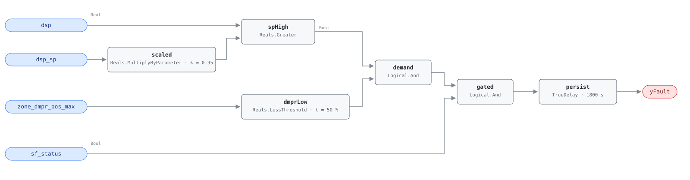

## Description

The fan holds duct static pressure at the top of its band while every zone
damper sits well below fully open. Together those facts say the setpoint is
higher than the system needs: the dampers are throttling away pressure the fan
spent energy producing, and the excess leaves as noise, leakage, and heat. Fan
power scales with the cube of pressure, so a setpoint 20% above what the worst
zone needs costs roughly half again the fan energy — and trimming it back
returns that energy immediately at no capital cost. DSP reset is absent in 74%
of buildings (PNNL 151-building study); this is the CLU-02 member that catches
the resulting operating symptom.

## Detection Logic

```
yFault = dsp > dsp_sp × high_sp_fraction
     AND zone_dmpr_pos_max < low_demand_damper_threshold
     AND sf_status
     sustained continuously for alarm_delay
```

Block graph (`rule.cxf.jsonld`):



`scaled` turns the live setpoint into the top-of-band pressure — a ratio rather
than a fixed offset, so the test travels with a setpoint the reset is allowed
to move. `spHigh` compares the measurement against that band and `dmprLow`
against the host-aggregated damper maximum; `demand` requires both, which is the
whole diagnostic content of the rule. Note what the pair excludes: high pressure
with an open damper is a system doing its job, and low dampers at low pressure
are a reset already working. `gated` adds the fan-running condition, since `dsp`
and `dsp_sp` mean nothing with the fan off and a stale reading would otherwise
alarm overnight. `persist` requires 30 minutes of continuous violation, riding
out morning start-up and the settling period after a setpoint change;
`delayOnInit = true` holds that window across a controller restart.

## Possible Diagnoses

1. DSP setpoint configured too high — a design-static value entered once and
   never revisited
2. Trim-and-respond active but not aggressive enough (trim magnitude too small,
   trim interval too long, or a minimum setpoint floor set at the old fixed
   value)
3. DSP reset responding to one rogue zone — a single box with a stuck damper or
   a failed flow sensor requests pressure continuously and holds the whole
   system up
4. Zone damper feedback not wired back to the AHU controller, so the reset has
   nothing to respond to and parks at maximum

## Energy Impact

EXCESS_CONSUMPTION, HIGH confidence, PROXY_ESTIMATION (EEM-12). Excess fan
power follows the cube law: `excess_fan_kw = ahu_fan_design_kw × [1 −
(needed_dsp/actual_dsp)³]`, where `needed_dsp` is the pressure at which the
most-open zone reaches its damper target. Savings run 5–30% of fan energy
depending on how far above the true requirement the setpoint sits — the wide
range is the cube law, not measurement uncertainty. Climate-neutral.

## Emissions Impact

Scope 2, PROXY_EMISSIONS, HIGH confidence; typical 300–2,000 kg CO₂e/yr (excess
fan energy). Fan waste runs through the whole occupied period, so it lands
across the daytime grid mix rather than concentrating in any one hour.
Avoided-emissions basis: marginal operating emissions rate (MOER).

## Deviations

- The reference's `dsp >= dsp_sp × high_sp_fraction` becomes a strict `>`:
  CDL has no `Reals.GreaterEqual`, the exact-equality case has measure zero on
  a measured pressure signal, and the strict form errs toward silence.
- The reference takes `max()` over a per-zone damper array; library v1 avoids
  array boundary points, so the host aggregates and feeds the scalar
  `zone_dmpr_pos_max` — the same point AHU-0024 consumes, flagged `derived`
  in the point dictionary.
- The fan-running condition is in the block graph rather than the
  preconditions: the library gates operating state host-side, but the reference
  states `sf_status = ON` as part of its detection logic and `sf_status` is a
  canonical point, so it is wired as a boundary input (as in AHU-0018). The
  multi-zone and damper-data preconditions stay in frontmatter.
- `high_sp_fraction` is dimensionless (0–1), consistent with the reference's
  0.95; `low_demand_damper_threshold` stays in percent because
  `zone_dmpr_pos_max` is a percent point.
- `persist.delayOnInit = true` (Modelica/CDL default is `false`), the library's
  standing choice: a violation already present at load waits out the full
  30 minutes instead of alarming on the first tick after a controller restart.

## Notes

This rule and AHU-0024 are the DSP half of CLU-02 from opposite sides. FC-058
watches the setpoint sit flat for three days and concludes the reset is absent;
this rule does not care whether a reset exists, only that the fan is pushing
pressure nobody is asking for. A misconfigured but active reset leaves FC-058
quiet and fires this rule — diagnosis 2. Both share the `missing-reset` playbook
and the same $0 fix per G36 §5.16.1.

Before touching the setpoint, check for a rogue zone (playbook step 1.2).
Healthy operation puts most zone dampers in the 50–75% band; all near 0% with
pressure at maximum is this rule's signature, and all near 100% is the opposite
fault (AHU-0001, insufficient static pressure).
