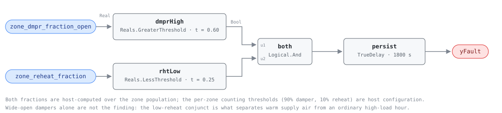

## Description

Most of the zones this air handler serves are holding their dampers near wide
open trying to make their space setpoints, and almost none of them are
reheating. Supply air that warm forces every box toward maximum flow to deliver
the same cooling: the zones drift off setpoint anyway, the fan runs harder than
the load requires, and the air reaching the space is wetter than it needs to be.
The low reheat fraction is the corroboration — PNNL-27338 §2.3 is explicit that
the setpoint must not be lowered while more than a quarter of the zones are
reheating, because that population is telling the opposite story. This is the
warm half of the SAT retuning pair AHU-0019 covers from the cold side, and it
costs comfort and fan energy before it costs anything else.

## Detection Logic

```
yFault = zone_dmpr_fraction_open > damper_fraction_threshold
     AND zone_reheat_fraction    < reheat_fraction_threshold
     sustained continuously for alarm_delay
```

Block graph (`rule.cxf.jsonld`):



Two threshold tests feed one conjunction and one timer, the mirror of AHU-0019
with both comparisons reversed. Note what this rule does *not* read: no supply
air temperature and no setpoint. PNNL-27338 §2.3 infers "too high" entirely from
the zone population, which means the rule fires just as readily on a unit that
cannot make a correct setpoint as on one whose setpoint is set wrong — AHU-0013
and AHU-0012 are the single-unit tests that split those two, and neither can see
this fault, because a unit sitting exactly on a bad setpoint looks healthy to
every sensor it owns. Both fractions are 0–1, not percent, and both comparisons
are strict, so exactly 60% of dampers open or exactly 25% of zones reheating
reads healthy. `persist` requires 30 continuous minutes, and `delayOnInit = true`
serves that window in full after a controller restart.

## Possible Diagnoses

1. **SAT setpoint parked too high** — set for a load profile that no longer
   exists, or a reset whose upper bound is above what the zones can absorb. The
   [missing-reset](../../../playbooks/missing-reset.md) playbook carries this
   heuristic verbatim at step 2.5.
2. **The AHU cannot make its setpoint** — chilled-water valve not modulating,
   chiller off, CHW pumps failing (PNNL-27338 §2.3 names all three). Identical
   population signature, entirely different work order; AHU-0013 and AHU-0012
   separate it from the AHU's own sensors, and both should be checked before
   anyone touches the setpoint.
3. **Genuine peak load** — at design conditions, wide dampers with no reheat is
   correct operation. Confirm the setpoint is not already at its low limit
   before treating this as a retuning opportunity.
4. **Starved airflow rather than warm air** — a duct static pressure setpoint
   too low leaves dampers open with the SAT perfectly correct (AHU-0001, and the
   DSP half of CLU-02 through AHU-0024).

## Energy Impact

COMFORT_ENERGY, MEDIUM confidence, PROXY_ESTIMATION. There is no waste integral
to compute here — nothing is being simultaneously added and removed, as it is on
the cold side. The cost is airflow: every zone that has to open further to
compensate for warm supply air buys fan power on the cube law, and the comfort
it buys is negative, because the zones are losing the space while they do it.
Correcting the setpoint recovers 1–4.4% of site energy on the EEM-05 basis
(2.5% national median), partly offset by the extra chiller load colder air
implies — PNNL-27338 §2.3 names that trade explicitly. Cooling-dominant, and the
latent benefit of drier supply air grows with humidity.

## Emissions Impact

Scope 2, PROXY_EMISSIONS, MEDIUM confidence; typical 500–3,000 kg CO₂e/yr, net
of the chiller load the correction adds back. Avoided-emissions basis: marginal
operating emissions rate (MOER).

## Deviations

- **The auto-correction is card prose, not graph.** PNNL-27338 §2.3.1 lowers the
  setpoint by `sat_retuning` = 1 °F per cycle and floors it at `min_sat_stpt` =
  50 °F, guarding the low-limit thermostat and the economizer's cold-air path.
  This library detects; those bounds belong in the retune, and the floor is the
  number to check first when this rule will not clear.
- **PNNL's windowed averages are replaced by a persistence delay.** The source
  averages `percent_dmpr` and `percent_rht` over a ≥15-minute `data_window` with
  at least 5 samples. A `TrueDelay` on the conjunction is the engine-native
  equivalent and is stricter — it requires the condition to hold every tick
  rather than on average — which suits a detect-only rule that must not cry wolf.
- **`alarm_delay` = 1800 s, between the source's cadence and AHU-0019's hour.**
  One `data_window` (900 s) reproduces PNNL's correction cadence, but PNNL nudges
  1 °F while this card raises an alarm, and morning pull-down shows this exact
  signature for longer than one window. AHU-0019's 3600 s is too slow in the
  other direction: warm supply air is a comfort complaint already in progress,
  so latency has an occupant cost the cold side does not carry. Sites wanting the
  literal source cadence set 900.
- **No `sat_sp` input, unlike AHU-0019.** The source's high-SAT test reads the
  setpoint array only to decide whether auto-correction is *possible* (§2.3.3
  step 6), never as a detection term. Adding a setpoint threshold would have made
  the two cards symmetric and the rule wrong: a unit whose setpoint is correct and
  whose coil has failed is exactly the case this population test is good at.
- **Both fractions are 0–1, not percent.** The source states 60% and 25%; the
  points compared against carry unit `1`. Hosts feeding 0–100 never fire the
  damper conjunct and always fire the reheat one — that is, the rule goes
  permanently silent rather than noisy, which is the worse failure.
- **Per-zone counting thresholds stay in host configuration.** The 90% damper and
  10% reheat thresholds define `zone_dmpr_fraction_open` and
  `zone_reheat_fraction` in `points/ahu.points.json`, not this rule; library v1
  avoids array boundary points, so the counting happens host-side (the
  `zone_reheat_fraction` precedent AHU-0019 set).
- **`confidence: MEDIUM`, against AHU-0019's HIGH.** The population evidence is
  unambiguous about the symptom and the source publishes every threshold, but
  three unrelated causes produce it (diagnoses 2–4) and the graph cannot rank
  them. `severity: 3` and `category: COMFORT_ENERGY` follow the mirror
  asymmetry: the cold side burns fuel to undo cooling, the warm side loses the
  space first and the fan bill second.
- **Strict comparisons** (`>`, `<`); the source does not specify boundary
  behavior, so the library's strict convention applies.
- **Occupied/fan-on gating and the multi-zone precondition are frontmatter**, for
  host enforcement rather than block graph, per the library's design stance.
- **`persist.delayOnInit = true`** (CDL default `false`), the library's standing
  choice: a condition already present at load waits out the full 30 minutes
  instead of alarming on the first tick after a restart.

## Notes

Bound to `missing-reset` rather than a playbook of its own: step 2.5 of that
playbook already carries both PNNL heuristics, this one included, and the fix is
the same trim-and-respond programming AHU-0023 asks for — from the other end of
the reset band. Run the pair. AHU-0019 firing on the same unit at a different
hour is not a contradiction; it is a reset whose band is wrong in both
directions, and CLU-02's trigger is the rule to fix. Membership in CLU-02 is
declared here and belongs in `clusters/clusters.json` alongside AHU-0019.
