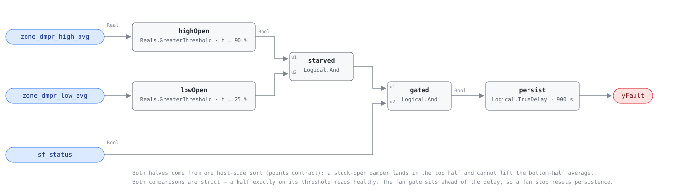

## Description

Sort every zone damper command the air handler serves, average the top half and
the bottom half, and both averages come back high. The busiest zones being wide
open is ordinary on a design day; the quiet zones also holding their dampers
open is not, and the two together say the trunk itself is short of pressure
rather than a few rooms being hot. Boxes downstream run wide open and still
miss their airflow setpoints — the "starved box" condition — so zone
temperatures wander and the complaints that follow get answered with overrides.
This is a comfort finding, not an energy one: raising the setpoint costs fan
power, and PNNL-27338 §2.6 is explicit that fixing low duct static pressure
saves none.

## Detection Logic

```
yFault = zone_dmpr_high_avg > zone_high_damper_threshold   top half of the population
     AND zone_dmpr_low_avg  > zone_low_damper_threshold    bottom half too
     AND sf_status
     sustained continuously for alarm_delay
```

Block graph (`rule.cxf.jsonld`):



The host does the sort and hands the rule two ordinary Reals (see the point
dictionary); the graph adds thresholds, the fan gate, and persistence. The
second conjunct is the whole point. A single stuck-open damper, or a handful of
zones at real load, lifts only the top half — it sits in that half by
construction and cannot move the bottom-half average at all — so the population
form separates a starved trunk from a busy one, which neither AHU-0001 (one
pressure pair plus fan speed) nor AHU-0031 (the single `zone_dmpr_pos_max`) can
do. Both comparisons are strict, so a half sitting exactly on its threshold
reads healthy. `sf_status` is wired ahead of `persist` rather than left to the
host: dampers drive open against a dead duct, so the fault signature is present
every night, and the gate has to reset the timer rather than merely mask its
output. `persist` requires 15 minutes of continuous violation and
`delayOnInit = true` holds that window across a controller restart.

## Possible Diagnoses

1. DSP setpoint left too low — an override, a noise complaint, or an
   energy-saving tweak that outlived the person who made it
2. Trim-and-respond clamped: maximum setpoint below design static, or a respond
   magnitude too small to answer the airflow requests arriving from the boxes
3. Duct breach or a disconnected branch downstream of the pressure sensor — the
   sensor is satisfied while the trunk beyond it is not (PNNL-27338 §2.6 names
   failed ductwork as a cause worth inspecting above the ceiling)
4. Fan or drive out of capacity — if AHU-0001 fires alongside this rule, the
   loop has already asked for everything and no setpoint change will help
5. Zone-side inflation — oversized minimum airflow setpoints, or damper
   feedback scaled wrong — makes the population read open when it is not

## Energy Impact

COMFORT_ENERGY, MEDIUM confidence, QUALITATIVE_ONLY. There is no savings term
to publish, and the reference declines to claim one: raising duct static
pressure raises fan power by the cube law, so the direct energy effect of the
fix is negative. The recoverable energy is second-order — fan hours extended to
chase zone temperatures, a supply air setpoint dropped to compensate for
airflow that never arrives, and overrides layered on to quiet complaints.
Confidence is MEDIUM rather than HIGH because the thresholds are published and
the mechanism is well described, but nothing quantifies the impact and the test
is only as good as the host's zone list.

## Emissions Impact

Scope 2, QUALITATIVE_EMISSIONS, MEDIUM confidence. No direct term, and the sign
is not guaranteed: correcting the setpoint spends fan energy to buy back
airflow. Any net credit comes from the compensating measures the starved
condition provoked — extended fan schedules and a depressed SAT setpoint — both
electric at the common site. Avoided-emissions basis: marginal operating
emissions rate (MOER).

## Deviations

- **The population sort happens host-side.** The reference consumes the whole
  per-zone damper array; library v1 avoids array boundary points, so the host
  sorts once and feeds `zone_dmpr_high_avg` and `zone_dmpr_low_avg` (both
  flagged `derived` in the point dictionary), exactly as AHU-0019 consumes
  `zone_reheat_fraction`. The counting is host configuration, not a rule
  parameter.
- **The sort is across zones, not across time.** PNNL-27338 §2.6.2 describes
  `zn_dmpr_arr` as a per-timestep average across the terminal boxes, which
  would make §2.6.3 step 3 a sort of the time series; step 3's own wording
  ("the largest 50% of the zone terminal box damper commands") and the Figure
  2.14/2.15 discussion read it across the zone population. This card takes the
  across-zones reading — it is the one that makes a two-threshold test a
  statement about zones — and carries the time dimension in `persist` instead.
- **Window evaluation becomes continuous persistence.** The reference tests
  once per 15-minute `data_window`; `alarm_delay` requires the condition
  continuously across the same 15 minutes, which is the stricter form (a
  continuous violation implies the windowed average clears the threshold, not
  the reverse). Sites whose host does not implement the reference's warm-up
  exclusion should raise `alarm_delay` past their morning pull-down —
  AHU-0031 ships 1800 s for the same reason.
- **The fan conjunct is in the graph, against AHU-0019's host-side choice.**
  The reference puts fan status in its main process, so either placement is
  faithful; the deciding argument is timer state. With the fan off, boxes park
  their dampers open and the population reads exactly like a starved trunk, so
  a host-side gate would suppress the output while `persist` charged all night
  and asserted on the first occupied tick. Wired, the fan stop resets it
  (`fan_cycle_restarts_persistence`). Same placement as AHU-0031.
- **Auto-correction is out of scope.** The reference's AIRCx process writes the
  setpoint back; this library detects and reports. The retuning schedule is
  carried as prose (see Notes) so a host that implements the write path owns
  the override checks and the cap along with it.
- **No cluster membership.** CLU-02 is the missing-reset syndrome, whose
  trigger fix (programming trim-and-respond) resolves a setpoint parked at its
  *design* value — the AHU-0031 direction. This fault is the opposite sign and
  is not cleared by that fix, so it stays out of the cluster while sharing its
  playbook.
- **`missing-reset` is the playbook, where AHU-0001 binds none.** AHU-0001's
  diagnoses are all mechanical repairs with no desk step. Here the first fix is
  a setpoint change and the second is trim-and-respond configuration, which is
  that playbook's step 1.2 and step 2.3-2.4 verbatim.
- **Severity 3, `category: COMFORT_ENERGY`, `estimation_method:
  QUALITATIVE_ONLY`** are library-authored, following AHU-0001's treatment of a
  fault with no computable waste term. The reference's own statement that the
  fix saves no fan energy is what rules out an EXCESS_CONSUMPTION framing.
- **Data sufficiency stays a precondition.** The reference guards its window
  with `no_required_data` — at least five samples inside the 15 minutes — and
  this card adds a zone-count floor of its own, since two halves of a two-zone
  population say nothing. Both are host NO_EVAL tests on derived points, and
  neither is visible to the block graph.
- `persist.delayOnInit = true` (Modelica/CDL default is `false`), the library's
  standing choice: a violation already present at load waits out the full 15
  minutes instead of alarming on the first tick after a controller restart.

## Notes

Retuning is incremental by design. PNNL-27338 §2.6.1-2.6.3 raises the setpoint
by 0.15 in. w.g. per diagnostic cycle (15 minutes) toward a hard cap of 2.5 in.
w.g., re-evaluating the damper population after each step and stopping early
once the zones settle — a rate chosen not to destabilize the fan loop. Walk the
setpoint the same way by hand, and watch for the fault clearing well below the
cap; reaching the cap with both halves still open is the tell for diagnosis 3
or 4, not for more pressure. Check AHU-0001 first: it and this rule firing
together mean the fan is already at the stop, and the work is mechanical.
