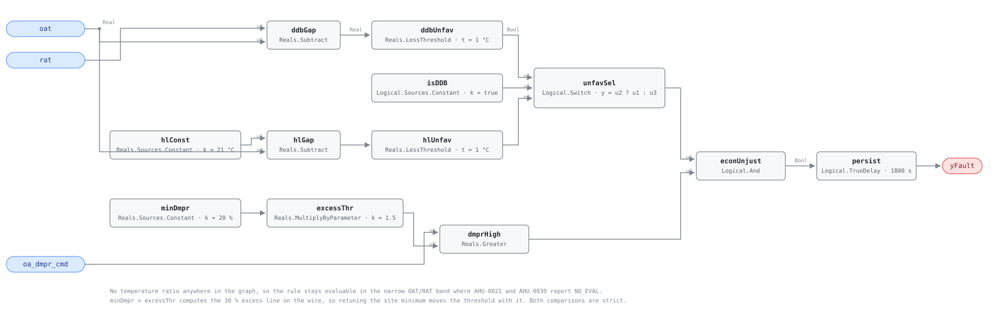

## Description

Nothing about the weather favors free cooling and the outdoor-air damper is open
well past its minimum position anyway. Whatever the coils are doing, they are
doing it to more outdoor air than the ventilation calculation asked for, and
outdoor air no cooler than the air it displaces is a load, not a resource. This is
the raw-damper half of the economizer question: it never divides one temperature
difference by another, so it keeps working in the conditions where the
outdoor-air fraction cannot be computed at all — which is most of the band it
fires in. AHU-0021 and AHU-0030 measure how much extra air arrives; this rule
asks only whether the damper had any business being open, and answers from the
command the controller wrote.

## Detection Logic

```
econ_unfavorable = (rat − oat)          < temp_deadband    when econ_type_is_ddb
                 = (econ_hl_temp − oat) < temp_deadband    otherwise

yFault = econ_unfavorable
     AND oa_dmpr_cmd > min_damper_sp × excess_damper_multiplier
     sustained continuously for alarm_delay
```

Block graph (`rule.cxf.jsonld`):



Both changeover branches are computed every tick and `unfavSel`
(`Logical.Switch`, `y = u2 ? u1 : u3`) picks one, exactly as AHU-0017 does — same
subtractions, same operand order, same `temp_deadband`, with `LessThreshold`
where that card has `GreaterThreshold`. `econ_unfavorable` is therefore the
strict complement of AHU-0017's `econ_favorable`, in both branches, which is what
lets a site read the pair as one policy. `minDmpr` and `excessThr` keep PNNL's
two published numbers as two live knobs: the 30% line is computed on the wire, so
retuning a site's minimum position to 30% moves the threshold to 45% without
anyone redoing the arithmetic. Both comparisons are strict, so a damper commanded
to exactly 30% and a changeover gap of exactly 1.0 °C both read healthy — the
second is one boundary point more conservative than PNNL's
`NOT (rat − oat > temp_deadband)`.
`persist` requires 30 continuous minutes, the length of PNNL's averaging window,
which rides out the damper stroke and the minutes either side of changeover;
`delayOnInit = true` holds that window across a controller restart.

## Possible Diagnoses

PNNL-27338 §3.4 emits a diagnostic message rather than a fault set, so this list
is authored from the mechanisms that hold an OA damper *command* above minimum
when nothing favors economizing:

1. Minimum position parameter set well above the ventilation design minimum —
   dialled up during a complaint or a commissioning shortcut, and a $0 desk fix.
   Check it before anything else.
2. Economizer enable with no disable path: the sequence opens on a favorable
   comparison and never re-tests it
3. Changeover setpoint or high limit left at a factory default that does not fit
   the climate
4. A changeover device — dry-bulb or enthalpy switch — failed in its
   "economize" state, a single point of failure with no other symptom
5. OAT sensor reading low, so outdoor air still looks worth importing
6. A mixed-air low-limit or freeze-protection loop holding the damper open, its
   setpoint never re-tuned for cooling weather
7. An override left in place after service (AHU-0027 finds the flag itself)

## Energy Impact

EXCESS_CONSUMPTION, HIGH confidence, DIRECT_MEASUREMENT. Every point of damper
command above the minimum imports outdoor air with no ventilation benefit, and
the rule fires only when that air is within `temp_deadband` of return temperature
or hotter, so the waste is a cooling penalty: `(oa_dmpr_cmd − min_damper_sp)/100 ×
supply_airflow × ρ·cp × (oat − rat)`, every term but the airflow already on this
rule's wires. Read it as a floor — sensible-only, and in the near-changeover band
where this rule does its distinctive work the latent load of humid outdoor air is
the larger half. Cooling-dominant and sharply seasonal.

## Emissions Impact

Scope 2, DIRECT_EMISSIONS, HIGH confidence; typical 1,000-6,000 kg CO₂e/yr,
matching AHU-0034's range for the same equipment and the same mechanical cooling.
The whole impact is electric compressor or chiller work, and the hours are the
grid's worst — hot afternoons coincident with cooling peaks — so value it at the
marginal operating emissions rate (MOER) rather than an average grid factor.

## Deviations

- **This card is a library extension, not a transcription**: chapter 9 specifies
  AHU-0001..065 and stops. Name, severity 3, phase 2 and `method: rule` are
  assigned here — severity 3 to match every other economizer card, phase 2
  because the rule presupposes a site that has already configured a changeover
  type for AHU-0017. The algorithm and every threshold are PNNL-27338 §3.4's.
- **The economizing-unfavorable gate is in the graph, where AHU-0021 and
  AHU-0030 leave it to the host.** Those cards gate on the unit's economizer
  *mode*, an operating state no measurement establishes. PNNL-27338 §3.1 computes
  `econ_condition` from two temperatures at every time step, which is a
  measurement — the library's standing line (AHU-0030: measured points in, modes
  out) — and AHU-0017 and AHU-0034 already carry that comparison in-graph. Here
  it is load-bearing: host-side, this rule would be a bare damper threshold.
- **The changeover-type switch is carried even though §3.4's prose is written
  around the dry-bulb case.** §3.1 defines both branches, and AHU-0017 and
  AHU-0034 ship them; a site on fixed high-limit changeover would otherwise have
  this rule contradicting its two siblings on the same unit. `econ_type_is_ddb`,
  `econ_hl_temp` and `temp_deadband` are their parameters unchanged.
- **`min_damper_sp` × `excess_damper_multiplier` ships as two parameters, not one
  30% threshold.** PNNL publishes the minimum as the site value and the excess
  threshold as its derivative; collapsing them makes a site with a 30% minimum
  remember to type 45. Feeding the minimum as `Reals.Sources.Constant.k` and the
  factor as `MultiplyByParameter.k` is algebraically identical and keeps both of
  PNNL's published names retunable alone (AHU-0021's precedent for `desired_oaf`).
- **Persistence replaces PNNL's window average.** §3.4 averages `damper_signal`
  over a 30-minute `data_window` (with `no_required_data = 10`) and tests the
  mean; this card tests the instantaneous comparison through a 30-minute
  `TrueDelay`. The latency matches, the semantics do not: a damper spending half
  the window wide open and half closed would trip the average and does not trip
  the delay. Persistence is the house form and the stricter of the two.
- **`temp_deadband` ships at 1.0 °C, not PNNL's 1 °F (0.56 °C).** The value is
  AHU-0017's and AHU-0034's, and one deadband across all three keeps their
  changeover geometry coherent: that pair brackets a symmetric ±1.0 °C dead zone
  and this card's gate is the exact complement of AHU-0017's. Coherence is worth
  more than half a degree of fidelity to a threshold PNNL itself calls
  adjustable. A site with untrimmed sensors must raise it on all three together.
- **No evaluability output.** AHU-0021 and AHU-0030 must publish `yTempDeltaOk`
  because their quotient becomes meaningless as `|oat − rat|` shrinks. This rule
  has no quotient, so there is no in-rule condition under which its own answer is
  unknown, and per SCHEMA.md there is nothing to expose as a `y…Ok`.
- **Both comparisons are strict** (`>` on the damper, `<` on the changeover gap).
  At `rat − oat` exactly equal to `temp_deadband` this rule stays silent where
  PNNL's `NOT (rat − oat > temp_deadband)` would evaluate — one boundary point,
  in the direction the library's strict convention always takes.
- **`fan_sp` is not bound.** §3.4.1 lists it among the process's required points,
  but it appears only in the energy estimate of Step 7, never in the detection
  test; fan speed belongs to the host's energy accounting, and binding a point a
  rule does not read would misstate the rule's data requirement.
- **The unoccupied case in §3.4's prose is left to AHU-0026.** PNNL extends the
  check to unoccupied periods, where the damper should be closed rather than at
  minimum; AHU-0026 already tests exactly that against `occ_schedule`, so this
  card's `operating_states` restricts it to occupied hours instead of carrying a
  second expectation for the same actuator.
- **The rule reads the damper command, not a measured position** (PNNL's own
  `damper_signal`, from the controller). A damper commanded to minimum and
  mechanically stuck open produces the entire physical fault and none of this
  signature; run AHU-0020 on the OA damper alongside, as AHU-0034 does.
- **`suppresses` and `suppressed_by` are empty although this rule nests
  AHU-0034.** At shipped defaults its changeover gate implies this one, its
  damper threshold is higher, and it adds a cooling conjunct — so every AHU-0034
  assertion is also one of these, in both branches. Both findings are
  true and separately actionable — AHU-0034's is the sharper diagnosis, this one
  the wider net — and any suppression edge would be an index-level decision
  declared on both cards, which single-writer authoring cannot do from here.
- **`savings_range` is inherited, not transcribed.** PNNL-27338 publishes no
  annual percentage for any of its five economizer diagnostics; the band quoted
  is AHU-0034's, carried so the family reads consistently, and the card's own
  claim is the runtime integral.
- **`persist.delayOnInit = true`** (Modelica/CDL default is `false`), the
  library's standing choice: a damper already open past changeover when the
  controller restarts waits out the full 30 minutes instead of alarming on the
  first tick.
- **Every vector is authored** — PNNL-27338 publishes an algorithm and a flow
  chart, not test cases. With default parameters they reach only the dry-bulb
  branch, since `vectors/v1` stages inputs and not parameters, so `hlConst`,
  `hlGap` and `hlUnfav` are structurally verified but never reach `yFault`
  through `u3` (as on AHU-0034); `econ_type_is_ddb = false` commissions itself.

## Notes

The temperature spread decides which of the three excess-outdoor-air cards can
speak. AHU-0021 and AHU-0030 infer the fraction from `(mat − rat) / (oat − rat)`
and report NO_EVAL whenever `|oat − rat|` is under 6 °C. This rule's gate points
the other way — it needs `rat − oat` under 1 °C — so it owns a roughly 7 °C-wide
band, from a degree below return temperature up to where the ratio becomes
reliable, in which it is the only one of the three that can answer at all. Above
that band both forms work and both should fire: PNNL-27338 §3.5 does exactly
that, running the raw damper test beside its OAF check against the same 30% line
and reporting both causes when both trip. Below it, in genuine free-cooling
weather, this rule is silent by construction. The 1-to-6 °C gap where none of
them speaks is honest — mild outdoor air with an unreliable ratio is when an
open damper is defensible.

Check the minimum-position parameter before sending anyone to the roof, then
command the damper to minimum and watch it move. If the command changes and the
fault clears, the sequence never asked for minimum and the fix is at a desk
([economizer-failure](../../../playbooks/economizer-failure.md), remote steps).
If `oa_dmpr_cmd` already sits at minimum while the space says otherwise, this
rule was never going to see it, and AHU-0020 is the one to run.
