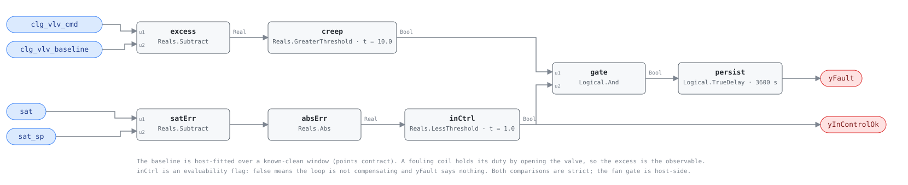

## Description

A cooling coil under supply-air temperature control hides its own fouling. As
the fins load up and the tubes scale, heat transfer falls — and the loop answers
by opening the valve. Supply air arrives at setpoint, the heat rate is unchanged
(Patil et al. 2022), and every thermal test in this library reads a healthy
unit: SAT tracks, the SAT-to-MAT drop is normal, nothing is high or low. What
has changed is hydraulic. The coil is buying the same duty with more water, and
the excess shows up as valve position — the one signal the control loop is not
holding constant. This rule reads that excess against a baseline fitted when the
coil was clean, and only while the loop is genuinely compensating: a coil that
has stopped meeting its setpoint is a louder, different fault.

## Detection Logic

```
excess       = clg_vlv_cmd − clg_vlv_baseline
tracking_err = |sat − sat_sp|

yInControlOk = tracking_err < in_control_band     (false ⇒ host reports NO_EVAL)
yFault       = excess > creep_threshold AND yInControlOk,
               sustained continuously for alarm_delay
```

Block graph (`rule.cxf.jsonld`):



The gate is the rule's argument, not a detail. Valve position is evidence about
a coil only while the loop is closing on setpoint; once it saturates, position
is pinned at 100% and the excess arithmetic is meaningless, so `yInControlOk`
goes false and the host reads NO_EVAL rather than a clean coil. That is why it
is an evaluability flag and not a sub-condition flag. The magnitude is taken
before the comparison, so an overcooling loop is out of the band the same as an
undercooling one; without it, a coil running 1.5 K cold with its valve wide open
would read as in control and be alarmed as fouled.

Both comparisons are strict: a valve sitting exactly on the creep line, and a
loop sitting exactly on the band edge, both read healthy. `persist` requires the
full hour continuously and `delayOnInit = true` holds that window across a
controller restart. Any interruption of either conjunct restarts it, so the
alarm follows the last excursion rather than the fault's onset.

## Possible Diagnoses

The rule detects hydraulic excess. It cannot name the cause, and four causes
share the signature — the playbook discriminates:

1. **Coil fouling** — the finding this card is named for. Air-side (fin
   blockage, a filter bank someone stopped changing) or water-side (scale,
   biofilm, corrosion product). Both reduce transfer and both are answered by
   more flow.
2. **Valve authority degradation** — an oversized, worn, or failing valve and
   actuator delivering less flow per point of command than it used to. The
   command creeps for a reason that has nothing to do with the coil.
3. **Air-bound coil** — air trapped at a high point reduces the wetted surface
   and the flow through it. The cheapest fix on this list: bleed it.
4. **Low chilled-water differential pressure at the coil** — a plant-side
   shortfall, a throttled branch, or a DP reset tuned past what the far coils
   need. Every coil on the affected branch creeps together, which is the tell.
5. **A baseline that no longer describes the operating condition** — a changed
   supply-air setpoint strategy, a new load, or a fit that has simply aged out.
   The fix is a refit, not a work order.

## Energy Impact

EFFICIENCY_LOSS, MEDIUM confidence, QUALITATIVE_ONLY. The AHU's own thermal
energy does not move — that is the mechanism, not a caveat — so there is nothing
to book on the air side. The cost is on the water side: the same duty carried by
more flow returns colder water, which is the low delta-T arithmetic CHW-0004
prices in pump energy and chiller staging, one coil's contribution at a time.
Confidence is MEDIUM because the mechanism is well published while the shipped
thresholds are placeholders and the baseline is a host obligation the graph
cannot audit. Cooling-dominant.

## Emissions Impact

Scope 2, QUALITATIVE_EMISSIONS, MEDIUM confidence. All of it is purchased
electricity — pumping and the chiller hours the depressed delta-T buys — so the
avoided-emissions basis is the marginal operating emissions rate (MOER), and the
timing is unhelpful: coils creep hardest on the hottest afternoons, when the
marginal generator is dirtiest.

## Deviations

- **The observable is hydraulic, and that is the whole design.** Patil et al.
  (2022) show that under temperature control a fouling exchanger holds its heat
  rate while the loop compensates, so thermal tests cannot see it. AHU-0033,
  AHU-0032 and the SAT-to-MAT family all stay quiet through this fault by
  construction; only the valve moves.
- **`clg_vlv_baseline` is consumed as an ordinary Real, with the fit host-side.**
  Same contract and same precedent as RTU-0007's `cond_split_baseline`: the
  regression lives in the host, the comparison in the graph. The known-clean fit
  window is the price, it is unverifiable from inside the rule, and
  `baseline_fitted_on_a_fouled_coil_stays_silent` pins the failure so nobody
  discovers it in the field.
- **`creep_threshold` 10.0% and `in_control_band` 1.0 °C ship as commissioning
  placeholders, not literature values.** No source publishes a portable
  valve-creep band — the right number depends on the fit's residual scatter and
  the loop's hunting amplitude, which are properties of the installation. HP-0001
  ships its baseline coefficients the same way and for the same reason.
- **The in-control band is tighter than AHU-0033's 1.7 K alarm line on
  purpose.** The two rules then partition the tracking error: inside 1.0 K this
  card evaluates, beyond 1.7 K AHU-0033 alarms, and the strip between is
  deliberately NO_EVAL here — a loop that is neither clearly compensating nor
  clearly failing supports neither finding.
- **The fan gate is host-side, against AHU-0036's in-graph choice.** AHU-0036
  wired fan status into its graph because dampers park open and the signature is
  present all night, so the timer would charge through it. Here the valve is
  driven shut when the fan stops: the excess goes negative and the fault term is
  false on arithmetic alone (`fan_off_signature_is_absent`). A host-side gate
  suppresses output for a condition the graph already reads healthy, which is
  the library's default and costs a block.
- **`yInControlOk` is an evaluability flag, not a sub-condition flag.** False
  means the comparison is meaningless, so the host must read it before `yFault`
  — the CHW-0004 / HP-0001 / RTU-0007 shape. It is a comparison against a
  parameter rather than an echo of an input, which is what SCHEMA.md asks of a
  boundary output.
- **Valve position stands in for flow, and the rule cannot separate the causes.**
  A fouled coil, a valve losing authority, an air-bound coil and a starved branch
  all move the command up at constant duty; distinguishing them needs a wrench, a
  flow meter, or the neighbours' behaviour. Naming the fault after the most
  common cause and listing the other three in Possible Diagnoses is the honest
  form — the same trade CHW-0004 makes at plant scale.
- **`playbooks: [low-delta-t]` is the least-bad fit, and the library has a
  gap.** That playbook's Step 2.4 (CHW DP reset), Step 3.1 (coil fouling), Step
  3.2 (valve sizing) and Step 3.3 (air in the piping) are exactly the four causes
  above, in order — but its Step 1 verifies plant delta-T and its Step 4 confirms
  at the plant, where this finding is one coil. A coil-maintenance playbook that
  starts at the AHU is a queued gap for the orchestrator; until it exists, this
  binding gets the discrimination steps right and the framing wrong.
- **`clusters: []`.** CLU-06 is chilled-water plant inefficiency triggered by
  CHW-0001, and fixing plant efficiency does not clear a fouled AHU coil — the
  causality runs the other way, coil by coil. This card is a contributor to that
  syndrome, not a member of it, and `related: [CHW-0004]` carries the link.
- **`alarm_delay` 3600 s and the restart semantics.** Fouling is a season-long
  process, so detection latency is free and false positives are not. The cost of
  an hour is that both conjuncts must hold continuously through it: a loop that
  steps out of band every twenty minutes never accumulates the window
  (`loop_excursion_restarts_persistence`), which is the correct behaviour for a
  rule whose premise is a settled loop.
- **`method: statistical` describes the baseline's provenance, not the runtime.**
  The graph performs two subtractions, an absolute value, two comparisons, an
  AND and a delay. The fit behind `clg_vlv_baseline` is the statistical part;
  RTU-0007 and HP-0001 carry the same note.
- **Severity 3, `category: EFFICIENCY_LOSS`, `estimation_method:
  QUALITATIVE_ONLY` and the name are library-authored,** mirrored from RTU-0007
  — the nearest shipped relative, a fouling rule against a host-fitted baseline.
  `g36: null`: G36 has no coil-degradation check.
- `persist.delayOnInit = true` (CDL default `false`), the library's standing
  choice: a coil already creeping at controller start waits out the full hour
  rather than alarming on the first tick.
- **Every scenario in `vectors.json` is library-authored** — there is no
  reference card to transcribe. Both threshold edges, both band edges, both
  gates on and off, the persistence edge and the two restart paths are pinned
  against the engine rev in `verified`.

## Notes

Read `yInControlOk` before `yFault`. A coil that has lost control and a coil
that is fine both hold `yFault` low, and only the flag separates them; the first
case belongs to AHU-0033 and is the more urgent of the two.

Run this beside CHW-0004. The plant rule sees the sum of every creeping coil in
the building and cannot say which; this rule names them one at a time. A
building where CHW-0004 alarms and no AHU-0038 instance does is telling you the
coils are fine and the bypass, the staging or the plant sensors are not.
