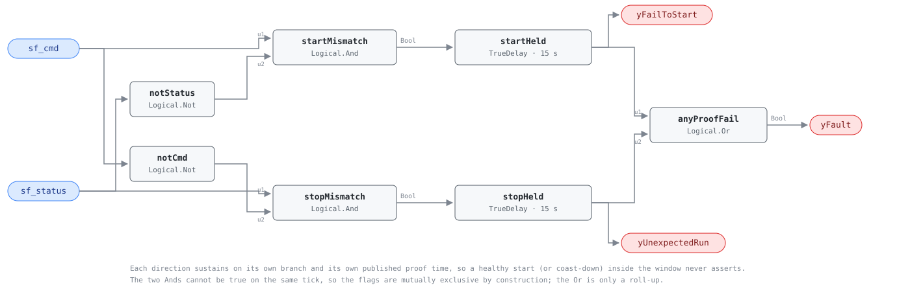

## Description

Almost every AHU rule in this library opens with "while the supply fan is
running." This card checks whether that sentence is true. It compares the run
command the BAS writes against the status the field reports and alarms in
either direction: commanded on with nothing proving (broken belt, tripped
overload, faulted drive, open disconnect), or proving running with no command
behind it (a switch left in HAND, a welded contactor, a miswired output). The
first means an air handler that is not handling air while its trend log looks
scheduled; the second means fan energy and conditioned air nobody asked for.
The finding is also structural — while these two points disagree, no rule
gated on "fan on" is standing on solid ground.

## Detection Logic

```
yFailToStart   = ( sf_cmd AND NOT sf_status ) sustained for start_proof_time
yUnexpectedRun = ( sf_status AND NOT sf_cmd ) sustained for stop_proof_time

yFault         = yFailToStart OR yUnexpectedRun
```

Block graph (`rule.cxf.jsonld`):



Seven blocks, two symmetric branches and a join. Each direction carries its own
published proof time so a healthy start and a healthy coast-down tune apart;
the `Or` is a roll-up holding no state. Every input is a boolean, so the
library's strict-comparison caveat does not arise.

The proof times demand CONTINUOUS mismatch: a command withdrawn mid-window
restarts `startHeld` from zero rather than banking the elapsed seconds.
`delayOnInit = true` on both delays (CDL default `false`) makes a controller
restart into an already-broken fan serve the full window instead of alarming on
its first tick — the case that matters most here, since restarts and fan starts
arrive together at 06:00.

Both sub-condition flags are diagnostic. False on either never means NO_EVAL,
and the rule needs no evaluability output: it is evaluable whenever both points
are delivered, which is the host's delivery-quality job. The one blind spot is
a status chattering faster than the proof window — no mismatch matures and both
flags stay false, which is deliberately the opposite of what `CDL.Logical.Proof`
does with that input (`status_chatter_never_matures`).

## Possible Diagnoses

**`yFailToStart` — commanded on, nothing proving:**

1. **Broken belt or sheared coupling** — the motor turns and no air moves.
   Whether this card sees it at all depends on the status device: a DP switch
   catches it, a current switch only if its trip point was set above the
   motor's no-load current (see `preconditions`)
2. **Tripped motor overload or a dropped-out starter** — the most common single
   cause, and free to confirm at the starter door
3. **VFD in LOCAL/HAND at the keypad, or faulted** — overcurrent, phase loss,
   DC bus, or a drive coasting on a fault-state default. The BAS output is
   correct and nobody downstream is listening
4. **Disconnect open, blown fuse, or phase loss** — lockout-tagout left open
   after a service call is the classic version
5. **A hard-wired safety in the start circuit** — smoke detector, freezestat,
   high-static cutout. The fan will not start and the sequence is working as
   designed; check the safeties before the fan
6. **The status device itself** — failed current switch, DP switch with
   blown-off or plugged tubing, or a setpoint above the real signal. This card
   cannot tell that from a genuinely stopped fan
7. **Wiring** — the BAS output landed on the wrong terminal, or the status
   input did

**`yUnexpectedRun` — running with no command:**

1. **HOA switch in HAND** at the starter or drive keypad, left after a service
   call. The most common cause, and a $0 fix once found
2. **Welded starter contactor or stuck control relay** — the fan cannot be
   stopped from the BAS at all, a safety finding as much as an energy one
3. **Drive running on a local reference or a fault-state default** — SYS-0008's
   diagnosis 5, reached here through the supply fan
4. **A second controller or a local timeclock** writing the same output, or a
   BAS output miswired to a normally-closed contact
5. **The status device stuck true** — a DP switch reading wind or stack draft
   through an open OA damper, or a current switch clamped on the wrong
   conductor

## Energy Impact

PROTECTIVE, HIGH confidence, PROXY_ESTIMATION. The two directions do not share
an energy story. `yUnexpectedRun` wastes the whole fan — `waste_kw =
sf_rated_kw × (sf_speed/100)³`, SYS-0008's formula on host-supplied nameplate
and speed, plus the conditioning penalty on air nobody scheduled, which after
hours is usually the larger term. `yFailToStart` wastes nothing; it costs
comfort, and it costs the coverage of every fan-gated rule that quietly stops
meaning anything. PROXY rather than DIRECT because the rule reads two booleans
and borrows both terms of its formula from the host.

## Emissions Impact

Scope 1 or 2, PROXY_EMISSIONS. The fan is electric everywhere, so its share is
Scope 2 on a marginal operating emissions rate basis; where the air an unbidden
fan pushes is conditioned by a fuel-fired plant, the larger term is Scope 1 and
belongs to the heating rules that see it. No range is published — the quantity
is set entirely by fan size and by how long the condition stood before somebody
read the alarm.

## Deviations

- **`CDL.Logical.Proof` is exported at the pin and was rejected on measured
  behavior, not on availability.** Loaded through the harness at e2ff2f8 it
  alarms on the tick the command changes: with the status stably false, a
  command flip to true at t = 300 s asserted `yLocFal` at t = 300 s, and raising
  `feedbackDelay` from 120 s to 600 s did not move that edge. Its own
  documentation says why — verification begins when the `feedbackDelay +
  debounce` timer or the `debounce` timer lapses, "whichever is first" — so a
  fan with a settled status gets no spin-up grace and every morning start
  alarms.
- **Three further semantic gaps, any one disqualifying.** Proof publishes a
  single window (`feedbackDelay + debounce`) for both directions where this
  family needs two independently tunable times, because spin-up and coast-down
  are different physics. It sets BOTH outputs true on an unstable measurement
  (its documented step 1) — the probe latched `yLocFal` at t = 30 s and
  `yLocTru` at t = 210 s on a status chattering every 30 s — a third state this
  card's mutual-exclusivity claim does not admit. And it latches rather than
  sustains: its outputs held until a rising edge of stable equality cleared
  them, 60 s (one `debounce`) after agreement returned.
- **So the graph is composed from four verified export classes** — `Logical.Not`
  ×2, `Logical.And` ×2, `Logical.TrueDelay` ×2, `Logical.Or` — in SYS-0008's
  per-branch-sustain shape. The cost is that this library now owns proof
  semantics it would otherwise inherit from CDL; the benefit is two published
  times, flags that fall when the condition does, and flags that mean what the
  card says.
- **Mutual exclusivity is structural, not asserted.** `startMismatch` needs
  `sf_cmd` and `stopMismatch` needs `NOT sf_cmd`, so they cannot be true on one
  tick, and a `TrueDelay` outputs false whenever its input is false, so neither
  flag outlives its branch. `direction_flip_never_asserts_both` pins the
  handover, including the real 120 s gap in `yFault` between the two.
- **Both proof times ship at G36's 15 s, transcribed, with the argued
  device-physics numbers demoted to retune guidance.** The card originally
  argued 120 s from drive ramps and coast-down; the standard's own number for
  exactly this alarm exists (§5.16.13.2) and published beats argued — PMP-0003
  set the family pattern by transcribing its pump clauses' 15 s / 60 s pair.
  The cost is pinned, not hidden: `slow_status_device_alarms_at_the_shipped_default`
  shows the transient a 45 s ramp manufactures at the default. They remain two
  parameters so a site can move either clock alone.
- **`delayOnInit = true` on both delays** (CDL default `false`) is the library's
  standing choice and does real work here specifically: controller restarts
  cluster at the same hour as fan starts, and the default would turn every
  restart-into-a-starting-fan into an alarm.
- **No evaluability output; both extra outputs are direction flags.**
  SCHEMA.md's two kinds are easy to confuse and these are SYS-0008's kind. The
  rule is evaluable whenever both booleans are delivered, so the only NO_EVAL
  condition is a delivery failure — which the graph cannot see and the host
  already owns. Hosts treating every non-`yFault` boolean as a gate will read
  this card backwards.
- **No `adjudicates` and no `suppresses`, although this rule plainly casts doubt
  on `sf_status`.** `adjudicates` judges a point's DATA validity, and here the
  point is usually telling the truth: under `yFailToStart` the fan really is
  stopped, and under `yUnexpectedRun` `sf_status` is the honest half while the
  command is the lie — marking it `invalid_while_active` would tell AHU-0026 and
  SYS-0008 to discard a correct reading at the moment it matters. Suppression is
  wrong for the same reason: those rules are usually right and this one is
  naming their cause. Two of the twelve diagnoses do accuse the status device,
  and the rule cannot pick them out of the other ten — which is an argument for
  reading the list, not for adjudicating the point. So the consequence ships as
  prose: an active `yFault` means the fan-on precondition is contested and hosts
  should apply NO_EVAL pressure to fan-gated rules.
- **Severity 2 / PROTECTIVE, mirrored from PMP-0001 and VFD-0001**, the shipped
  command-versus-status relatives, rather than from AHU-0018's CRITICAL_WASTE.
  This card's product is proof integrity; where the unexpected run is also
  after-hours waste, AHU-0018 fires on the same event with its own numbers.
- **HIGH confidence claims the verdict, not the diagnosis; PROXY_ESTIMATION
  splits the two directions.** No model, no threshold, no derived quantity —
  "these two booleans have disagreed for two minutes" is exactly what the graph
  computes and reports, so the breadth lives in the twelve-item diagnosis list
  rather than in the verdict (PMP-0001 chose MEDIUM for a rule whose flow
  conjunct carries real measurement risk). On the energy side
  DIRECT_MEASUREMENT would oversell `yFailToStart`, which has no term at all,
  and QUALITATIVE_ONLY would undersell `yUnexpectedRun`.
- **`g36: null` with verified clause citations in `source`.** §5.1.6 defines
  'proven' and §5.16.13.2 is this fault as G36's own alarm (15 s, Level 2 /
  Level 4 by direction) — verified against the standard text. The `g36` field
  carries transcribed-AFDD lineage, and G36's AFDD routine has no
  command-vs-status fault, so the citations live in `source` (HW-0009's family
  stance). The shipped windows ARE the alarm's 15 s; outlasting real device
  latency and drive ramps is the params' retune guidance, not the default.
- **`playbooks: [proof-of-operation, vfd-pump-faults]`.** The family playbook
  (authored with this batch) owns the HOA/overload/belt/contactor walk and the
  status-device-type question; vfd-pump-faults stays bound for its drive
  fault-code and command-tracking steps, which cover the VFD diagnoses.
- **`clusters: []`.** `clusters/clusters.json` defines no proof-of-operation
  cluster, and CLU-09 (Sensor Integrity Failure) is the wrong home for the
  reasons the `adjudicates` bullet gives. The cluster set is
  orchestrator-maintained and this card does not edit it.
- **No published test vectors exist.** Every scenario in `vectors.json` is
  authored from the equation above and replayed against the pinned engine rev,
  including both proof-time edges at tick resolution.

## Notes

Read this card before trusting any fan-gated verdict on the same air handler.
AHU-0026 asks whether the OA damper is open while the fan runs unoccupied and
SYS-0008 asks whether exhaust and supply move together; both take `sf_status` at
face value, and while `yFault` is active that face value is what is in dispute.
A proof failure poisons the precondition of the whole fan-gated family, which is
why it ships as a first-class rule rather than a data-quality note.

The gap worth naming: there is no proof-of-operation playbook. Someone standing
at the AHU needs the HOA-switch-and-overload walk, the belt check, and the
current-switch-versus-DP-switch question this card's `preconditions` turns on.
