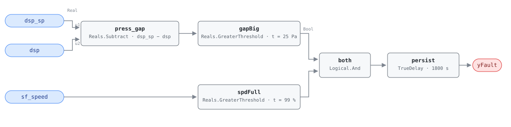

## Description

The fan is at the stop and the duct is still short of pressure. Everything
downstream depends on that pressure: VAV boxes throttle against it to hold zone
airflow, and when it is not there the boxes run wide open and still starve. The
fan itself has nothing left to give — the control loop has already asked for
everything and the measurement has not moved — so the deficit is mechanical, not
a tuning problem. A belt slipping on its sheaves, a fire/smoke damper that
closed and never reopened, a filter bank loaded past its change-out point, or a
VFD that has silently derated all read the same way from the outside.

This is a protective fault, not an energy fault. Its value is that it catches
the mechanical failure early — a slipping belt is a $50 part before it shreds
and a service call after — and it explains complaints that would otherwise be
chased zone by zone. The energy story is real but secondary and indirect: a fan
pinned at 100% against a leaking or obstructed duct burns full fan power to
deliver less than design air.

## Detection Logic

```
press_gap = dsp_sp − dsp
yFault    = (press_gap > dsp_error_threshold)      pressure short of setpoint by more than tolerance
        AND (sf_speed  > speed_full_threshold)     fan has no reserve left
            sustained continuously for alarm_delay
```

Block graph (`rule.cxf.jsonld`):



`press_gap` subtracts the measurement from the setpoint and `gapBig` compares
that deficit against `dsp_error_threshold`, which is the reference's
`dsp < dsp_sp − eps_dsp` rearranged so one positive number carries the
tolerance (see Deviations). `spdFull` is the half that makes the rule mean
anything: pressure below setpoint at part speed is an ordinary control loop
working, and only a loop that has run out of fan is evidence of a defect. Both
comparisons are strict, so a deficit sitting exactly on 25 Pa and a speed
feedback parked exactly on 99.0% both read healthy. `persist` requires 30
minutes of continuous violation, which is what separates a mechanical fault
from a morning start-up, a damper stroke, or the pressure dip after a bank of
boxes opens at once.

## Possible Diagnoses

1. Ductwork obstruction or collapse — a closed fire/smoke damper, a dropped
   internal liner, or debris left after a renovation
2. Fan belt slipping or broken
3. Fan motor or VFD fault — a drive derating on a thermal or current limit
   reports full speed command while delivering less
4. Excessive duct leakage — a disconnected branch or a failed flex connection
   downstream of the sensor
5. DSP sensor fault — a plugged or disconnected sensing tube reads low with a
   perfectly healthy duct behind it

## Energy Impact

PROTECTIVE, LOW confidence, QUALITATIVE_ONLY. There is no waste term to
compute, and the fault is worth acting on regardless of what it costs: the
alarm is about equipment damage and undeliverable airflow, not about
kilowatt-hours. What energy there is comes in through the back door and depends
entirely on the cause. Duct leakage (diagnosis 4) means the fan is producing
air that never reaches a zone, which is genuine waste; an obstruction
(diagnosis 1) means the fan is spending pressure across the blockage instead of
the distribution system. A slipping belt or a derated drive costs comfort and a
repair bill rather than energy. No PNNL measure covers this fault, and the
reference publishes no savings range — hence LOW confidence and no number here.
Climate-neutral: a belt slips the same in January and July. Runtime
estimation, when a leakage or obstruction cause is confirmed, follows Energy
Impact Reference §4.4 applied to fan hours; this rule contributes the hours and
the diagnosis, not the kilowatts.

## Emissions Impact

QUALITATIVE_EMISSIONS, LOW confidence; negligible direct emissions. A fan
already running at 100% draws what it draws whether or not the duct is short of
pressure, so detecting this fault avoids no emissions on its own. Scope is
recorded as `N/A` rather than 1, 2, or 1+2: there is no emitting stream to
attribute, which is the general shape of a PROTECTIVE fault. Any emissions
credit belongs to the repair that follows — a resealed duct or a cleared
obstruction lets a subsequent DSP reset lower the setpoint, and that saving is
AHU-FC-065's to claim. Avoided-emissions basis: N/A.

## Deviations

- **`dsp < dsp_sp − eps_dsp` rewritten in gap form.** The reference compares
  the measurement against an offset setpoint. Implemented that way, `eps_dsp`
  would have to be negated into an `AddParameter` ahead of the comparison;
  subtracting first and testing `dsp_sp − dsp > eps_dsp` is algebraically the
  same statement with `eps_dsp` staying the positive number the reference
  publishes, retunable at one CXF path. Same rearrangement as AHU-FC-062. The
  two forms can disagree by one ulp on a value straddling the threshold, since
  the rounding happens in a different place; at 25 Pa on a signal whose sensor
  resolution is on the order of 1 Pa this is not observable.
- **`sf_speed >= 99%` → strict `>`.** CDL `Reals` has no `GreaterEqual` or
  `GreaterEqualThreshold`, only strict comparisons, so a feedback parked at
  exactly 99.000% reads as not-at-full-speed and the rule stays silent. On a
  real VFD readback the exact-equality case has measure zero — a drive at its
  maximum jitters above 99 — and the strict form errs toward silence, which is
  the right direction for a rule whose alarm dispatches a technician. The
  vectors pin both sides: 99.0% clears with a 75 Pa deficit present, 99.5%
  alarms. A host binding a coarsely quantized speed point (integer percent, or
  a drive that reports a rounded 99) should retune `speed_full_threshold` down
  to 98.9 rather than rely on the drive overshooting.
- **The fan-running condition is a precondition, not a wire.** The reference
  lists "supply fan running" under Preconditions rather than inside its Logic
  row, so it stays in frontmatter for the host to enforce. This is the opposite
  choice from AHU-FC-065, where the reference puts `sf_status = ON` in the
  logic itself and the graph carries it. The distinction is deliberate: the
  block graph mirrors the reference's stated logic, and everything the
  reference calls a precondition stays host-side per the library's stance.
- **Operating states OS 1–5 are declared, not gated.** The reference marks the
  fault applicable in every operating state, so there is nothing to exclude;
  the frontmatter records the applicability and the graph carries no state
  logic.
- **First `PROTECTIVE` fault in the library, and the first with no emissions
  scope.** `category: PROTECTIVE` and `estimation_method: QUALITATIVE_ONLY`
  come straight from the reference card. `emissions.scope` is the literal
  string `"N/A"` — the schema types the field as free text and lint does not
  constrain it, but no prior card needed a null-scope value, so the convention
  is set here.
- **The reference's "normal" test vector doubles as a boundary case.** Its
  350 Pa / 375 Pa / 60% row is NO_FAULT for two independent reasons: the fan is
  not at full speed, and the 25 Pa gap does not clear a strict comparison
  against a 25 Pa threshold. Read alone it would not prove which half kept the
  rule quiet, so `gap_exactly_at_threshold` repeats the same pressures at 100%
  speed to isolate the pressure boundary, and `gap_just_over_threshold`
  (25.1 Pa) takes it from the other side.
- `persist.delayOnInit = true` (Modelica/CDL default is `false`), the library's
  standing choice: a deficit already present at load waits out the full 30
  minutes instead of alarming on the first tick after a controller restart.

## Notes

No playbook is referenced. `playbooks/` currently covers control-sequence and
sensor remediation; nothing there addresses mechanical duct and fan work — belt
inspection, damper position survey, leakage testing — which is what this fault
dispatches. A fan-and-duct-mechanical playbook can adopt it when that family
lands.

Diagnosis 5 is the one to rule out first, because it is the only one that costs
nothing to check and the only one where the duct is fine. A plugged sensing
tube or a disconnected pickup reads low forever, and the fan chases it to 100%
and stays there — which is the same trace as a collapsed duct. Two tells
separate them: a genuine deficit moves when zone demand moves, and a healthy
duct with a bad sensor still delivers zone airflow, so the VAV boxes will not
be complaining. Check the zone flow feedback before pulling access panels.

This fault is the low-side mirror of AHU-FC-065 (fan at excessive static
pressure): the same two signals, read for the opposite failure. Both live at
the extremes of the DSP control band, and they cannot be true at once. If the
DSP setpoint has never been reset from its design value — the case AHU-FC-058
detects, present in 74% of buildings — then this rule is being asked to hold a
pressure nobody chose, and a fan at 100% against an unrealistically high
setpoint is a tuning artifact rather than a broken belt. Confirm the setpoint is
sane before believing the mechanical diagnoses.
