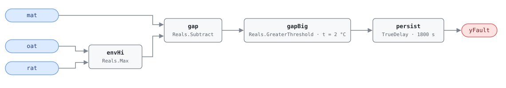

## Description

Mixed air is a blend of outdoor and return air, so it cannot be warmer than
both streams. When MAT reads more than combined sensor accuracy above the
warmer of OAT and RAT, the reading is impossible and something is wrong with
the measurement or the sensor's surroundings: a sensor out of calibration, or
one mounted where sunlight or a warm surface reaches it instead of the mixed
stream.

This is G36 §5.16.14 FC#3, the high half of the mixed-air envelope check. Its
mirror image is AHU-FC-002, which tests the low side; the two share points,
tolerance, and delay and differ only in direction. Both sit inside cluster
CLU-09 (Sensor Integrity Failure), whose trigger AHU-FC-062 tests the same
envelope in both directions at once. Roughly 15% of buildings have at least
one AHU with a temperature sensor this far out.

## Detection Logic

```
yFault = mat > max(oat, rat) + mat_tolerance,
         sustained continuously for alarm_delay
```

Block graph (`rule.cxf.jsonld`):



`envHi` takes the warmer of the two source temperatures, `gap` subtracts it
from MAT, and `gapBig` compares that overshoot against `mat_tolerance` with a
strict `>`. A MAT sitting exactly 2.0 °C above the bound is therefore healthy;
2.1 °C above is not. Which stream is the warmer one flips with the season — in
cooling weather OAT is the upper bound — so `Max` is used rather than a fixed
RAT-above-OAT assumption. `persist` requires 30 minutes of continuous
violation, so a MAT that spikes and recovers during a damper stroke never
alarms; recovery is immediate on the tick MAT drops back inside the bound.

Nothing below the envelope can trip this rule. A MAT 4 °C under both sources
is a genuine violation of the same physics, and this rule reports healthy for
it — that case is AHU-FC-002's.

## Possible Diagnoses

1. MAT sensor out of calibration, reading high
2. OAT sensor out of calibration, reading low
3. RAT sensor out of calibration, reading low
4. Solar gain at the MAT sensor location — the sensor sees radiant heat or a
   sun-struck duct wall rather than the mixed stream

## Energy Impact

COMFORT_ENERGY, LOW confidence, QUALITATIVE_ONLY. There is no waste term to
compute: a mis-read temperature costs nothing directly. The cost is what the
bad reading does downstream — a MAT biased high reads as excess heat in the
mixture, so the mixed-air loop pulls in more outdoor air than the mixture
needs and the coil downstream pays for the difference, as preheat in winter or
as mechanical cooling in summer. PNNL-25985 EEM-01 (sensor recalibration) puts
the recoverable range at 0–5% of site energy across a whole sensor population, sensor-dependent and
climate-neutral. Prevalence ~15% of buildings have sensor faults.

## Emissions Impact

QUALITATIVE_EMISSIONS, LOW confidence; no direct emissions. Scope is recorded
as `1|2` because it depends on which subsystem the bad reading distorts: excess
outdoor air paid for at the preheat coil lands in Scope 1 (on-site combustion),
the same excess paid for at the cooling coil lands in Scope 2 (purchased
electricity). The same drifted sensor can do both in different
seasons, so no single scope is correct year-round. Avoided-emissions basis:
N/A.

## Deviations

- **Single combined tolerance instead of G36's per-sensor error bands.** G36's
  precise form is `MAT_AVG − eps_MAT > max[(RAT_AVG + eps_RAT), (OAT_AVG +
  eps_OAT)]`, with an independent accuracy allowance for each of the three
  sensors. The HVAC FDD Reference deliberately collapsed that to one
  `eps_MAT` applied once, and this card inherits the simplification. One
  combined band is more conservative — it needs a larger true error before it
  fires, so fewer false positives — and correspondingly less sensitive to
  drift in any individual sensor. A site that wants the G36 form needs three
  parameters and an offset block on each sensor path ahead of the `Max`, not a
  retune of this one.
- **Instantaneous samples instead of averaged signals.** G36 compares
  time-averaged temperatures (`MAT_AVG`, `RAT_AVG`, `OAT_AVG`). This rule
  compares the raw samples and leans on the 30-minute `persist` delay to
  reject noise: a transient excursion never survives 30 minutes of continuous
  violation. The two are not equivalent. Averaging tolerates a signal that
  crosses the bound repeatedly while its mean stays outside; persistence does
  not — an oscillating MAT resets the timer on every tick it spends inside the
  envelope and can hide indefinitely. Sensor drift, the fault this rule is
  actually for, is a steady offset and shows up the same way under either
  treatment.
- **Bound comparison rewritten as gap comparison.** The reference computes
  `max(oat, rat) + mat_tolerance` and compares MAT against it. Subtracting
  instead and comparing the gap against a positive threshold keeps
  `mat_tolerance` a single positive `set_param` value and matches AHU-FC-002
  and AHU-FC-062 spelling for spelling: `mat − max > tol ⟺ mat > max + tol`.
  Algebraically identical, one number to retune.
- **Strict inequality at the threshold.** `GreaterThreshold` is `u > t`, so a
  gap of exactly `mat_tolerance` reads healthy — a sensor sitting precisely at
  its rated accuracy stays off the alarm list. CDL Reals offers no
  greater-or-equal comparison, so this is also the only available spelling.
  The vectors pin both sides of the edge (2.0 °C clear, 2.1 °C faulted).
- **Suppression is declared, not encoded.** AHU-FC-062 tests the same envelope
  in both directions with a shorter delay and suppresses this rule while it is
  active. The block graph cannot express that — the engine is status-blind and
  each rule is an independent composite — so the relationship lives in
  `suppressed_by` and in CLU-09, and the host enforces it.
- **Operating states and preconditions are frontmatter, not graph.** G36 scopes
  FC#3 to operating states 1–5 with the supply fan running; freeze-protection
  and the minutes after an economizer mode change are periods when MAT
  legitimately disagrees with the steady-state mixture. All of it is
  host-enforced, per the library's stance.
- `persist.delayOnInit = true` (Modelica/CDL default is `false`): a violation
  already present at load waits out the full 30 minutes rather than alarming on
  the first tick after a controller restart.
- Severity 3 (warning) comes from the reference's chapter 9 card, its only
  severity statement for this fault — the §5.8.1 index carries no severity
  column.
- The reference publishes two test vectors for FC#3 (normal 18/5/22 and too
  high 28/5/22) against three for FC#2. `within_tolerance` in `vectors.json`
  is the mirror of the FC#2 within-tolerance vector, added so both halves of
  the pair pin the same cases; it is labelled as a mirror, not a reference
  vector.

## Notes

The rule finds a contradiction between three sensors; it cannot say which one
is lying. Direction narrows the list — a high MAT means MAT reads high or one
of its bounds reads low, which is why the diagnosis list here is the mirror of
AHU-FC-002's rather than a copy. Solar gain earns a place on this side and not
the other: a sun-struck sensor reads high, never low. Step 1 of the
[sensor-drift](../../../playbooks/sensor-drift.md) playbook resolves the
ambiguity with a portable reference instrument, one sensor at a time.

The persistence asymmetry with AHU-FC-062 is deliberate: the union gate runs a
15-minute delay, this pair runs 30. On a genuine envelope violation the
operator sees AHU-FC-062 first as the integrity alarm — MAT is not
trustworthy, stop believing the rules that consume it — and 15 minutes later
this rule confirms which side of the envelope the reading fell on. If the host
honors `suppressed_by`, that second alarm never displays; it is still worth
computing, because its verdict carries the direction and the diagnosis list
that the union gate cannot.

Fix is on-site: recalibrate against a NIST-traceable reference, or replace
($30–$80 for a temperature sensor). If all three sensors check out, look at the
sensor's mounting — relocating a MAT probe out of a sunlit or radiant spot
fixes what recalibration cannot.
