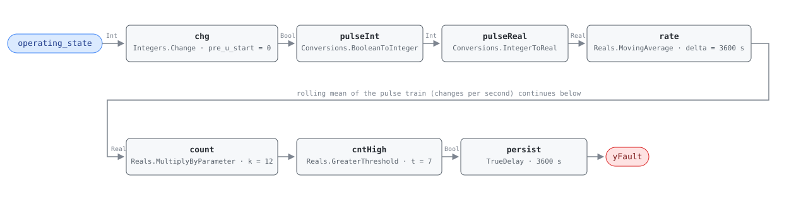

## Description

The sequence cannot decide what it is doing. An AHU walking between heating,
cooling, economizer, and off more than a few times an hour is not following
load — load does not move that fast — it is chasing a changeover threshold with
nothing to hold it on one side. Every transition costs something real: valves
and dampers stroke, control loops restart from a new setpoint and overshoot on
the way, and the air the unit was conditioning one way gets conditioned the
other way a few minutes later. The wear is the part that shows up on an
invoice; the energy is spent on work that cancels itself.

The cause is nearly always a missing or undersized deadband, either in the
changeover logic itself or in the zone demand aggregation feeding it. A second
common cause is upstream noise: one flaky sensor whose reading crosses a
threshold every few minutes will drive the whole unit through the same
oscillation with the sequencing logic working exactly as written. A member
fault of CLU-01 (Simultaneous Heating & Cooling) — a unit that swaps between
heating and cooling states every few minutes ends up doing both within any
window long enough to matter.

## Detection Logic

```
pulse  = (operating_state ≠ previous tick's operating_state)   one tick wide
count  = MovingAverage(pulse, count_window) × count_scale       transitions in the trailing hour
yFault = count > os_max, sustained continuously for alarm_delay
```

Block graph (`rule.cxf.jsonld`):



`chg` is the only block that touches the state value, and all it asks is
whether the value moved. Its `up` and `down` outputs are declared for
completeness and left unconnected — which state the unit moved to says nothing
about whether it is oscillating. `pulseInt` and `pulseReal` carry the one-tick
boolean into the real domain, where the arithmetic lives. `rate` is where the
counting happens, and it is worth being precise about how. `Reals.MovingAverage` is a
continuous-time integral mean: it accumulates `u·dt` and divides by the window.
A one-tick pulse of height 1.0 therefore encloses exactly one tick interval of
area, so `n` transitions inside the trailing hour give
`rate = n · dt / count_window`. Multiplying by `count_scale = count_window / dt`
= 3600/300 = 12 recovers `n` itself. That is the whole trick, and its cost is
that `count_scale` is coupled to the host's tick interval — see Deviations.

`cntHigh` applies the strict threshold, so exactly seven transitions an hour
reads clear and eight alarms; on a signal that can only take integer values in
steady state, that boundary is unambiguous rather than a measure-zero
technicality. `persist` then requires the count to stay above `os_max` for a
full hour, which means roughly two hours of genuine thrashing before anything
is reported — the reference's own `AlarmDelay`, and a reasonable price for not
alarming on a busy morning startup.

## Possible Diagnoses

1. Deadband between modes too narrow — the sequence flips back as soon as it
   has finished acting, because the condition that ended the last mode is the
   condition that starts the next one
2. Fluctuating zone demands near a changeover threshold — the aggregated demand
   signal sits on the boundary and the unit follows every wobble in it
3. Sensor noise causing mode oscillation — one intermittent or poorly located
   sensor crosses the threshold repeatedly and the sequencing logic faithfully
   obeys

## Energy Impact

COMFORT_ENERGY, LOW confidence, QUALITATIVE_ONLY. There is no waste term to
compute from this rule's inputs — it sees a state index and nothing else, so it
cannot say what any transition cost. The reference puts the loss at 1–3% of AHU
energy, split between actuator wear (a maintenance cost that becomes an energy
cost once a stroked-out valve stops seating) and the transitions themselves,
where a coil is charged and then abandoned before the air stream has settled.
Confidence is LOW for the same reason as AHU-FC-056: no controlled study
isolates cycling losses from the deadband change that fixes them, and no PNNL
measure covers sequencing stability. Climate-neutral — a threshold with no
deadband oscillates in any weather, though the shoulder seasons are when the
unit spends the most time near one. Runtime estimation follows Energy Impact
Reference §4.4 (unstable hours × AHU coil and fan power) applied host-side;
this rule contributes the hours.

## Emissions Impact

Scope 1 + 2, QUALITATIVE_EMISSIONS, LOW confidence; on the order of
5–15 kg CO₂e/yr from cycling losses. Both scopes appear because the transitions
being counted cross between them — a unit oscillating between heating and
cooling states burns a little gas at the boiler and a little electricity at the
chiller for the same hour of indecision. The magnitude is small enough that the
number is offered as an order of magnitude, not an estimate. Avoided-emissions
basis: N/A.

## Deviations

- **The reference card is abbreviated and names no points; `operating_state` is
  our choice.** The chapter 9 card for this fault has no Required Points table
  — it states the logic (`os_transitions_per_hour > OS_MAX`) and the tunables
  and stops. This rule binds the host-derived integer point `operating_state`,
  which the dictionary already carries for exactly this purpose. Only
  transitions are consumed and no value is ever interpreted, so any stable
  enumeration binds; the dictionary recommends G36 §5.16.14's OS#1–OS#5 index
  and requires only that the encoding not change under the rule's feet.
- **Rolling count built from a moving average, because the block set has no
  windowed counter.** `Integers.OnCounter` counts monotonically from a reset
  and has no window, so expressing "transitions in the trailing hour" with it
  would need the host to drive a reset every hour — which would turn the
  rolling count into a tumbling one and make the verdict depend on where the
  hour boundary fell. The moving average is genuinely rolling, at the price of
  the scale factor described next.
- **`count_scale` is coupled to the host's tick interval.**
  `k = count_window / dt`, and the default 12.0 is correct only at the 300 s
  tick the vectors use (3600/300). A
  host ticking every 60 s must set `count_scale` to 60.0; leaving it at 12.0
  would report a fifth of the true count and the rule would never fire. This is
  a deployment constraint of the same family as AHU-FC-056's minimum sample
  interval, and it is the one thing about this rule that cannot be got wrong
  quietly — a mis-set `count_scale` produces a plausible-looking number.
- **Minimum tick interval, from the same block.** Each `MovingAverage` instance
  keeps a fixed 64-checkpoint ring and silently drops the oldest in-window
  sample past that (one warning per instance). A window spanning n ticks
  retains n + 1 checkpoints (one sits at or before the trailing edge), so the
  window may span at most 63 ticks: `dt ≥ count_window/63` = 3600/63 =
  **57.15 s** (an earlier revision of this card said 56.25 s, dividing by 64).
  Combined with the scale rule, a legal deployment has `dt ≥ 57.15 s` and
  `count_scale = 3600/dt ≤ 63`. At the default 300 s tick the window holds 12
  samples, well inside the ring.
- **Startup artifact (a): a spurious first-tick pulse, which costs nothing
  here.** `Integers.Change` compares against `pre_u_start` on the first tick, so
  a unit that loads in OS#3 registers a change at t = 0. It does not reach the
  count: the moving average integrates `u·dt`, and `dt` is zero on the first
  tick, so the pulse encloses no area. The `startup_pulse_is_inert` vector pins
  this. `chg.pre_u_start` is written explicitly as 0 in the CXF rather than
  left to the engine default (which is also 0) and is deliberately not exposed
  as a card parameter, since nothing it can do survives past tick 0.
- **Startup artifact (b): the first hour reads as a rate, not a count.** While
  `t < count_window` the moving average divides by elapsed time rather than by
  the window, so two changes in the first ten minutes read as 12/hr — the pace,
  extrapolated. That is a defensible number and arguably the more useful one,
  but it is not the reference's completed-hour count, and a burst at startup can
  hold `cntHigh` true for a while on the strength of it (the
  `warmup_rate_never_asserts` vector shows exactly this, and shows the reading
  collapsing as the window fills). `delayOnInit = true` means no assertion is
  possible before 3600 s, and the frontmatter precondition requires the host to
  report NO_EVAL for that same first hour, so the artifact cannot reach a
  verdict.
- **Strict `>` on a discrete count.** `os_max` is compared with
  `Reals.GreaterThreshold`, so exactly 7 transitions an hour is clear and 8
  alarms — the reference's `> OS_MAX` read literally. The arithmetic is exact at
  the boundary rather than approximately exact: `12.0 × (7 × 300 / 3600)`
  evaluates to precisely 7.0 in IEEE-754, so the `seven_per_hour_stays_clear`
  vector is a real boundary pin and not a near-miss.
- **The counting window is half-open.** `rate` compares the accumulated
  integral now against its value one `count_window` ago, so a transition
  exactly `count_window` old has just left the window. Nothing in the reference
  speaks to this; it matters only for a rule right on the threshold, and it
  errs toward silence.
- **`alarm_delay` equals `count_window`.** Both come from the reference (60 min
  AlarmDelay, per-hour count) but the interaction is worth stating: the count
  must stay above `os_max` for a full hour after first crossing it, so a unit
  needs roughly two hours of sustained thrashing before `yFault` asserts, and a
  burst that ends inside the first hour never reports
  (`thrash_stops_before_delay`).
- **No test vectors are transcribed, because the reference publishes none.**
  The abbreviated card carries no vector table, so the entire suite is authored
  from the equation. Every assertion edge was derived by replaying the graph at
  the pinned engine rev rather than by closed-form arithmetic — the moving
  average is a continuous-time integral mean, and its warm-up and decay
  trajectories do not match hand-computed sample statistics.
- **`related` adds AHU-FC-056.** The reference's Related row lists AHU-FC-050
  only. AHU-FC-056 (SAT hunting) already names this fault as related from its
  side — it is the same instability measured one layer down, inside a single
  control loop — so the link is made reciprocal here.
- Severity 3 (warning) and method `rule`, per the reference's chapter 9 card;
  its §5.8.1 index carries no severity column.
- Operating states OS 1–5 are declared, not gated: the reference marks the fault
  applicable in every state, and there is nothing for the graph to exclude.
- `persist.delayOnInit = true` (Modelica/CDL default is `false`), the library's
  standing choice: a count already above `os_max` at load waits out the full
  hour instead of alarming on the first tick after a controller restart.

## Notes

The fix is a deadband, and it is remote and free. Step 2.1 of the
[simultaneous-hc](../../../playbooks/simultaneous-hc.md) playbook already
specifies the numbers for the heating/cooling case — G36 §5.16's 2.8 °C (5 °F)
minimum between heating and cooling loops — and the same reasoning applies to
whatever pair of states this unit is oscillating between: the condition that
leaves a mode must not be the condition that re-enters it. Before changing the
sequence, confirm the demand signal driving the changeover is not itself the
problem (diagnosis 3); widening a deadband around a noisy input hides the noise
without fixing it, and a sensor that jumps will eventually jump wide enough to
cross any deadband.

This rule and AHU-FC-056 are the same pathology at two altitudes. AHU-FC-056
measures temperature scatter inside one control loop; this one counts how often
the unit changes its mind about which loop should be running. A coil loop
hunting hard enough to swing the unit between operating states trips both, and
that pairing is the strongest evidence for diagnosis 3 — noise upstream of the
sequencing logic. Hunting confined to one coil trips AHU-FC-056 alone.

`count_scale` deserves a line in any deployment checklist. It is the only
parameter in this library whose correct value is a property of the host's clock
rather than of the building, and the failure mode is silent: an oscillating AHU
on a 60 s tick with the default 12.0 reports a steady, believable count of 2.4
per hour and never alarms.
