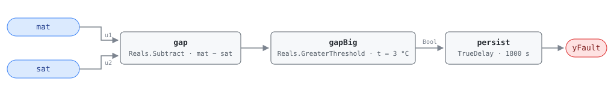

## Description

In heating, air leaves the unit warmer than it arrived: it crosses the supply
fan, which adds about a degree of shaft work, and then a heating coil the
sequence has called for. SAT sitting several degrees *below* MAT under those
conditions is not a control error — something in the unit is taking heat back
out. A cooling coil valve leaking or stuck open, a DX circuit stuck on, or a
sensor pair that disagrees by more than either instrument is rated for.

This is G36 §5.16.14 FC#5, applicable in OS#1 (heating) only; elsewhere a SAT
below MAT is what the sequence asked for. The leaking-cooling-coil diagnosis is
simultaneous heating and cooling seen from the air side, which is why the fault
sits in CLU-01 behind AHU-FC-050: FC-050 catches two valve commands
overlapping, this rule catches one device passing water or refrigerant with no
command raised.

## Detection Logic

```
gap    = mat − sat
yFault = gap > mat_sat_gap_threshold,
         sustained continuously for alarm_delay
```

Block graph (`rule.cxf.jsonld`):



The threshold is G36's `SAT_AVG + eSAT <= MAT_AVG − eMAT + dTSF` rearranged so
one positive number carries the whole allowance (see Deviations). It is not a
sensor tolerance: it is the two sensor bands *minus* the fan rise the air gets
for free, so the rule fires on heat removal that neither instrument error nor
the fan can explain. The comparison is strict, so a gap sitting exactly on
3.0 °C reads healthy where G36's `<=` would call it a fault. `persist` requires
30 minutes of continuous violation — enough to ride out a mode change, a
hot-water loop coming up to temperature, or a valve stroking through its span —
and any interruption restarts the timer.

Nothing about the size of the heating call reaches this rule. A unit whose
heating coil does nothing at all still shows SAT about a fan rise above MAT, so
the gap runs slightly negative and this rule reads healthy; that failure
belongs to the inactive-coil rules.

## Possible Diagnoses

G36 §5.16.14 FC#5, transcribed:

1. SAT sensor error
2. MAT sensor error
3. Cooling coil valve leaking or stuck open
4. Heating coil valve stuck closed or actuator failure
5. Fouled or undersized heating coil
6. HW temperature too low or HW unavailable
7. Gas or electric heat unavailable
8. DX cooling stuck on

Read the list as two groups. Either the sensors are lying (1, 2), or a heat
sink is running against the heating call (3, 8) — and a dead coil behind it
(4–7) makes the gap wide enough to clear the threshold sooner. Diagnoses 4
through 7 explain a missing rise on their own, but not a rise of the wrong
sign, so they reach this rule only in company.

## Energy Impact

EXCESS_CONSUMPTION, MEDIUM confidence, PROXY_ESTIMATION, all three from the
reference's §5.8.1 index row. The waste is a cancellation: the heating source
pays to warm air and a leaking cooling coil or stuck DX circuit immediately
unpays it, so both sides bill.

```
waste_kw >= supply_airflow_m3s × 1.2 × 1.005 × ((mat + dTSF) − sat)
```

A floor, not an equality — it credits the heating coil with no rise at all, and
design airflow stands in for a measured one. The index puts the recoverable
range at 1–4% of site energy against PNNL-25985 EEM-05 (supply air temperature
reset), the nearest catalog measure rather than a study of this failure, so
treat it as an order-of-magnitude bound. Heating-dominant: the rule is only
evaluable in OS#1, so its hours are heating hours.

## Emissions Impact

PROXY_EMISSIONS, MEDIUM confidence. Scope `1+2` because the two halves of the
exchange run at once and land in different inventories: hot water from a gas
boiler or furnace section is Scope 1, electric resistance or a heat pump is
Scope 2, and the cooling side eating the heat is Scope 2 in nearly every
building. Avoided-emissions basis: marginal operating emissions rate (MOER) for
the electric half, static combustion factor for the fuel half.

## Deviations

- **The reference card is abbreviated; G36 is the normative source.** HVAC FDD
  Reference v1.0 carries AHU-FC-005 as a §5.8.1 index row only — no equation,
  tunables, diagnoses, operating-state applicability, or severity. Detection
  Logic and Possible Diagnoses are transcribed from ASHRAE Guideline 36
  §5.16.14 FC#5 as it appears in Addendum u to Guideline 36-2018 (first public
  review, 2021), with the Table 5.16.14.5 defaults (NISTIR 7365 provenance,
  which the addendum notes are biased toward minimizing false alarms).
- **Severity 3 is the library's.** No reference card states one and the §5.8.1
  index carries no severity column; the value matches this chapter's scaffold
  row and every other G36 comparison rule here.
- **The energy profile is the index row's; the emissions split is the
  library's.** `category`, `confidence`, `estimation_method`, and
  `savings_range` are copied from §5.8.1. The index has no emissions column, so
  `scope: 1+2` follows AHU-FC-050's convention for simultaneous
  heating-and-cooling waste (matching mirror card AHU-FC-012), and the runtime
  formula is mirrored from AHU-FC-050's waste term.
- **Combined-epsilon threshold.** `MAT − SAT >= eSAT + eMAT − dTSF` binds one
  positive threshold to one CXF path: 1 + 3 − 1 = 3.0 °C at the Table 5.16.14.5
  defaults. A site that retunes any input recomputes the sum rather than the
  parameter — a measured 2 K fan rise drops the threshold to 2.0 °C, a looser
  eMAT of 4 K for a poorly mixed plenum raises it to 4.0 °C. Same rearrangement
  as AHU-FC-062 and AHU-FC-001.
- **G36's `<=` becomes a strict `>`.** CDL `Reals` offers no greater-or-equal
  comparison; the disagreement has measure zero on a real temperature pair and
  errs toward silence.
- **Instantaneous samples instead of averaged signals.** G36 computes every
  signal as a five-minute rolling average of one-minute samples; this rule
  compares raw samples and leans on the 30-minute `persist` delay. The two are
  not equivalent — averaging tolerates a signal that keeps crossing back while
  its mean stays outside the band, whereas persistence resets on every
  compliant tick, so an oscillating gap can hide indefinitely. A steady offset,
  which is what a leaking valve or drifted sensor produces, reads the same
  either way. Same note as AHU-FC-002.
- **Operating-state applicability and ModeDelay are frontmatter, not graph.**
  G36 scopes FC#5 to OS#1 and suspends every fault condition for 30 minutes
  after a mode change; both are host concerns under this library's stance
  (precedent AHU-FC-063), and a verdict outside OS#1 or inside the transition
  window is NO_EVAL, never healthy. The OS#1 signature the host gates on is G36
  Table 5.16.14.2's: heating coil > 0, cooling coil = 0, OA damper at minimum.
- **Suppression is declared, not encoded.** MAT is an input, so AHU-FC-062 —
  the mixing-box integrity gate — silences this rule while active. The engine is
  status-blind, so it lives in `suppressed_by` for the host to enforce.
- `persist.delayOnInit = true` (Modelica/CDL default is `false`), the library's
  standing choice: a gap already present at load waits out the full 30 minutes
  rather than alarming on the first tick after a controller restart.

## Notes

This rule and AHU-FC-007 are the two G36 heating-side SAT tests, and they fail
differently on purpose: FC-007 says the unit cannot make the air it was asked
for, this one says the unit is making air colder than it found it. A fouled coil
or dead boiler trips FC-007 alone; a leaking cooling valve trips both, which
points at diagnosis 3 or 8 before anything else. Order of work: confirm MAT
first — AHU-FC-062 runs a shorter delay and suppresses this rule — then take the
leaking-valve half of the list to the
[simultaneous-hc](../../../playbooks/simultaneous-hc.md) playbook.
