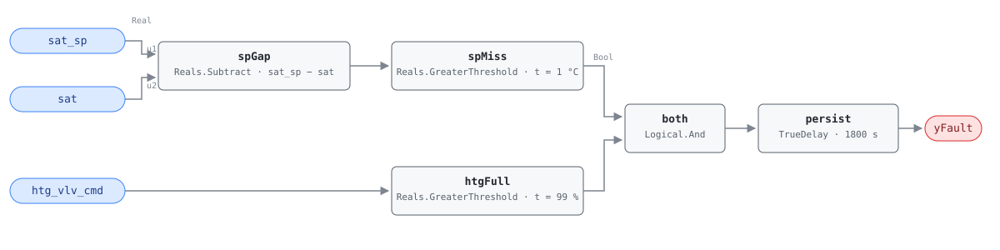

## Description

The heating coil is wide open and the air is still coming out cold. Two signals
settle that: the coil command has reached its stop, so the control loop has
already asked for everything it has, and SAT is below setpoint by more than the
sensor could be wrong about. What is left is a capacity, supply, or sensing
problem — the coil cannot deliver, the heat source is not there to deliver, or
the measurement is lying about what did get delivered. None of it is a tuning
question, which is what makes the saturated-valve half of the test worth
carrying: SAT below setpoint at 60% valve command is an ordinary loop working
through a load change.

This is G36 §5.16.14 FC#7, applicable in OS#1 (heating) only, and G36 omits it
entirely on units with no heating coil.

## Detection Logic

```
sp_gap = sat_sp − sat
yFault = (sp_gap       > sat_error_threshold)   SAT short of setpoint by more than sensor error
     AND (htg_vlv_cmd  > hc_full_threshold)     coil has no capacity left
         sustained continuously for alarm_delay
```

Block graph (`rule.cxf.jsonld`):



`spGap` subtracts the measurement from the setpoint and `spMiss` compares that
shortfall against `sat_error_threshold`, which is G36's `SAT_AVG < SATSP − eSAT`
rearranged so the tolerance stays a positive number on one CXF path (see
Deviations). `htgFull` is the half that gives the rule meaning. Both comparisons
are strict, so an error sitting exactly on 1.0 °C and a coil reported at exactly
99.0% both read healthy. `persist` requires 30 minutes of continuous violation,
which is what separates a broken coil from a morning warm-up, a step in the
setpoint reset schedule, or the recovery after a mode change.

The rule reads the coil *command*, not a position feedback, and that is
deliberate: a valve commanded to 100% while its actuator has failed closed is
diagnosis 3, and reading the command is what lets this rule catch it. The cost
is that the rule cannot distinguish a coil that is genuinely wide open and
starved from one that never moved.

## Possible Diagnoses

G36 §5.16.14 FC#7, transcribed:

1. SAT sensor error
2. Cooling coil valve leaking or stuck open
3. Heating coil valve stuck closed or actuator failure
4. Fouled or undersized heating coil
5. HW temperature too low or HW unavailable
6. Gas or electric heat unavailable
7. DX cooling stuck on
8. Leaking or stuck economizer damper or actuator

The list spans three failure modes that look identical from these three points:
the heat never arrives (3–6), something removes it after it arrives (2, 7, 8),
or it arrived and the sensor did not see it (1). Trending MAT alongside SAT
splits the first two groups — that comparison is AHU-FC-005.

## Energy Impact

EXCESS_CONSUMPTION, MEDIUM confidence, PROXY_ESTIMATION, all three taken from
the reference's §5.8.1 index row, which puts the range at 2–5% of AHU energy and
maps no PNNL measure to the fault. The waste depends on the cause, and the three
points cannot tell the causes apart, which is exactly why the estimate is a
proxy. When something is removing heat (diagnoses 2, 7, 8) the unit is paying
twice and AHU-FC-050's simultaneous heating and cooling term sizes it directly.
When the coil is starved or fouled (3–6) the AHU wastes little on its own — it
burns full heating capacity and delivers less than that — but the deficit does
not disappear: terminal reheat, baseboard, or plug-in heaters make it up at
worse efficiency than the central coil would have, and zones with no terminal
heat simply drift below setpoint until someone files a complaint.
Heating-dominant by climate, since the rule can only be evaluated in OS#1.

## Emissions Impact

PROXY_EMISSIONS, MEDIUM confidence. Scope is recorded as `1|2` because the
inventory follows the heat source: hot water from a gas boiler, a gas furnace
section, or a steam coil is Scope 1, while electric resistance heat, a heat
pump, and the terminal reheat that makes up the deficit are usually Scope 2. A
site with a gas boiler and electric reheat pays into both, and the cooling-side
diagnoses (2, 7) add a Scope 2 term of their own. Avoided-emissions basis:
static combustion factor for the fuel half, marginal operating emissions rate
(MOER) for the electric half.

## Deviations

- **The reference card for this fault is abbreviated; G36 is the normative
  source.** HVAC FDD Reference v1.0 carries AHU-FC-007 as a §5.8.1 index row —
  name, impact category, confidence, estimation method, EEM link, savings range
  — with no chapter 9 card behind it, so it publishes no equation, no tunable
  defaults, no diagnoses, no operating-state applicability, no severity, and no
  test vectors. Detection Logic and Possible Diagnoses are transcribed from
  ASHRAE Guideline 36 §5.16.14 FC#7 as it appears in Addendum u to Guideline
  36-2018 (first public review, 2021), with the internal-variable defaults of
  Table 5.16.14.5 (NISTIR 7365 provenance, which the addendum notes are biased
  toward minimizing false alarms).
- **Severity 3 is the library's.** No reference card exists to state one and the
  §5.8.1 index carries no severity column. The value matches the scaffold row in
  this chapter's README and the treatment of the other G36 comparison rules
  here.
- **The energy profile is the index row's; the emissions split is the
  library's.** `category`, `confidence`, `estimation_method`, and
  `savings_range` are copied from §5.8.1 (EXCESS_CONSUMP / MED / PROXY / 2–5%
  AHU), as every 001-range card verified before this one did. The index carries
  no emissions column, so `scope` and `method` are assigned here: `1|2` follows
  AHU-FC-054's convention for a fault whose fuel depends on which diagnosis is
  true. The cause-dependent runtime formula is the library's too; its
  simultaneous-heating-and-cooling branch is AHU-FC-050's term.
- **`SAT_AVG < SATSP − eSAT` rewritten in gap form.** Implemented literally,
  `eSAT` would have to enter the graph as a negative offset ahead of the
  comparison; subtracting first and testing `sat_sp − sat > eSAT` is the same
  statement with the tolerance staying the positive number G36 publishes,
  retunable at one CXF path. Same rearrangement as AHU-FC-001 and AHU-FC-062,
  and the same one-ulp caveat on a value straddling the threshold, which no
  temperature sensor resolves.
- **`HC >= 99%` becomes a strict `>`.** CDL `Reals` has no `GreaterEqual` or
  `GreaterEqualThreshold`, so a coil command parked at exactly 99.000% reads as
  not-at-full-capacity and the rule stays silent — the same deviation and the
  same direction of error AHU-FC-001 documents for fan speed. A host whose valve
  command is quantized to whole percent, or whose controller reports a rounded
  99, should retune `hc_full_threshold` to 98.9 rather than rely on the loop
  overshooting. The vectors pin both sides (99.0 clear, 99.5 faulted).
- **Instantaneous samples instead of averaged signals.** G36 computes every
  signal as a five-minute rolling average of one-minute samples (`SAT_AVG`).
  This rule compares raw samples and leans on the 30-minute `persist` delay to
  reject noise. The two are not equivalent: averaging tolerates a signal that
  keeps crossing back while its mean stays outside the band, and persistence
  does not — an oscillating SAT resets the timer on every compliant tick and can
  hide indefinitely. A steady shortfall, which is what a starved or fouled coil
  produces, reads the same way under either treatment. Same note as AHU-FC-002;
  a unit whose SAT swings across the band rather than sitting under it is
  AHU-FC-056's finding, not this one's.
- **Operating-state applicability and ModeDelay are frontmatter, not graph.**
  G36 scopes FC#7 to OS#1 and suspends every fault condition for 30 minutes
  after a mode change. Both are host concerns under this library's stance
  (precedent AHU-FC-063): a verdict outside OS#1 or inside the transition window
  is NO_EVAL, never healthy. The OS#1 signature the host gates on is G36 Table
  5.16.14.2's: heating coil > 0, cooling coil = 0, OA damper at minimum
  position. Note that the graph's `htg_vlv_cmd > 99` test is not that gate — it
  is the saturation half of the fault condition, and OS#1 admits any heating
  command above zero.
- **No published test vectors.** The reference publishes vectors only for faults
  with full chapter cards. Every scenario in `vectors.json` is authored from the
  G36 equation: both sides of both threshold edges, a warm-up transient shorter
  than `alarm_delay`, a case where the valve backs off and breaks the
  conjunction, and a recovery that clears.
- `persist.delayOnInit = true` (Modelica/CDL default is `false`), the library's
  standing choice: a shortfall already present at load waits out the full 30
  minutes rather than alarming on the first tick after a controller restart.

## Notes

No playbook is referenced. `playbooks/` covers control-sequence, sensor, and
actuator remediation; nothing there addresses coil capacity and heat-supply work
— hot water temperature and flow verification, coil cleaning, strainer and air
vent checks, gas train and heat-source availability — which is what most of this
diagnosis list dispatches. A heating-plant playbook can adopt this fault when
that family lands. The two diagnoses that do have a home today are 2 and 7,
which belong to `simultaneous-hc` through AHU-FC-005 and AHU-FC-050.

Check the setpoint before the coil. A SAT setpoint that never resets
(AHU-FC-057, absent in 74% of buildings) can hold a heating call the unit was
never sized to meet, and a reset schedule that steps the setpoint up faster than
the coil can follow produces exactly this signature for the first few minutes of
every step — which is what the 30-minute delay is there to absorb. Once the
setpoint is confirmed sane, work the supply side before the coil: hot water
temperature and pump status cost nothing to read, and diagnoses 5 and 6 are the
ones that take a whole building's heating with them rather than one unit's.

AHU-FC-013 is this fault mirrored into cooling — SAT too high with the cooling
coil at 100% — and AHU-FC-005 is its companion in the same operating state,
reading MAT instead of the setpoint. Together they separate "cannot make the
air" from "is actively unmaking it": FC-007 alone points at supply or capacity,
FC-007 with FC-005 points at a heat sink running against the heating call.
