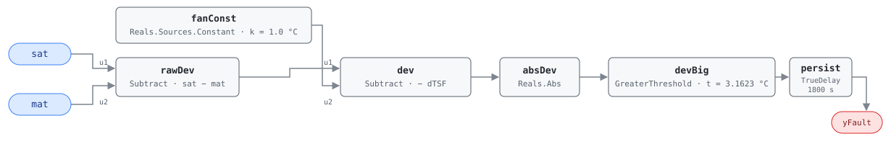

## Description

In OS#2 the air handler runs as a modulating economizer: both coils are
commanded shut, so the only thing between the mixed-air sensor and the
supply-air sensor doing any work is the supply fan. Air should leave at the
temperature it arrived plus the degree or so the fan puts in. A disagreement
larger than the two sensors' combined error after that fan rise is taken out
means something in between is adding or removing heat, or a sensor is not
reporting the stream it is mounted in.

This is the one state where the two sensors can be audited against each other
at no cost — everywhere else a coil is doing work and SAT is supposed to differ
from MAT. The fault is deliberately non-committal about direction: air leaving
too warm points at hot water leaking through a seated heating valve, too cold
at chilled water doing the same. Either way the plant is serving a coil nobody
commanded, which no command-following check can see.

## Detection Logic

```
G36 §5.16.14 FC#8, applies to OS#2 (omitted if the unit has no MAT sensor):

    | SAT_AVG − dTSF − MAT_AVG | > sqrt(eSAT² + eMAT²)

with the Table 5.16.14.5 defaults:

    | sat − 1.0 − mat | > sqrt(1² + 3²) = 3.1623 °C

yFault = (|sat − fan_rise − mat| > combined_error), sustained for alarm_delay
```

Block graph (`rule.cxf.jsonld`):



Fan rise and sensor error do different jobs, which is why they are separate
parameters: `fan_rise` positions the center of the acceptance band —
the difference the unit is expected to show — and `combined_error` sets its
half-width. Retuning one does not imply retuning the other. The fan-heat term
is a constant source into a `Subtract` rather than an `AddParameter` with a
negative parameter, so `fanConst.k` holds the physical quantity with its
physical sign and a host that measures a 1.4 °C rise can set 1.4 (precedent:
AHU-FC-055's `designConst`).

G36's comparison is already strict, so `GreaterThreshold` reproduces it exactly
and a deviation of exactly 3.1623 °C reads healthy in both. `persist` requires
30 minutes of continuous violation and any interruption restarts the timer.

## Possible Diagnoses

Per G36 §5.16.14 Table 5.16.14.8, FC#8:

1. SAT sensor error — cheapest to rule out with a hand-held reference in the
   supply duct
2. MAT sensor error — harder, since a mixed-air sensor can be in calibration
   and still read a stratified slice of the plenum instead of the mixture
   (AHU-FC-062 catches the gross version)
3. Cooling coil valve leaking or stuck open — chilled water through a valve
   commanded to 0 shows up here and nowhere in the command stream
4. Heating coil valve leaking or stuck open — the mirror case, and the more
   expensive one in this state: the unit chose free cooling because outdoor air
   was useful, and boiler energy is being spent to undo it

## Energy Impact

COMFORT_ENERGY, LOW confidence, QUALITATIVE_ONLY — the grades in the
reference's §5.8.1 index row, which maps the fault to PNNL-25985 EEM-01 (sensor
recalibration) and publishes savings as sensor-dependent. Nothing is estimated
from the rule's inputs: two temperatures and no airflow give no power term, and
the difference is ambiguous between a lying sensor and a leaking valve. Those
have very different costs — a drifted sensor burns nothing directly, while a
valve leaking through in free cooling burns plant energy continuously, and
worse than the same leak elsewhere because the unit entered OS#2 on the finding
that outdoor air could do the job unaided. Climate-neutral.

## Emissions Impact

QUALITATIVE_EMISSIONS, LOW confidence; the block is library-assigned, as the
§5.8.1 index carries no emissions column. Scope `1|2` because the equation
cannot tell which coil is leaking: a hot water valve passing flow lands in
Scope 1 (Scope 2 for electric resistance or heat pump heat), a chilled water
valve or stuck DX circuit in Scope 2. The sensor-error diagnoses have no direct
emissions. Avoided-emissions basis: N/A — no quantity is estimated.

## Deviations

- **The reference card is an index row, so this card is built from G36.**
  §5.8.1 gives the code, the name, and the energy grades, with no equation,
  vectors, or severity. The equation, OS#2 applicability, four diagnoses, and
  internal-variable defaults are transcribed from ASHRAE Guideline 36 §5.16.14
  as it appears in Addendum u to Guideline 36-2018 (first public review, 2021).
- **Severity 3 is library-assigned.** The index has no severity column, and
  G36's Level 3 alarm grading (§5.16.14.16) is a reporting priority rather than
  a ranking. The value matches every other G36 001-range card here.
- **Energy profile follows the §5.8.1 index row** (COMFORT_ENERGY / LOW /
  QUAL, EEM-01, savings "sensor-dependent"); the emissions block is
  library-assigned.
- **Root-sum-square threshold shipped as one number.** G36 writes the bound as
  `sqrt(eSAT² + eMAT²)`; the graph carries the evaluated 3.1623 °C in
  `devBig.t`, so a host retunes one parameter and no square root runs at
  runtime. The composition is spelled out in the parameter description because
  the arithmetic is not linear: a 4 °C mixed-air sensor gives sqrt(1 + 16) =
  4.1231 °C, not 1 + 4.
- **No boundary deviation for this fault.** FC#8's comparison is already strict
  (`>`), unlike the `≥`/`≤` forms elsewhere in Table 5.16.14.8 (FC#5, FC#12,
  FC#14, FC#15), so no measure-zero rewrite is involved. Same finding as
  AHU-FC-009 and AHU-FC-011.
- **Fan heat enters as a constant signal, not a negative parameter.** An
  `AddParameter` with `p = −1.0` computes the same deviation but stores the fan
  rise with an inverted sign, so a host setting a measured value through
  `set_param` would double the error instead of correcting it.
- **Instantaneous samples instead of averaged signals.** G36 compares 5-minute
  rolling averages sampled at 1-minute intervals; this rule compares raw
  samples and leans on the 30-minute `persist` delay. Not equivalent —
  persistence resets on every compliant tick, so an oscillating difference can
  hide indefinitely, while a drifted sensor and a leaking valve are steady
  offsets and read the same either way. (Honesty note carried from AHU-FC-002.)
- **Suppression is declared, not encoded.** AHU-FC-062 gates MAT integrity and
  silences this rule while active; the engine is status-blind, so the
  relationship lives in `suppressed_by` for the host to enforce.
- **Operating-state gating and NO_EVAL are frontmatter, not graph.** G36 scopes
  FC#8 to OS#2 (§5.16.14.9b), suspends evaluation for ModeDelay after a mode
  change, and suspends it entirely when the AHU is off (§5.16.14.11). A host
  that evaluates in OS#1 or OS#4 will see this rule assert continuously —
  correctly by the equation and meaninglessly in fact, because a working coil
  is exactly what the difference is measuring.
- `persist.delayOnInit = true` (Modelica/CDL default is `false`): a deviation
  already present at load waits out the full 30 minutes rather than alarming on
  the first tick after a controller restart. Library-wide choice, per
  AHU-FC-050.

## Notes

This rule and AHU-FC-010 are the G36 pair testing whether two temperatures that
ought to be equal actually are, and both are close cousins of AHU-FC-062.
FC-062 tests *containment* — MAT inside the OAT–RAT envelope — a law that holds
in every operating state; these two test *equality*, which holds in one state
each, and size their bands as the root-sum-square of two specific sensors'
error. The pair also splits the AHU at the fan: FC-010 compares MAT against
OAT, both upstream, and carries no fan-heat term. Run the
[sensor-drift](../../../playbooks/sensor-drift.md) playbook before touching a
valve — a hand-held reference settles the SAT question in minutes, and a sensor
runs $30–$80.
