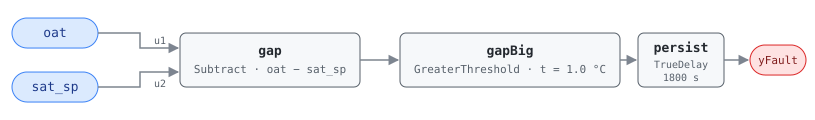

## Description

The unit is running as a modulating economizer while outdoor air is too warm to
reach the supply setpoint. In OS#2 both coils are shut and outdoor air is the
only cooling in the machine; it enters at OAT and picks up roughly 1 °C
crossing the supply fan, so once OAT is above `SATSP − dTSF` no damper position
gets supply air down to setpoint. The unit belongs in OS#3, with mechanical
cooling on top of a fully open damper.

The fault names a changeover that did not happen: the high-limit logic should
have handed off and did not, or the OAT the logic reads is not the OAT the unit
is breathing, or something is quietly supplying cooling that keeps the SAT loop
looking satisfied. Within CLU-03 (Economizer Failure) this is the mirror of the
trigger AHU-FC-051 — that rule catches an economizer that will not open when
outdoor air is useful, this one catches one still open after it stopped being.

## Detection Logic

```
G36 §5.16.14 FC#9, applies to OS#2:

    OAT_AVG − eOAT > SATSP − dTSF + eSAT

rearranged to gap form:

    oat − sat_sp > eOAT + eSAT − dTSF = 1 + 1 − 1 = 1.0 °C

yFault = (oat − sat_sp > oat_excess_threshold), sustained for alarm_delay
```

Block graph (`rule.cxf.jsonld`):



Everything G36 spreads across both sides of the inequality — two sensor error
bands and the fan-heat correction — collapses into the single positive
`gapBig.t`, so a host retunes one parameter instead of reasoning about which
side each term lives on. The gap is signed, and its sign is the physics:
negative means free cooling has headroom, positive means the damper is out of
moves, and the threshold sets how far past zero the gap must go before sensor
error stops being a plausible explanation.

G36's comparison is already strict, so `GreaterThreshold` reproduces it exactly
and a gap of exactly 1.0 °C reads healthy in both. `persist` requires 30
minutes of continuous violation and any interruption restarts the timer;
recovery is immediate on the tick the gap falls back under the threshold.
Either input can open the gap — a setpoint reset walking toward a colder target
crosses the same line a warming afternoon does.

## Possible Diagnoses

Per G36 §5.16.14 Table 5.16.14.8, FC#9:

1. SAT sensor error — the SAT loop chases a reading that is not the supply air
   and holds the unit in economizer mode at a setpoint outdoor air cannot reach
2. OAT sensor error — a sensor reading low keeps the changeover logic convinced
   free cooling is viable; cheapest of the three to rule out
3. Cooling coil valve leaking or stuck open — invisible to the command in OS#2,
   but real cooling, and it can hold SAT near setpoint where outdoor air alone
   never could, so the unit has no reason to change over

## Energy Impact

COMFORT_ENERGY, LOW confidence, QUALITATIVE_ONLY — the reference's §5.8.1 index
row, which maps the fault to PNNL-25985 EEM-06 (OA damper faults). The
immediate symptom is lost cooling capacity: the unit cannot make setpoint,
zones drift warm, and VAV boxes open chasing supply air that never gets cold
enough. No waste term is computable from two temperatures with no airflow, coil
state, or counterfactual mode. The secondary cost depends on the diagnosis — a
leaking cooling valve runs a chiller against a coil nobody commanded, while a
delayed changeover mostly costs comfort until mechanical cooling engages.
Cooling-dominant by construction.

## Emissions Impact

QUALITATIVE_EMISSIONS, LOW confidence, Scope 2. Every path out of this fault
runs on purchased electricity — chiller or DX capacity engaging late, fan
energy moving air that is not cold enough, and in the leaking-valve case
compressor work nobody asked for. No on-site combustion is involved: OS#2 has
the heating coil commanded shut, and a heating valve leaking in this state is
FC#15's finding, not this one's. Avoided-emissions basis: N/A.

## Deviations

- **The reference card is an index row, so this card is built from G36.**
  §5.8.1 gives the code and the name and nothing else. The equation, OS#2
  applicability, three diagnoses, and internal-variable defaults are
  transcribed from ASHRAE Guideline 36 §5.16.14 as it appears in Addendum u to
  Guideline 36-2018 (first public review, 2021).
- **Severity 3 is library-assigned.** The reference publishes none; the value
  matches this chapter's scaffold row and every other G36 001-range card here.
  G36's own Level 3 alarm grading (§5.16.14.16) is a reporting priority rather
  than a ranking, but it points the same direction.
- **Energy profile matches the §5.8.1 index row** (COMFORT_ENERGY / LOW / QUAL,
  EEM-06, savings "sensor-dependent"), mirroring AHU-FC-002 and AHU-FC-003; the
  emissions block is library-assigned. Scope 2 is narrower than the `1|2` those
  cards use, because unlike a mis-read MAT this fault cannot drive heating:
  OS#2 has the heating coil shut by definition.
- **Combined-epsilon threshold.** G36 puts `eOAT` on the measured side and
  `dTSF` and `eSAT` on the setpoint side, which would bind one card parameter
  to three block parameters with two signs. `oat − sat_sp > eOAT + eSAT − dTSF`
  puts one positive number on one CXF path, algebraically identical, with the
  composition recorded in the parameter description. Same move as AHU-FC-062
  and AHU-FC-002.
- **The default assumes a local OAT sensor.** G36 gives eOAT as 1 °C at the
  unit and 3 °C for a global sensor, and the library ships the local value. A
  site feeding this rule from a campus or weather-service OAT must set
  `oat_excess_threshold` to 3.0 °C (3 + 1 − 1); leaving it at 1.0 makes the
  rule fire on sensor disagreement G36 considers within tolerance.
- **No boundary deviation for this fault.** FC#9's comparison is already strict
  (`>`), unlike the `≥`/`≤` forms elsewhere in Table 5.16.14.8 (FC#5, FC#12,
  FC#14, FC#15), so no measure-zero rewrite is involved.
- **Instantaneous samples instead of averaged signals.** G36 compares 5-minute
  rolling averages sampled at 1-minute intervals; this rule compares raw
  samples and leans on the 30-minute `persist` delay. Not equivalent —
  persistence resets on every compliant tick, so an oscillating OAT can hide
  indefinitely, while the steady offset this rule is for reads the same either
  way. (Honesty note carried from AHU-FC-002.)
- **Operating-state gating and NO_EVAL are frontmatter, not graph.** G36 scopes
  FC#9 to OS#2 (§5.16.14.9b), suspends evaluation for ModeDelay after a mode
  change, and suspends it entirely when the AHU is off (§5.16.14.11). The
  engine is status-blind and the graph computes fault-given-valid-data only
  (precedent AHU-FC-063). A host that evaluates in OS#3 will see this rule
  assert on every warm afternoon, correctly by the equation and meaninglessly
  in fact.
- `persist.delayOnInit = true` (Modelica/CDL default is `false`): a gap already
  open at load waits out the full 30 minutes rather than alarming on the first
  tick after a controller restart. Library-wide choice, per AHU-FC-050.

## Notes

The instructive property of this rule is only visible next to its pair.
AHU-FC-009 and AHU-FC-011 test the same two points against the same epsilons
and both account for the same 1 °C fan rise, but FC#9 **subtracts** fan heat
(threshold 1.0 °C) while FC#11 **adds** it (3.0 °C): fan heat narrows the
usable free-cooling band from the top and widens it from the bottom, so the
too-warm test fires sooner and the too-cold test waits longer. A site on a
global OAT sensor recomputes both — 3.0 °C here, 5.0 °C for AHU-FC-011 — and
they do not scale together. Check the OAT sensor before anyone edits changeover
logic (step 1.2 of the
[economizer-failure](../../../playbooks/economizer-failure.md) playbook): a
sensor reading low produces this exact signature with the sequence working.
