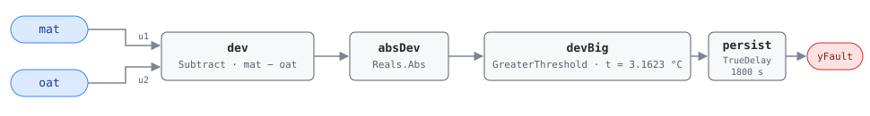

## Description

In OS#3 the unit has opened the outdoor air damper to 100% and closed the
return damper, and is running mechanical cooling on top. Mixed air is then not
a mixture at all — it is outdoor air, one plenum downstream — so the two
sensors are measuring the same stream at two points and should agree to within
their combined accuracy.

When they do not, either a sensor is lying or the return damper is not where
the command says it is. The second case is the expensive one: return air in a
building that needs cooling is warmer than the outdoor air the economizer just
chose, so every degree of leak-through arrives at the coil as load the unit did
not need to buy, and the damper feedback will not show it. This is the
outdoor-air-side counterpart to AHU-FC-008, which audits the supply and
mixed-air sensors in free cooling; between them the two G36 equality tests
cover most of the unit's temperature instrumentation using only operating
states the sequence already visits.

## Detection Logic

```
G36 §5.16.14 FC#10, applies to OS#3 (omitted if the unit has no MAT sensor):

    | MAT_AVG − OAT_AVG | > sqrt(eMAT² + eOAT²)

with the Table 5.16.14.5 defaults and a local OAT sensor:

    | mat − oat | > sqrt(3² + 1²) = 3.1623 °C

yFault = (|mat − oat| > combined_error), sustained for alarm_delay
```

Block graph (`rule.cxf.jsonld`):



There is no fan-heat term, and its absence is physics rather than omission:
both sensors sit upstream of the supply fan, so whatever the fan adds is added
after the comparison and cancels out of it. AHU-FC-008 straddles the fan and
must correct for it.

The sign of `dev` carries the diagnosis even though the rule discards it.
Positive — mixed air warmer than outdoor — is the leaking return damper in
cooling weather. Negative is a sensor story: no amount of recirculated building
air pulls a mixture below the outdoor stream when the building is warmer than
outdoors. A host that wants the direction keeps the two temperatures alongside
the verdict.

G36's comparison is already strict, so `GreaterThreshold` reproduces it exactly
and a deviation of exactly 3.1623 °C reads healthy in both. `persist` requires
30 minutes of continuous violation and any interruption restarts the timer.

## Possible Diagnoses

Per G36 §5.16.14 Table 5.16.14.8, FC#10:

1. MAT sensor error — out of calibration, or reading a stratified slice of the
   plenum rather than the stream (AHU-FC-062 catches the gross version)
2. OAT sensor error — cheapest to rule out, and usually placement: a sensor on
   a sun-struck wall or above a condenser reads high all afternoon
3. Leaking or stuck economizer damper or actuator — the return damper is not
   sealing, or the outdoor damper never reached the 100% it reports

## Energy Impact

COMFORT_ENERGY, LOW confidence, QUALITATIVE_ONLY — the grades in the
reference's §5.8.1 index row, which maps the fault to PNNL-25985 EEM-01 (sensor
recalibration) and publishes savings as sensor-dependent. Two temperatures and
no airflow give no power term, and the difference is ambiguous between a lying
sensor and a leaking damper. On the damper diagnosis the waste is direct and
continuous: recirculated return air arrives at the coil warmer than the outdoor
air the economizer selected, and the chiller pays for as long as the leak
lasts. On the sensor diagnoses the cost is indirect — the same bad reading
feeds AHU-FC-055, AHU-FC-064, and the changeover logic. Cooling-dominant, since
OS#3 exists only when the unit is making cold air.

## Emissions Impact

QUALITATIVE_EMISSIONS, LOW confidence; the block is library-assigned, as the
§5.8.1 index carries no emissions column. Scope 2: every path out of this fault
lands on the cooling plant — chiller or DX work spent on recirculated air, and
fan energy moving it. No on-site combustion is involved, since OS#3 has the
heating coil commanded shut and a heating valve leaking in this state reports
as FC#15. That is why this card is narrower than AHU-FC-008's `1|2`, which
cannot tell which coil is leaking. Avoided-emissions basis: N/A.

## Deviations

- **The reference card is an index row, so this card is built from G36.**
  §5.8.1 gives the code, the name, and the energy grades, with no equation,
  vectors, or severity. The equation, OS#3 applicability, three diagnoses, and
  internal-variable defaults are transcribed from ASHRAE Guideline 36 §5.16.14
  as it appears in Addendum u to Guideline 36-2018 (first public review, 2021).
- **Severity 3 is library-assigned.** The index has no severity column, and
  G36's Level 3 alarm grading (§5.16.14.16) is a reporting priority rather than
  a ranking. The value matches every other G36 001-range card here.
- **Energy profile follows the §5.8.1 index row** (COMFORT_ENERGY / LOW /
  QUAL, EEM-01, savings "sensor-dependent"); the emissions block is
  library-assigned.
- **Root-sum-square threshold shipped as one number.** G36 writes the bound as
  `sqrt(eMAT² + eOAT²)`; the graph carries the evaluated 3.1623 °C in
  `devBig.t`, so a host retunes one parameter and no square root runs at
  runtime. The composition is spelled out in the parameter description because
  the arithmetic is not linear.
- **The default assumes a local OAT sensor.** G36 gives eOAT as 1 °C at the
  unit and 3 °C for a global one. A site feeding this rule from a campus sensor
  or weather service must set `combined_error` to sqrt(9 + 9) = 4.2426 °C;
  leaving it at the local value makes the rule fire on disagreement G36
  considers within tolerance. The two G36 equality tests do not retune
  together — AHU-FC-008's threshold does not move at all, since it contains no
  OAT term.
- **No boundary deviation for this fault.** FC#10's comparison is already
  strict (`>`), unlike the `≥`/`≤` forms elsewhere in Table 5.16.14.8 (FC#5,
  FC#12, FC#14, FC#15), so no measure-zero rewrite is involved. Same finding as
  AHU-FC-009 and AHU-FC-011.
- **Instantaneous samples instead of averaged signals.** G36 compares 5-minute
  rolling averages sampled at 1-minute intervals; this rule compares raw
  samples and leans on the 30-minute `persist` delay. Not equivalent —
  persistence resets on every compliant tick, so an oscillating difference can
  hide indefinitely, while a drifted sensor and a leaking damper are steady
  offsets and read the same either way. (Honesty note carried from AHU-FC-002.)
- **Suppression is declared, not encoded.** AHU-FC-062 gates MAT integrity and
  silences this rule while active; the engine is status-blind, so the
  relationship lives in `suppressed_by` for the host to enforce.
- **Operating-state gating and NO_EVAL are frontmatter, not graph.** G36 scopes
  FC#10 to OS#3 (§5.16.14.9c), suspends evaluation for ModeDelay after a mode
  change, and suspends it entirely when the AHU is off (§5.16.14.11). A host
  that evaluates at minimum outdoor air will see this rule assert on every cold
  morning, correctly by the equation and meaninglessly in fact, because mixing
  return air is what the damper is for.
- `persist.delayOnInit = true` (Modelica/CDL default is `false`): a deviation
  already present at load waits out the full 30 minutes rather than alarming on
  the first tick after a controller restart. Library-wide choice, per
  AHU-FC-050.

## Notes

This rule and AHU-FC-008 are the G36 pair testing whether two temperatures that
ought to be equal actually are, and both are close cousins of AHU-FC-062.
FC-062 tests *containment* — MAT inside the OAT–RAT envelope — a law that holds
in every operating state; these two test *equality*, which holds in one state
each. A unit whose MAT sits inside the envelope and still disagrees with
outdoor air by 4 °C on full outdoor air passes the gate and fails here, which is
the point of running both. The outdoor air fraction AHU-FC-055 and AHU-FC-064
compute puts MAT and OAT in numerator and denominator at once, so an error big
enough to trip this rule moves that ratio further still. Run the
[sensor-drift](../../../playbooks/sensor-drift.md) playbook before anyone opens
the mixing box, and check where the outdoor sensor is mounted — sun on the
housing produces this signature with a calibrated element inside.
