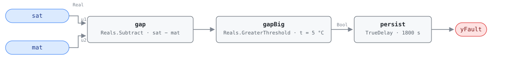

## Description

Air crossing an air handler in a cooling-side state can gain a little heat from
the supply fan and nothing else. When SAT reads more than the combined sensor
and fan-heat allowance above MAT, the stream is picking up heat from a source
that should not be running: a gas or electric stage stuck on, a heating valve
leaking through, or a heating coil that never closed when the unit left OS#1.
The alternative is that one of the two sensors is lying, which is the same
finding pointed at a different part.

This is G36 §5.16.14 FC#12, and it is AHU-FC-005 read in the mirror: that rule
tests the heating side, where SAT is supposed to be *above* MAT. Both are
statements about the sign of the temperature change across the unit, and each
is evaluated only in the operating states where its sign is the expected one.

A heating source active while the unit is cooling is simultaneous heating and
cooling under another name, which puts this rule in cluster CLU-01 behind
AHU-FC-050. The difference is what each rule can see: AHU-FC-050 needs both
valve commands and catches the conflict at the command layer, while this rule
reads two temperatures and catches it at the air stream — including the case
AHU-FC-050 misses, where the heating command reads zero and heat arrives
anyway.

## Detection Logic

```
gap    = sat − mat
yFault = gap > sat_mat_gap_threshold,
         sustained continuously for alarm_delay
```

Block graph (`rule.cxf.jsonld`):



G36 writes the test as `SAT_AVG − eSAT − ΔTSF ≥ MAT_AVG + eMAT`. Moving the
constants to one side gives `SAT − MAT ≥ eSAT + eMAT + ΔTSF`, which is one
subtraction against one positive threshold: `gap` computes the rise across the
unit and `gapBig` compares it against 5.0 °C, the composed allowance. The
comparison is strict, so a gap sitting exactly on 5.0 °C reads healthy and
5.1 °C does not. `persist` requires 30 minutes of continuous violation, which
is what separates a stuck heat source from a heating stage finishing its
off-cycle purge; recovery is immediate on the tick the gap falls back inside
the allowance.

Nothing below the threshold can trip this rule, including a gap of −20 °C. A
cooling coil that has stopped cooling shows up here only once the air is
actively being heated; the case where SAT merely fails to reach setpoint with
the valve wide open is AHU-FC-013's.

## Possible Diagnoses

Transcribed from G36 §5.16.14 FC#12:

1. SAT sensor error
2. MAT sensor error
3. Cooling coil valve stuck closed or actuator failure
4. Fouled or undersized cooling coil
5. CHW temperature too high or CHW unavailable
6. DX cooling unavailable
7. Gas or electric heat stuck on
8. Heating coil valve leaking or stuck open

Diagnoses 7 and 8 are what make this a waste fault rather than a capacity
fault: they are the only entries that put energy *into* the stream. Air that
is merely failing to be cooled lands about one fan-heat rise above MAT, not
five degrees above it, so the cooling-side entries usually reach this rule in
combination — a leaking heating coil that a working chilled-water coil had been
masking becomes visible the moment the cooling capacity goes away.

## Energy Impact

EXCESS_CONSUMPTION, MEDIUM confidence, PROXY_ESTIMATION, with a savings range
of 2–5% of AHU energy — the §5.8.1 index row, which is the only energy
statement the reference makes about this fault (no chapter card, no EEM
mapping). The waste has two halves — the heat someone paid to add, and the
cooling paid to remove it again —
and `waste_kw = supply_airflow_m3s × 1.2 × 1.005 × (sat − (mat + dTSF))` sizes
the first; the second is a further charge of roughly the same magnitude at the
plant's efficiency. Design airflow substituting for a measured one is what
keeps the term a proxy. MEDIUM rather than HIGH because the rule cannot
separate its waste diagnoses from its sensor diagnoses: a mis-calibrated SAT
sensor draws the identical trace and wastes nothing, and the formula run on it
returns a number for waste that does not exist. Cooling-dominant, since the
rule is evaluated only in cooling-side states.

## Emissions Impact

PROXY_EMISSIONS, MEDIUM confidence. Scope is recorded as `1+2`, following
AHU-FC-050: when the fault is real both inventories are being paid into at the
same moment — gas heat adding energy (Scope 1) and purchased electricity
driving the chiller that removes it again (Scope 2). The `1` is contingent on
the heat being combustion; on an all-electric unit the whole exchange collapses
to Scope 2. The heating-side mirror AHU-FC-005 records the same exchange as
`1|2` for exactly that contingency, so the pair is inconsistent on notation
rather than on physics: `1+2` reads as the simultaneity, `1|2` as the fuel
ambiguity, and both are describing one heat source fighting one cooling source.
When the cause turns out to be a sensor there is nothing to attribute at all.
Avoided-emissions basis: marginal operating emissions rate (MOER) for the
electric half, static combustion factor for the fuel half.

## Deviations

- **The reference card is abbreviated; G36 is the normative text here.** The
  HVAC FDD Reference carries AHU-FC-012 only as a §5.8.1 index row — a name, an
  energy profile, and nothing else. No chapter 9 card, so no equation, no
  internal variables, no test vectors, no severity, no diagnosis list, no
  preconditions. The detection logic on this card is transcribed from ASHRAE
  Guideline 36 §5.16.14 FC#12 as it appears in Addendum u to Guideline 36-2018
  (First Public Review, 2021), including the possible-diagnosis list verbatim.
  Where the two sources could conflict, G36 wins, because it is the only one
  that states the rule.
- **Combined threshold instead of three separate allowances.** G36's
  `SAT_AVG − eSAT − ΔTSF ≥ MAT_AVG + eMAT` carries three constants: eSAT = 1 °C
  (supply-air sensor), eMAT = 3 °C (mixed-air sensor), ΔTSF = 1 °C (temperature
  rise across the supply fan), all NISTIR 7365 defaults that the addendum notes
  are "intentionally biased toward minimizing false alarms". Rearranged to gap
  form they compose into a single positive threshold of 5.0 °C bound to one CXF
  path, `gapBig.t`, so a host retunes one number through `set_param` instead of
  three. The arithmetic to recompute it is `eSAT + eMAT + ΔTSF`: a site that
  drops eMAT to 1 °C for a local calibrated sensor sets the threshold to 3.0,
  and one that measures a 2 °C fan rise sets it to 6.0. Same rearrangement as
  AHU-FC-062 and AHU-FC-001. The two forms can differ by one ulp on a value
  straddling the threshold, since the rounding lands in a different place; at
  5 °C on sensors rated to ±1 °C this is not observable.
- **G36's `≥` becomes a strict `>`.** CDL `Reals` has no `GreaterEqual` or
  `GreaterEqualThreshold`, only strict comparisons, so a gap of exactly 5.000 °C
  reads healthy where G36 would report the fault. The disagreement has measure
  zero on a real temperature signal and errs toward silence, which is the right
  direction for a rule whose alarm dispatches a technician. The vectors pin both
  sides (5.0 °C clear, 5.1 °C faulted). A host binding coarsely quantized
  temperatures — integer °C, or a BAS that rounds to 0.5 — should retune
  `sat_mat_gap_threshold` down to 4.9 rather than rely on the signal overshooting.
- **Instantaneous samples instead of 5-minute rolling averages.** G36 computes
  every signal in §5.16.14 as a 5-minute rolling average with 1-minute sampling
  (`SAT_AVG`, `MAT_AVG`); this library consumes instantaneous points and lets the
  30-minute AlarmDelay stand in. The two are not equivalent, and the honesty note
  from AHU-FC-002 applies unchanged: averaging tolerates a signal whose mean sits
  outside the bound while it keeps crossing back, persistence does not — an
  oscillating gap resets the timer on every compliant tick and can hide
  indefinitely. The `oscillating_gap_never_alarms` vector demonstrates exactly
  that miss. A steady offset, which is what a stuck heat source and a drifted
  sensor both produce, reads the same either way.
- **Operating states and ModeDelay are host-side preconditions.** G36 scopes
  FC#12 to OS#2-#4 and suspends evaluation for ModeDelay (30 min) after any mode
  change in a served zone group, and §5.16.14 also suspends all fault evaluation
  while the AHU is not operating. None of it is in the graph: per the library's
  stance (precedent AHU-FC-063) operating-state applicability, transition
  windows, and NO_EVAL are host concerns declared in `preconditions`. A verdict
  produced outside OS#2-#4 or inside a transition window is NO_EVAL, never
  healthy. The `omit if no MAT sensor` qualifier G36 attaches to FC#12 is a
  deployment decision of the same kind and lives there too.
- **OS#2 is included on the addendum's own authority.** The published FC#12 row
  applies to OS#3-#4; Addendum u shows the applicability edited to OS#2-#4, which
  is the text transcribed here. Free cooling with a modulating outdoor-air damper
  is a cooling-side state like the other two — the air should not warm crossing
  the unit — so the widened scope is the physically consistent one. A host
  running the unedited 2018 text should gate OS#3-#4 only; the graph is identical
  either way.
- **Severity 3 is the library's, not the reference's.** No chapter card exists
  to state one and the §5.8.1 index carries no severity column. The value
  matches this chapter's README scaffold row and the other G36 comparison rules
  here. G36 §5.16.14 does say every reported fault condition "shall be a Level 3
  alarm", but that is G36's alarm-priority scheme rather than this library's
  1-4 severity scale, so it corroborates the number without supplying it.
- **The energy profile is the index row's; the runtime formula and scope are
  the library's.** `category`, `confidence`, `estimation_method`, and
  `savings_range` are copied from §5.8.1 (EXCESS_CONSUMP / MED / PROXY / 2-5%
  AHU, no EEM mapped), as the verified 001-range cards before this one did. The
  reference stops there, so the proxy formula is this card's, mirrored from
  AHU-FC-005 with the sign flipped — that rule counts heat removed from air the
  heating coil paid to warm, this one counts heat added to air the cooling coil
  pays to remove. Scope `1+2` follows AHU-FC-050 rather than AHU-FC-005's
  `1|2`; see Emissions Impact for why the pair reads differently on notation
  while describing the same exchange.
- **No published test vectors.** The reference publishes none for this fault and
  G36 publishes none for any of them, so `vectors.json` is authored from the
  equation: both sides of the 5.0 °C edge, a sustained stuck-heat case, a
  sensor-error case, a transient shorter than AlarmDelay, a recovery, and the
  oscillation the persistence substitution is known to miss.
- `persist.delayOnInit = true` (Modelica/CDL default is `false`), the library's
  standing choice: a violation already present at load waits out the full 30
  minutes instead of alarming on the first tick after a controller restart.

## Notes

The threshold asymmetry with AHU-FC-005 is worth understanding before either
number is retuned. The heating-side rule tests `MAT − SAT` against
eSAT + eMAT − ΔTSF = 3.0 °C; this one tests `SAT − MAT` against
eSAT + eMAT + ΔTSF = 5.0 °C. The sensor allowances are identical and the fan
heat is what differs: it is expected warming, so it excuses SAT running warm
(widening this threshold to 5) and indicts SAT running cold (narrowing the
heating-side threshold to 3). Same physics, same sensors, opposite sign on one
term.

The two sensor diagnoses are the cheapest to eliminate and the most likely to be
right, so start there. If AHU-FC-062 is also active on the unit, this rule's
verdict is already suspect and the host should be suppressing it — a MAT outside
the OAT/RAT envelope will produce a spurious gap in whichever direction the
sensor has drifted. If the sensors check out, the [simultaneous
heating and cooling](../../../playbooks/simultaneous-hc.md) playbook covers the
remaining work: the heat source is on, and what is left is finding whether the
command, the valve, or the control sequence is responsible.
