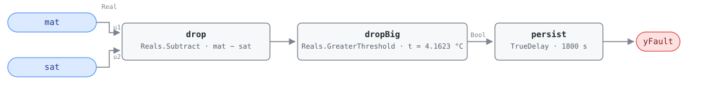

## Description

In OS#1 and OS#2 the cooling coil is closed by definition — G36 identifies both
states partly by `CC = 0`. Air crossing the unit meets the supply fan and
nothing else, so it reaches the supply sensor about a degree warmer than it
left the mixing box. When SAT instead reads several degrees *below* MAT,
something is pulling heat out of the stream: chilled water past a valve that
reports itself shut, or a DX circuit that never got the message to stop.

The waste is worst in OS#1, where every kilowatt the leaking coil removes is a
kilowatt the heating coil is paid to put back — the AHU-FC-050 failure arriving
through a different door. In OS#2 there is no heating bill, but chilled water
is still being made and pumped for air the economizer was cooling for nothing.
This rule and AHU-FC-015 are AHU-FC-050's silent siblings: that rule reads the
two valve *commands* and needs both past 5% open, so a valve reporting 0% and
flowing anyway is invisible to it. This pair reads the temperature signature
and does not care what the command says.

## Detection Logic

```
drop   = mat − sat
yFault = drop > coil_drop_threshold,
         sustained continuously for alarm_delay
```

Block graph (`rule.cxf.jsonld`):



G36 writes the test as `CCET_AVG − CCLT_AVG ≥ sqrt(eCCET² + eCCLT²) + ΔTSF*`,
footnoting the fan-heat factor as included or not depending on where the coil
sensors sit. This library binds `CCET := mat` and `CCLT := sat` — the
instrumentation most air handlers actually have — which brings the proxied
epsilons (3 °C mixed-air, 1 °C supply-air, root-sum-square 3.1623 °C) and puts
the supply fan inside the measurement, so the ΔTSF term applies: 3.1623 + 1 =
4.1623 °C.

Follow that arithmetic, because for a *drop* the fan works against the signal.
Fan heat and coil cooling move the air in opposite directions, so `mat − sat`
measures the true coil drop *minus* one dTSF and a measured 4.1623 °C is a real
drop of about 5.16 °C. The shipped default is therefore doubly conservative —
the direction the addendum says its defaults are chosen for — and sites that
want the sharper test retune (see Deviations).

The comparison is strict, so a drop sitting exactly on 4.1623 °C reads healthy
where G36 would report the fault. `persist` requires 30 continuous minutes and
any interruption restarts the timer, which separates a leaking valve from a
coil giving up the chilled water still standing in it after a state change.

## Possible Diagnoses

Transcribed from G36 §5.16.14 FC#14:

1. CCET sensor error
2. CCLT sensor error
3. Cooling coil valve stuck open or leaking
4. DX cooling stuck on

Under this library's binding, diagnoses 1 and 2 read as MAT and SAT sensor
error, and they are the cheap ones to eliminate first. Diagnosis 3 dominates in
the field and is why the card carries the
[stuck-actuator](../../../playbooks/stuck-actuator.md) playbook: a two-way
valve whose seat has eroded, or an actuator that has lost its close position,
passes water at a command of 0% and no command-based rule will ever see it.
Diagnosis 4 is the DX equivalent — a stuck contactor or a compressor a local
safety has latched on.

## Energy Impact

CRITICAL_WASTE, HIGH confidence, DIRECT_MEASUREMENT, savings 0.5–5% of site
energy mapped to PNNL EEM-03 (leaking coil valves) — the §5.8.1 index row, the
only energy statement the reference makes here. DIRECT_MEASUREMENT is honest in
a way it is not for the abbreviated comparison rules: the two temperatures the
rule already reads *are* the measurement.

```
waste_kw = supply_airflow_m3s × 1.2 × 1.005 × ((mat − sat) + dTSF)
```

The fan's rise is added back because the measured drop under-reports the coil's
work by that much; design airflow is the one substitution. HIGH confidence
because a sustained drop across a coil commanded shut has no benign explanation
other than a sensor, and the sensor case shows up as a drop that does not move
with load. Heating-dominant despite being a cooling fault, following the
operating states: OS#1 is a heating state, and the hours a leaking
chilled-water valve does the most damage are the hours a heating coil is
fighting it.

## Emissions Impact

PROXY_EMISSIONS, scope `1+2`, both library-assigned since the §5.8.1 index
publishes no emissions column. The unwanted cooling is purchased electricity at
the chiller or DX compressor (Scope 2), and in OS#1 the heating that cancels it
follows whatever the plant burns — Scope 1 for gas, Scope 2 for electric
resistance or a heat pump. On an all-electric site the exchange collapses to
Scope 2, and when the cause is a sensor there is nothing to attribute.
Avoided-emissions basis: marginal operating emissions rate (MOER) for the
electric half, static combustion factor for the fuel half.

## Deviations

- **The reference card is abbreviated; G36 is the normative text.** The HVAC
  FDD Reference carries AHU-FC-014 only as a §5.8.1 index row — no equation,
  internal variables, vectors, severity, diagnoses, or preconditions. Detection
  logic and the diagnosis list are transcribed from ASHRAE Guideline 36
  §5.16.14 FC#14 as it appears in Addendum u to Guideline 36-2018 (First Public
  Review, 2021).
- **CCET and CCLT are bound to MAT and SAT.** G36 leaves the instrumentation
  open (§5.16.14.5) and Table 5.16.14.5 supplies the proxied epsilons. The
  consequence is that the rule sees the whole air path from the mixing box to
  the supply sensor: the fan is inside the measurement (handled by dTSF) and so
  is any duct heat gain between coil and sensor (not handled — it biases the
  drop downward and makes the rule quieter still). A site with dedicated coil
  sensors rebinds the two boundary inputs at deployment and retunes
  `coil_drop_threshold` with its own sensor errors; because the fan is then
  outside the pair, that retune also drops the dTSF term.
- **The fan-heat term is included, and for this fault it works against the
  signal.** A measured 4.1623 °C at the threshold is a true coil drop of
  5.16 °C, where the sensor bands alone would justify reporting at 3.16 °C — the
  shipped default demands a leak 63% larger than the noise floor does, and the
  cost is real misses of modest leaks. Two worked retunes for sites that want
  the sharper test: dedicated sensors bracketing the coil with the fan outside
  the pair drop the term entirely (3.1623 with a 3 °C entering band, ≈1.41 with
  a matched ±1 °C pair); keeping the mat/sat binding but accepting G36's noise
  floor on the *true* drop gives sqrt(10) − 1 = 2.1623.
- **G36's `≥` becomes a strict `>`.** CDL `Reals` offers only strict
  comparisons, so a drop of exactly 4.1623 °C reads healthy where G36 reports
  the fault. Measure zero on a real temperature signal, and it errs toward
  silence. A host binding coarsely quantized temperatures should retune the
  threshold down rather than rely on the signal overshooting.
- **The threshold is a rounded constant, not a root-sum-square computed in the
  graph.** sqrt(3² + 1²) + 1 = 4.16227766…, shipped as 4.1623 — high by
  2.2 × 10⁻⁵ °C, four orders of magnitude below the resolution of the sensors
  feeding it, and one number to retune instead of three.
- **Instantaneous samples instead of 5-minute rolling averages.** G36 computes
  every §5.16.14 signal as a 5-minute rolling average with 1-minute sampling;
  this library consumes instantaneous points and lets the 30-minute AlarmDelay
  stand in. Not equivalent — persistence resets on every compliant tick, so an
  oscillating drop (a short-cycling DX stage) can hide indefinitely, while the
  steady leak of a failed valve seat reads the same either way. (Honesty note
  from AHU-FC-002.)
- **Operating states, ModeDelay, and the not-operating suspension are host-side
  preconditions.** G36 scopes FC#14 to OS#1–#2 and suspends evaluation after a
  mode change in a served zone group and whenever the AHU is off; none of it is
  in the graph, per the library's stance. G36 attaches no "omit if no MAT
  sensor" qualifier to FC#14 — it contemplates dedicated coil sensors — but this
  library's binding needs MAT, so the qualifier applies to the shipped rule and
  lives in `preconditions`.
- **Severity 2 is the library's.** The §5.8.1 index carries no severity column.
  Severity 2 puts this fault with AHU-FC-050 and AHU-FC-054 rather than the
  001-range comparison rules at 3, which is where CRITICAL_WASTE and HIGH
  confidence point. G36's Level 3 alarm grading is a priority scheme, not this
  library's 1–4 scale.
- **The energy profile is the index row's; the runtime formula, climate
  sensitivity, and emissions block are the library's,** reasoned from the
  operating states the fault is evaluated in.
- `persist.delayOnInit = true` (Modelica/CDL default is `false`), the library's
  standing choice: a violation already present at load waits out the full 30
  minutes instead of alarming on the first tick after a controller restart.

## Notes

In OS#1 this rule overlaps AHU-FC-005, which tests the same two sensors in the
same direction against a narrower 3.0 °C threshold and therefore alarms first
on any leak large enough to trip both; the value of this rule there is its
diagnosis list, which names the cooling coil and the DX circuit directly. It
stands alone in OS#2. The threshold asymmetry between the two is about how
sensor bands compose — linearly for AHU-FC-005, in quadrature here — and the
fan-heat term then moves opposite ways, leaving this rule the quieter despite
the tighter bands. Start at the sensors, since a MAT reading high or a SAT
reading low produces this trace with nothing wrong in the mechanical room; an
active AHU-FC-062 should already be suppressing the rule. Then isolate the coil
and watch the drop disappear, and let the stuck-actuator playbook separate a
failed actuator from an eroded seat.
