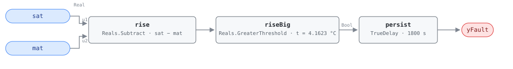

## Description

In OS#2, OS#3, and OS#4 the heating coil is closed by definition — G36
identifies all three states partly by `HC = 0`. Air crossing the unit should
pick up the supply fan's degree of shaft work and nothing more. When SAT reads
several degrees above MAT anyway, hot water is moving through a valve that
reports itself shut, or an electric or gas stage is energized that nothing
called for.

In OS#3 and OS#4 the cooling coil is running at the same time, so every
kilowatt the leaking coil adds is a kilowatt the chiller is paid to remove —
the AHU-FC-050 failure arriving through a different door. In OS#2 the leak
spends the economizer's savings by warming the outdoor air that was supposed to
do the cooling, often pushing the unit into mechanical cooling it did not need.
This rule and AHU-FC-014 are AHU-FC-050's silent siblings: that rule reads the
two valve *commands* and needs both past 5% open, so a valve reporting 0% and
flowing anyway is invisible to it.

## Detection Logic

```
rise   = sat − mat
yFault = rise > coil_rise_threshold,
         sustained continuously for alarm_delay
```

Block graph (`rule.cxf.jsonld`):



G36 writes the test as `HCLT_AVG − HCET_AVG ≥ sqrt(eHCET² + eHCLT²) + ΔTSF*`,
footnoting the fan-heat factor as included or not depending on where the coil
sensors sit. This library binds `HCET := mat` and `HCLT := sat` — the
instrumentation most air handlers actually have — which brings the proxied
epsilons (3 °C mixed-air, 1 °C supply-air, root-sum-square 3.1623 °C) and puts
the supply fan inside the measurement, so the ΔTSF term applies: 3.1623 + 1 =
4.1623 °C.

Here the term is doing physical work rather than bookkeeping. A healthy
draw-through unit with both coils shut already reads `sat − mat` = +1.0 °C.
Drop the term and the test charges that degree to the coil: the threshold falls
to 3.1623 °C, a true coil rise of 2.17 °C reports as a leak, and on a unit
whose fan adds more than 3.16 °C the alarm never clears. With the term the
shipped test fires precisely when the coil's own contribution exceeds the
3.1623 °C sensor floor.

The comparison is strict, so a rise sitting exactly on 4.1623 °C reads healthy
where G36 would report the fault. `persist` requires 30 continuous minutes and
any interruption restarts the timer, which separates a leaking valve from a
coil giving up the hot water still standing in it after a state change.

## Possible Diagnoses

Transcribed from G36 §5.16.14 FC#15:

1. HCET sensor error
2. HCLT sensor error
3. Heating coil valve stuck open or leaking

The single-zone version of the same row (§5.18.14, the SZVAV table in Addendum
u) adds "gas or electric heat stuck on", which applies to any unit with a
non-hydronic heat source even though the VAV row omits it.

Under this library's binding, diagnoses 1 and 2 read as MAT and SAT sensor
error, and they are the cheap ones to eliminate first. Diagnosis 3 dominates in
the field and is why the card carries the
[stuck-actuator](../../../playbooks/stuck-actuator.md) playbook: a two-way
valve whose seat has eroded, or an actuator that has lost its close position,
passes water at a command of 0% and no command-based rule will ever see it.

## Energy Impact

CRITICAL_WASTE, HIGH confidence, DIRECT_MEASUREMENT, savings 0.5–5% of site
energy mapped to PNNL EEM-03 (leaking coil valves) — the §5.8.1 index row, the
only energy statement the reference makes here. DIRECT_MEASUREMENT is honest in
a way it is not for the abbreviated comparison rules: the two temperatures the
rule already reads *are* the measurement.

```
waste_kw = supply_airflow_m3s × 1.2 × 1.005 × ((sat − mat) − dTSF)
```

Subtracting the fan rise is not a rounding detail — at the threshold it is 1.0
of a 4.16 °C measured rise, so crediting it to the coil would overstate the
waste by about a third, and more on any smaller leak. Design airflow is the one
substitution. HIGH confidence because a sustained rise across a coil commanded
shut has no benign explanation other than a sensor, and the sensor case shows
up as a rise that does not move with load. Cooling-dominant, following the
operating states: all three are cooling-side, and in OS#3–#4 the leak is paid
for twice, once at the boiler and once at the chiller.

## Emissions Impact

PROXY_EMISSIONS, scope `1+2`, both library-assigned since the §5.8.1 index
publishes no emissions column. The leaked heat is Scope 1 or Scope 2 depending
on the plant (gas boiler versus electric resistance or a heat pump), and the
cooling that removes it again in OS#3–#4 is purchased electricity, Scope 2. On
an all-electric site the exchange collapses to Scope 2, and when the cause is a
sensor there is nothing to attribute. Avoided-emissions basis: marginal
operating emissions rate (MOER) for the electric half, static combustion factor
for the fuel half.

## Deviations

- **The reference card is abbreviated; G36 is the normative text.** The HVAC
  FDD Reference carries AHU-FC-015 only as a §5.8.1 index row — no equation,
  internal variables, vectors, severity, diagnoses, or preconditions. Detection
  logic and the diagnosis list are transcribed from ASHRAE Guideline 36
  §5.16.14 FC#15 as it appears in Addendum u to Guideline 36-2018 (First Public
  Review, 2021); the fourth diagnosis comes from the addendum's single-zone
  table (§5.18.14) and is marked as such.
- **HCET and HCLT are bound to MAT and SAT.** G36 leaves the instrumentation
  open (§5.16.14.5) and Table 5.16.14.5 supplies the proxied epsilons. The
  consequence is that the rule sees the whole air path from the mixing box to
  the supply sensor: the fan is inside the measurement (handled by dTSF) and so
  is any duct heat gain between coil and sensor (not handled — on this fault it
  biases the rise upward and makes the rule slightly louder, the opposite of
  its effect on AHU-FC-014). A site with dedicated coil sensors rebinds the two
  boundary inputs at deployment and retunes `coil_rise_threshold` with its own
  sensor errors; because the fan is then outside the pair, that retune also
  drops the dTSF term.
- **The fan-heat term is included, and here it is what keeps healthy units
  quiet.** Fan heat and coil heat both raise SAT, so the measured rise is the
  true coil rise *plus* one dTSF and the threshold must discount the fan's own
  contribution before charging anything to the coil. Unlike its cooling-side
  twin this rule is not additionally desensitized by the binding, so there is no
  sharper retune of the same kind to offer; sites with a measured fan rise other
  than 1 °C substitute it in the sum directly.
- **G36's `≥` becomes a strict `>`.** CDL `Reals` offers only strict
  comparisons, so a rise of exactly 4.1623 °C reads healthy where G36 reports
  the fault. Measure zero on a real temperature signal, and it errs toward
  silence. A host binding coarsely quantized temperatures should retune the
  threshold down rather than rely on the signal overshooting.
- **The threshold is a rounded constant, not a root-sum-square computed in the
  graph.** sqrt(3² + 1²) + 1 = 4.16227766…, shipped as 4.1623 — high by
  2.2 × 10⁻⁵ °C, four orders of magnitude below the resolution of the sensors
  feeding it, and one number to retune instead of three.
- **Instantaneous samples instead of 5-minute rolling averages.** G36 computes
  every §5.16.14 signal as a 5-minute rolling average with 1-minute sampling;
  this library consumes instantaneous points and lets the 30-minute AlarmDelay
  stand in. Not equivalent — persistence resets on every compliant tick, so an
  oscillating rise (a short-cycling electric stage) can hide indefinitely,
  while the steady leak of a failed valve seat reads the same either way.
  (Honesty note from AHU-FC-002.)
- **Operating states, ModeDelay, and the not-operating suspension are host-side
  preconditions.** G36 scopes FC#15 to OS#2–#4 and suspends evaluation after a
  mode change in a served zone group and whenever the AHU is off; none of it is
  in the graph, per the library's stance. Freeze protection deserves its own
  mention there: a preheat coil driven open to protect itself produces this
  exact signature while doing its job. G36 attaches no "omit if no MAT sensor"
  qualifier to FC#15, but this library's binding needs MAT, so the qualifier
  applies to the shipped rule and lives in `preconditions`.
- **Severity 2 is the library's.** The §5.8.1 index carries no severity column.
  Severity 2 puts this fault with AHU-FC-050 and AHU-FC-054 rather than the
  001-range comparison rules at 3, which is where CRITICAL_WASTE and HIGH
  confidence point. G36's Level 3 alarm grading is a priority scheme, not this
  library's 1–4 scale.
- **The energy profile is the index row's; the runtime formula, climate
  sensitivity, and emissions block are the library's,** reasoned from the
  operating states the fault is evaluated in.
- `persist.delayOnInit = true` (Modelica/CDL default is `false`), the library's
  standing choice: a violation already present at load waits out the full 30
  minutes instead of alarming on the first tick after a controller restart.

## Notes

This rule and AHU-FC-012 test the same sign, on the same two sensors, in
overlapping states, and both exist on purpose. AHU-FC-012 thresholds at
eSAT + eMAT + ΔTSF = 5.0 °C — bands added linearly, worst case — while this one
adds them in quadrature to 4.1623 °C, the sharper composition when the errors
are independent, so this rule alarms first by 0.84 °C of rise. FC#12's
diagnosis list is broad and includes cooling-side capacity failures; FC#15 names
the heating coil and its sensors and nothing else, so a host that wants one
alarm should keep this one. Start at the sensors, since a MAT reading low or a
SAT reading high produces this trace with nothing wrong in the mechanical room;
an active AHU-FC-062 should already be suppressing the rule. Then isolate the
coil and watch the rise collapse to fan heat — or, on electric or gas heat,
check the stage's contactor or safety interlock.
