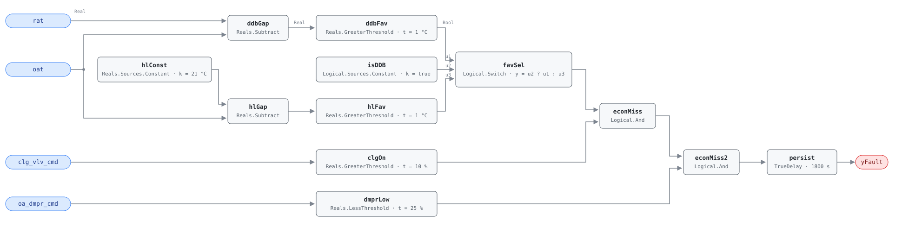

## Description

Outdoor air is cool enough to do the cooling for free, but the outdoor-air
damper sits at or near its minimum position while the cooling coil runs. Every
kilowatt the compressor or chiller spends in that state buys cooling the
economizer was standing by to provide at fan power alone. The fault is common
and cheap to fix: Cowan's 2004 field survey found 54% of RTU economizers
carrying at least one fault, most often a disconnected damper linkage, and the
reference puts economizer faults at roughly 15% prevalence across buildings.
It is the trigger rule for CLU-03 (Economizer Failure) — clearing it should
clear AHU-FC-009 and AHU-FC-011 within a day or two, since a damper that never
leaves minimum also fails every mixed-air and OA-fraction test downstream.

## Detection Logic

```
econ_favorable = (rat - oat)          > temp_deadband   when econ_type_is_ddb
               = (econ_hl_temp - oat) > temp_deadband   otherwise

yFault = econ_favorable
     AND clg_vlv_cmd > cooling_enabled_threshold
     AND oa_dmpr_cmd < econ_damper_threshold
     sustained continuously for alarm_delay
```

Block graph (`rule.cxf.jsonld`):



Both changeover branches are computed on every tick and `favSel`
(`Logical.Switch`, `y = u2 ? u1 : u3`) picks one: `isDDB` selects the
differential branch (`rat - oat`, the default) or the fixed high-limit branch
(`econ_hl_temp - oat`). Subtracting first and thresholding the difference is
what lets one `temp_deadband` serve both branches — at the default 1.0 °C,
outdoor air must be a full degree cooler than the reference before the
economizer is expected to act, which keeps sensor noise around the changeover
point from producing an alarm. All three comparisons are strict, so a damper
parked at exactly 25%, a cooling valve at exactly 10%, or a 1.0 °C temperature
gap does not trip the rule. `persist` then requires 30 minutes of continuous
violation, long enough to ride out damper strokes, changeover transitions, and
the minimum-position dwell an economizer holds while its mixed-air loop settles.

## Possible Diagnoses

1. Economizer control sequence disabled or misconfigured in the BAS
2. OA damper stuck at minimum position (linkage disconnected, blades bound)
3. Damper actuator failure — no power, no air, or a burnt-out motor
4. OAT sensor error, reading higher than actual, which locks out changeover
5. Economizer lockout active when it should not be (seasonal or manual)

## Energy Impact

CRITICAL_WASTE, HIGH confidence, DIRECT_MEASUREMENT. The waste is the
mechanical cooling that free cooling would have displaced, readable straight
off the valve command: `waste_kw = clg_vlv_cmd/100 × ahu_clg_capacity_kw`.
Correcting economizer operation saves 5–20% of cooling energy (PNNL-27338 §3;
PNNL EEM-06, OA damper faults and controls). Confidence is HIGH — the fault
condition is read directly from commands and temperatures, needing no baseline
or model, and both the prevalence and the savings range come from field data
(Cowan 2004; PNNL-27338's AIRCx deployments) rather than simulation. Strongly
cooling-dominant in its climate sensitivity, and most valuable in mild
shoulder-season weather, which is exactly when the damper should be modulating
and exactly when nobody is watching it.

## Emissions Impact

Scope 2, DIRECT_EMISSIONS, HIGH confidence; typical 1,500–8,000 kg CO₂e/yr. The
displaced energy is electric compressor or chiller work, so the entire impact
lands in purchased electricity. Free-cooling hours cluster in mild daytime and
overnight weather, when the marginal generator differs sharply from the annual
average — use the marginal operating emissions rate (MOER), not an average
grid factor, or the estimate will miss by the width of the grid's daily swing.

## Deviations

- The reference's `econ_type` is an enum (`DDB` | `HL_DB`, default `DDB`). This
  rule carries it as the boolean parameter `econ_type_is_ddb` (default `true`)
  driving a `Logical.Switch`. Only two changeover types exist in the reference,
  so a boolean loses nothing, and it gains retunability: a host flips a boolean
  parameter through `set_param` on a deployed rule, whereas an enum would have
  to be smuggled in as an integer with a naming convention bolted on beside it,
  which two values do not earn. A site running enthalpy-based changeover needs
  a different rule, not a third enum value.
- The evaluability gate `|oat - rat| >= TMIN` and the OS-4 (mechanical cooling)
  operating-state restriction are declared as preconditions for host
  enforcement, not encoded in the block graph. Both are data-quality and
  gating concerns, which this library keeps out of the rule per its design
  stance; the rule computes the fault condition given valid data.
- All three comparisons are strict (`>`, `>`, `<`). The reference does not
  specify boundary behavior; strict inequalities keep a damper sitting exactly
  on its minimum-position threshold and a temperature gap sitting exactly on
  the deadband out of the alarm, and the vectors pin that choice.
- `temp_deadband` is one card parameter bound to two CXF paths (`ddbFav.t`,
  `hlFav.t`), matching the reference's single deadband. Only one branch is
  selected at a time, but hosts must still set both paths together — otherwise
  flipping `econ_type_is_ddb` silently changes the deadband.
- `persist.delayOnInit = true` (Modelica/CDL default is `false`), the library's
  standing choice: a violation already present at load waits out the full 30
  minutes instead of alarming on the first tick after a controller restart.

## Notes

With default parameters the vectors exercise only the DDB branch. `vectors/v1`
stages inputs, not parameters, so `isDDB` holds `true` for every scenario in
`vectors.json`: `hlConst`, `hlGap`, and `hlFav` are loaded, evaluated, and
structurally verified on each tick, but their result never reaches `yFault`
through `u3` of the switch. The HL_DB path is behaviorally exercised only by
hosts that set `econ_type_is_ddb = false` via `set_param`. The `u3` wiring was
smoke-tested during authoring by flipping `isDDB.k` to `false` and replaying
cases where the two branches disagree, but that check is not part of the
shipped vectors and did not produce the recorded content ID — a host adopting
the fixed high-limit changeover should run its own commissioning check rather
than inherit confidence from these vectors.

`econ_hl_temp` defaults to 21 °C, near ASHRAE 90.1's 70 °F high limit for
climate zones 4A–5A. Zones 1A–3A allow 75 °F (23.9 °C) and zones 5B–8 use
65 °F (18.3 °C) — retune per the playbook's step 2.2 rather than accepting the
default in a climate it does not fit. Differential dry-bulb, the default here,
sidesteps the question: free cooling enables whenever outdoor air is cooler
than return air, which is the correct test for a site without a humidity-driven
reason to do otherwise.

Verify order within CLU-03: fix this rule first. AHU-FC-009 and AHU-FC-011 read
mixed-air behavior, and a damper pinned at minimum makes both of them fire for
a reason that has nothing to do with their own sensors.
