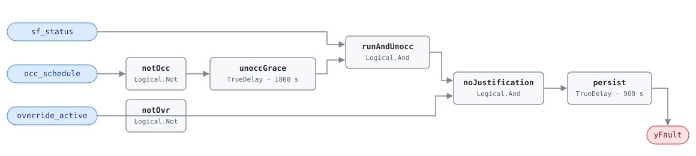

## Description

The supply fan is operating outside the defined occupancy schedule when no
active override or demand condition justifies it. While this fault is active,
essentially the entire AHU energy draw — fan power plus any heating or cooling
of outdoor air — is waste. Roughly 15% of buildings exhibit it, usually from
schedule misconfiguration or a stuck override, and it is the trigger rule for
both the After-Hours Operation (CLU-04) and Schedule Dysfunction (CLU-08)
clusters. It is also among the fastest faults to pay back: the fix is almost
always a $0 schedule or override correction.

## Detection Logic

```
yFault = sf_status
     AND (NOT occ_schedule  sustained for grace_period)
     AND NOT override_active
     sustained continuously for alarm_delay
```

Block graph (`rule.cxf.jsonld`):



`unoccGrace` implements the reference's grace period: the unoccupied state
must persist for `grace_period` before it counts, so normal operation
continuing briefly past schedule end never alarms. `persist` then requires the
full justification-free condition (fan on · unoccupied past grace · no
override) to hold for `alarm_delay`. Any re-occupancy, fan stop, or override
activation resets the corresponding timer. Worst-case time to alarm after
schedule end is `grace_period + alarm_delay` (default 45 min).

## Possible Diagnoses

1. Schedule misconfiguration or incorrect time zone (DST mismatches are a
   common culprit)
2. Stuck override in the BAS (BACnet priority array holding the fan on)
3. Fan relay or contactor stuck closed
4. Occupancy sensor triggering unnecessarily
5. Night setback / morning warmup running too long

## Energy Impact

CRITICAL_WASTE, HIGH confidence, DIRECT_MEASUREMENT. While active, the entire
AHU draw is waste: `waste_kw = ahu_fan_design_kw × (sf_speed/100)³ + active
heating/cooling` (cubed fan law on speed; thermal penalty typically 1.5–3× the
fan energy). Savings range 3–16% of site energy (PNNL-25985 EEM-04 shortened
schedules / EEM-16 night setbacks). Climate-neutral: waste scales with
operating hours, not weather. Prevalence ~15%.

## Emissions Impact

Scope 1 + 2, DIRECT_EMISSIONS, HIGH confidence; typical 3,000–20,000 kg
CO₂e/yr (full AHU energy during unoccupied hours). After-hours waste lands in
evening/overnight hours when the marginal grid generator is often coal or gas
peaking — in solar-heavy regions the nighttime MOER can be 2–3× the midday
value, so this fault's emissions rank can exceed its energy-cost rank.
Avoided-emissions basis: MOER.

## Deviations

- The reference's logic calls `in_occupied_schedule(current_time,
  occ_schedule)` — a schedule-evaluation function over a schedule object. Our
  rule consumes the host-evaluated boolean `occ_schedule` point instead;
  schedule interpretation (time zone, calendar, holiday exceptions) is a host
  concern, consistent with this library's precondition philosophy and with
  223P/Brick having no schedule vocabulary to describe one (see
  `points/ahu.points.json` notes).
- The reference lists `grace_period` as "minutes after schedule end to allow."
  We implement it as a `TrueDelay` on the unoccupied signal, which grants the
  same grace after schedule end and equally after any occupied→unoccupied
  transition — equivalent for schedule-driven hosts, and safer for hosts that
  drive `occ_schedule` from occupancy sensing.
- `delayOnInit = true` on both timers: a controller restart mid-condition
  still waits out the full grace + persistence window (same startup-alarm
  rationale as AHU-FC-050).

## Notes

Remote fix succeeds ~95% of the time at $0 (schedule correction, override
release, setback enablement). When this rule fires, check SYS-FC-052
(lighting) and SYS-FC-053 (exhaust fans) — they frequently share the same
master-schedule root cause, which is why this rule triggers two clusters.
