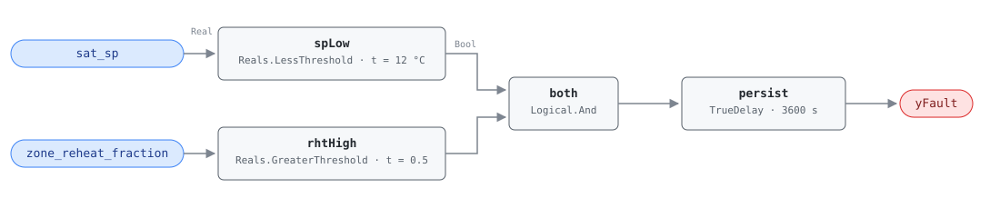

## Description

The supply air temperature setpoint sits below the minimum recommended value
while a large share of the zones served are running reheat. Air colder than any
zone asked for costs chiller energy to make and then costs boiler or electric
reheat energy to undo, so every degree of over-cooling is paid for twice. The
signature is unmistakable in trend data and invisible to occupants — the zones
stay comfortable, which is exactly why a setpoint parked at 10 °C survives for
years. SAT reset is absent in 74% of buildings (PNNL 151-building study), and
this rule is the member fault of CLU-02 that shows the missing reset actually
costing money.

## Detection Logic

```
yFault = sat_sp < sat_sp_low_limit
     AND zone_reheat_fraction > reheat_fraction_threshold
     sustained continuously for alarm_delay
```

Block graph (`rule.cxf.jsonld`):



Two independent threshold tests feed one conjunction and one timer. `spLow`
watches the setpoint, not the measured SAT: this rule is about what the
sequence asked for, while a unit that cannot hold its setpoint (AHU-FC-007,
AHU-FC-013) or hunts around it (AHU-FC-056) is a separate finding. `rhtHigh` supplies the corroboration that turns "cold setpoint" into
"waste" — without a reheat majority, a 10 °C setpoint may simply be serving a
high-load hour. Both comparisons are strict, so a setpoint parked exactly on the
12 °C limit or exactly half the zones reheating does not trip the rule.
`persist` requires 60 minutes of continuous violation, which rides out morning
cool-down, a passing cold deck excursion, and the reheat spike that follows any
occupied-mode transition.

## Possible Diagnoses

1. SAT setpoint too aggressive — set low at commissioning and never reset since
2. SAT reset logic disabled or misconfigured (the CLU-02 root cause; confirm
   with AHU-FC-057)
3. A single rogue zone dragging the AHU setpoint down through the
   trim-and-respond request path — one starved or mis-sensored box can hold the
   whole system at its minimum setpoint

## Energy Impact

EXCESS_CONSUMPTION, HIGH confidence, PROXY_ESTIMATION. The waste is a reheat
integral: `excess_reheat_kw = Σ over reheating zones of (rht_vlv_cmd_i/100 ×
vav_rht_capacity_kw_i)`, plus the chiller energy spent making air nobody
wanted. Raising the setpoint into the reset band saves 5–15% of AHU cooling
plus reheat energy (PNNL-25985 EEM-05 supply air temperature reset and EEM-15
VAV minimum flow reduction, combined — the two EEMs interact, since a high
minimum flow forces reheat that no setpoint change can eliminate).
Heating-dominant by climate: the reheat half of the bill grows with the hours
spent below balance point. Prevalence: 74% of buildings lack SAT reset.

## Emissions Impact

Scope 2, PROXY_EMISSIONS, HIGH confidence; typical 800–5,000 kg CO₂e/yr (excess
cooling plus reheat). Sites with gas or steam reheat move that half of the
inventory into scope 1; the card reports scope 2 because electric reheat and
electric chilling are the common case in the buildings this rule was written
from. Avoided-emissions basis: marginal operating emissions rate (MOER).

## Deviations

- **`rht_vlv_cmd_all` (zone array) → host-derived `zone_reheat_fraction`
  (scalar).** The reference counts reheating zones across a per-zone valve
  command array; library v1 avoids array boundary points, so the host counts
  the zones whose reheat valve exceeds its reheat-active threshold and feeds
  one fraction (flagged `derived` in the point dictionary). Same pattern as
  `zone_dmpr_pos_max` in AHU-FC-058. The reheat-active counting threshold
  (typically >5% valve command) is host configuration, not a rule parameter.
- **`reheat_fraction_threshold` is a fraction 0–1, not a percent.** The
  reference states the threshold as 50%; the point it compares against carries
  unit `1` (dimensionless, range 0–1), so the parameter is 0.5. Hosts feeding a
  0–100 percentage will fire this rule on essentially every tick.
- Both comparisons are strict (`<`, `>`). The reference does not specify
  boundary behavior; strict inequalities keep a setpoint sitting exactly on the
  low limit, and an exact 50/50 reheat split, out of the alarm, and the vectors
  pin that choice.
- The reference tags this fault for both AHU and RTU. This card is the
  AHU-family instance; an RTU-FC-053 would restate it against the RTU's
  discharge setpoint and its zone group.
- Operating-state gating (OS 2, 3, 4 — occupied) and the multi-zone
  precondition are declared in frontmatter for host enforcement rather than
  encoded in the block graph, per the library's design stance.
- `persist.delayOnInit = true` (Modelica/CDL default is `false`), the library's
  standing choice: a violation already present at load waits out the full
  60 minutes instead of alarming on the first tick after a controller restart.

## Notes

AHU-FC-057 and this rule are the two halves of the same CLU-02 story from
opposite ends. FC-057 is the statistical trigger — it proves the setpoint never
moves, using nothing but the setpoint and OAT. This rule is the harm case: the
setpoint is parked low *and* the zones downstream are demonstrably burning fuel
to undo it. FC-057 firing alone is a $0 programming ticket; both firing means
the ticket has a number attached to it. Fix order is FC-057's fix — program the
reset per G36 §5.16.2 (playbook `missing-reset`, step 2.2) — after which this
rule should clear within one occupied day.

The default `reheat_fraction_threshold` of 0.5 is twice as permissive as the
PNNL-27338 AIRCx heuristic quoted in the playbook (step 2.5: more than 25% of
zones with reheat valves above 50% open means the SAT is too low). Sites wanting
AIRCx parity retune `rhtHigh.t` to 0.25 and should expect a higher fire rate.
Before raising the setpoint, check the zone minimum flows: a box with a 40%
minimum will reheat at any SAT, and it will keep this rule firing after the
reset is programmed.
