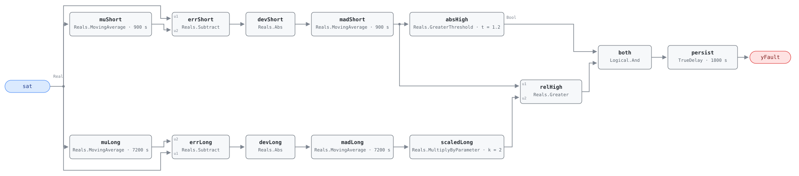

## Description

Supply air temperature swings around its setpoint instead of settling on it.
The signature is scatter, not offset: SAT may average exactly on setpoint while
crossing it every few minutes. An oscillating loop keeps its valve or damper in
continuous motion, wearing the actuator and burning coil energy on overshoot it
then has to undo. The usual cause is proportional gain set too high, or integral
time too short, for the coil's actual authority — often after a valve or
actuator was replaced with a differently sized part. The rule compares the unit
against itself, since some AHUs simply run noisier than others: a fault requires
recent scatter that is both absolutely large and several times the unit's own
baseline. Present in roughly 5% of buildings; severity 3, nothing here is unsafe.

## Detection Logic

```
muShort  = MovingAverage(sat, window)                 muLong  = MovingAverage(sat, long_window)
madShort = MovingAverage(|sat − muShort|, window)     madLong = MovingAverage(|sat − muLong|, long_window)

yFault   = (madShort > oscillation_threshold)     absolute scatter test
       AND (madShort > k × madLong)               onset test: scatter far above this unit's baseline
           sustained continuously for alarm_delay
```

Block graph (`rule.cxf.jsonld`):



Two identical chains run at two timescales. Each takes the moving average of
SAT over its window (`muShort`, `muLong`), subtracts it from the live reading,
takes the absolute value (`errShort`/`devShort`, `errLong`/`devLong`), and
averages that deviation over the same window again (`madShort`, `madLong`) — a
rolling mean absolute deviation, since the engine has no rolling standard
deviation (see Deviations for the conversion). `absHigh` applies the absolute
threshold to the short window; `scaledLong` and `relHigh` apply the ratio test.
Both comparisons are strict. `persist` requires 30 minutes of continuous
violation, which rides out one-off step disturbances — an economizer changeover
or a setpoint reset spikes `madShort` for about one short window and then
flushes out — and `delayOnInit = true` holds that window across a restart.

The ratio test normalizes against the unit's own recent history, so this rule
flags onset, not steady state: hunting that outlasts `long_window` raises
`madLong` until `madShort > k × madLong` no longer holds, and the alarm clears
roughly `long_window`/2 after onset with the loop still hunting. That is a
property of the reference's logic, not of the MAD substitution. Hosts should
hold the work order open after the first assert rather than tracking `yFault`.

## Possible Diagnoses

1. PID loop poorly tuned (oscillating) — gain too high or integral time too
   short for the coil's authority
2. Valve or damper actuator hunting — worn linkage, sticking stem, or a
   positioner fighting its own feedback
3. Conflicting control loops — two sequences acting on the same air stream
   (e.g. a coil loop and a face-and-bypass or mixing loop with overlapping
   ranges)
4. Intermittent sensor signal — a loose SAT wire or failing transmitter reads
   as oscillation with no control defect present

## Energy Impact

COMFORT_ENERGY, LOW confidence, QUALITATIVE_ONLY. There is no direct waste term
to compute: an oscillating loop delivers roughly the right average temperature,
and the loss is in the cycling itself — strokes that overshoot and correct, coil
energy on excursions that cancel out, and the fan and pump work behind them. The
reference puts this at 1–3% of AHU energy while the hunting lasts; confidence is
LOW because no controlled study isolates oscillation losses from the tuning
changes that fix them. Runtime estimation follows Energy Impact Reference §4.4
(hunting hours × AHU coil and fan power) — this rule contributes the hours, not
the kilowatts. Climate-neutral.

## Emissions Impact

Scope 2, QUALITATIVE_EMISSIONS, LOW confidence. Minimal in absolute terms —
control-loop inefficiency, not a stuck-open coil. No avoided-emissions basis is
published for this fault; a host that wants a number should apply its standard
electricity factor to the fan and pump energy attributed above and treat the
result as an order-of-magnitude estimate.

## Deviations

- Rolling standard deviation → rolling mean absolute deviation. The reference
  uses `rolling_std`, and the engine's elementary block set has no variance or
  standard-deviation block, so MAD is computed from four `MovingAverage`
  instances plus a subtract and an absolute value per timescale. MAD and std
  are proportional for any fixed waveform, so the ratio test carries over
  unchanged — the scale factor cancels on both sides of `madShort > k × madLong`.
- The absolute threshold does not cancel, so it is restated in MAD units: for
  Gaussian noise `std = 1.2533 × MAD`, for a pure sine `std = 1.1107 × MAD`, so
  the reference's 1.5 °C std is a MAD of 1.20–1.35. The default takes the lower
  bound, 1.2; a site wanting the conservative end sets 1.35.
- `Reals.MovingAverage` is a continuous-time integral mean, not a sample mean —
  the engine accumulates `u·dt` forward-Euler and divides by the window — so
  hand-computed sample statistics do not match it exactly.
- Each `MovingAverage` keeps a fixed 64-checkpoint ring, so the tick interval
  must be ≥ `long_window/64` = 112.5 s at the default windows. A host ticking
  faster silently shortens the baseline window: the fault still detects, but
  against a truncated baseline.
- The reference's "sufficient data in both windows" precondition is implemented
  host-side. During the first `long_window` after engine start `madLong`
  divides by elapsed time and underestimates the baseline, so the frontmatter
  precondition requires the host to report NO_EVAL for the first 2 h.
- The short window is coarse at realistic tick rates — 900 s at a 300 s BAS
  tick is three samples — which the threshold and the 30-minute timer absorb. A
  faster trend interval smooths it at no cost, subject to the 112.5 s floor.
- `window` and `long_window` each bind two CXF parameter paths (the mean stage
  and the deviation-averaging stage), like `valve_open_threshold` in
  AHU-FC-059. Hosts must set both paths of a window together; splitting them
  changes what the statistic means.
- Both comparisons are strict (`>`). The boundary is pinned by bracketing
  rather than an exact-equality tick, because `madShort` is a computed
  statistic and cannot be parked exactly on 1.2 the way a staged input can.
- The reference states its test vectors as statistical summaries rather than
  tick traces; each is re-expressed here as a SAT trajectory producing the
  stated scatter. The noisy-but-consistent case runs at a larger amplitude than
  the reference's, so the absolute test passes and the ratio test is the only
  thing blocking the fault — at the reference's numbers both tests fail.
- Severity 3 (warning) and method `statistical` follow the reference's chapter
  9 card. This chapter's README lists severity 4 / `rule`; the chapter 9 card
  governs and the index row needs correcting, as it did for AHU-FC-059.
- The reference tags this fault for AHU and RTU; this card is the AHU-family
  instance, and an RTU-FC-056 would restate it against the RTU's discharge-air
  sensor.
- `persist.delayOnInit = true` (Modelica/CDL default is `false`), the library's
  standing choice: a violation already present at load waits out the full 30
  minutes instead of alarming on the first tick after a controller restart.

## Notes

A unit that has hunted for months reads as healthy here until something
disturbs it — catching those needs a cross-unit or absolute-scatter comparison,
which is a Phase 3 rule, not this one.

Diagnosis 4 deserves its precondition: a SAT transmitter with an intermittent
connection produces textbook oscillation statistics behind a perfectly tuned
loop. Read the raw trend before touching tuning parameters — control hunting is
smooth and roughly periodic, a failing sensor is neither. No playbook is
referenced because nothing in `playbooks/` yet covers control-loop tuning.
