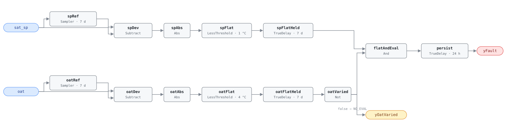

## Description

The supply air temperature setpoint remains fixed over an extended evaluation
window despite varying outdoor-air and load conditions. A functioning SAT
reset (G36 §5.16.2 trim-and-respond) modulates the setpoint warmer as loads
decrease, cutting mechanical cooling and downstream VAV reheat. PNNL's
151-building field study found SAT reset absent in **74% of buildings** — this
rule and its twin AHU-FC-058 are the "74% problem," the trigger pair for
cluster CLU-02, and the fix is a $0 desk-only sequence change worth ~2.5% of
site energy on its own.

## Detection Logic

```
baseline(x)  = x sampled and held every evaluation_window (7 days)
sp_flat      = |sat_sp − baseline(sat_sp)| < sp_flat_tolerance,
               continuously for evaluation_window
oat_flat     = |oat − baseline(oat)| < oat_variation_tolerance,
               continuously for evaluation_window

yOatVaried   = NOT oat_flat        (false ⇒ host reports NO_EVAL)
yFault       = sp_flat AND yOatVaried, sustained for alarm_delay
```

Block graph (`rule.cxf.jsonld`):



Two symmetric chains compare each signal against a weekly sample-and-hold
baseline (`Discrete.Sampler`, which emits the live input on its first tick —
no startup artifact). `spFlatHeld` asserts only after the setpoint has stayed
within tolerance of its baseline continuously for a full window; any reset
activity ≥ 1 °C resets it. `oatFlatHeld` does the same for OAT, and its
negation is `yOatVaried`: "not varied" is defined as a full window of
continuous flatness. In the synchronous dataflow both dwell timers fire on
the same tick in the all-flat case, so the fault conjunction is false by
construction — no boundary race — and `persist` (24 h) filters any residual
transient. Worst-case time to alarm from cold start:
`evaluation_window + alarm_delay` (8 days).

## Possible Diagnoses

1. SAT reset sequence never programmed in the BAS
2. SAT reset sequence disabled by an operator
3. SAT setpoint overridden to a fixed value
4. Trim-and-respond parameters misconfigured
5. Zone request signals not reaching the AHU controller

## Energy Impact

EXCESS_CONSUMPTION, HIGH confidence, PROXY_ESTIMATION (EEM-05). A fixed-low
SAT over-cools the air stream and drives downstream VAV reheat; savings from
enabling reset are 1–4.4% of site energy (2.5% national weighted median),
heating-dominant by climate. Prevalence: 74% of buildings.

## Emissions Impact

Scope 2, PROXY_EMISSIONS, HIGH confidence; typical 800–5,000 kg CO₂e/yr
(excess cooling and reheat). Avoided-emissions basis: MOER.

## Deviations

- Windowed range → deviation from a weekly sampled baseline. The reference
  computes `max − min` over the window and CDL has no windowed min/max, so
  each signal is compared against a `Discrete.Sampler` hold refreshed once per
  window, with tolerances at half the reference ranges. Equivalent detection
  for signals that move and return, slightly conservative for monotonic drift
  within one window. `Reals.MovingAverage` was rejected: the engine implements
  it with a 64-checkpoint ring, so a 7-day window silently degrades at BAS tick
  rates, while the sampler is exact at any tick rate.
- NO_EVAL is surfaced as the second output `yOatVaried`, since boolean block
  logic cannot express a tri-state; false means NO_EVAL, never healthy. Its
  inverted-flat semantics make it optimistically true during the first window
  after startup, when `yFault` cannot fire anyway because `spFlatHeld` needs
  the same full window.
- `AlarmDelay` = 24 h is a `TrueDelay` on the fault conjunction; the evaluation
  window itself is enforced by the flatness dwell timers.
- `delayOnInit = true` on all `TrueDelay`s (startup conservatism per
  AHU-FC-050).

## Notes

Fastest payback in the catalog together with AHU-FC-058: remote fix ~90%,
$0, programmed per G36 §5.16.2 (start 18 °C; trim +0.2 °F when satisfied;
respond −0.5 °F per cooling request; range 13–18 °C). See the
[missing-reset](../../../playbooks/missing-reset.md) playbook.
