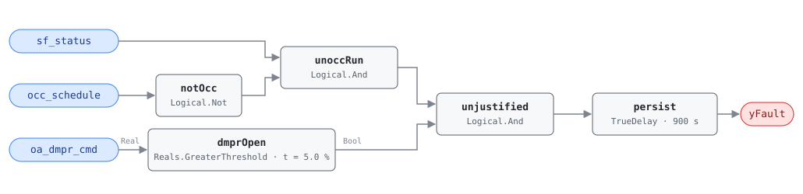

## Description

The air handler runs outside the occupancy schedule with the outdoor air
damper still commanded open. Unoccupied operation — night setback, morning
warmup, a tenant override — needs no ventilation: there is nobody to ventilate
for, so every cubic metre of outdoor air drawn in is heated or cooled to no
purpose. A damper left at its occupied minimum (typically 15–30%) through a
winter night puts the full outdoor-to-return enthalpy difference on the coils
for the entire run. Prevalence is about 10%, and the fix is usually a single
line in the unoccupied sequence.

This rule is the ventilation half of the after-hours pair. AHU-FC-052 asks
whether the fan should be running at all; this one asks whether the fan is
dragging in outdoor air while it runs.

## Detection Logic

```
yFault = sf_status
     AND NOT occ_schedule
     AND oa_dmpr_cmd > oa_closed_threshold
     sustained continuously for alarm_delay
```

Block graph (`rule.cxf.jsonld`):



`unoccRun` establishes that the fan is running while the schedule says
unoccupied; `dmprOpen` tests the damper command against the closed threshold
with a strict comparison, so a damper parked at exactly 5% (leakage band, or a
minimum-position parameter never zeroed but within tolerance) does not alarm.
`persist` requires the combination to hold for `alarm_delay`, which rides out
the damper stroke at a scheduled occupied→unoccupied transition. Any fan stop,
return to occupancy, or damper close resets the timer; a damper that reopens
restarts the full 15 min.

## Possible Diagnoses

1. Minimum OA position not set to 0% in the unoccupied sequence — the damper
   holds its occupied minimum around the clock
2. OA damper stuck open (seized linkage, failed actuator, disconnected crank
   arm)
3. Economizer logic overriding unoccupied damper control — the economizer
   sees a favorable outdoor condition and modulates the damper open without
   consulting occupancy

## Energy Impact

CRITICAL_WASTE, HIGH confidence, DIRECT_MEASUREMENT. The waste is the
conditioning load on unnecessary outdoor air: `waste_kw = (oa_dmpr_cmd/100) ×
design_oa_flow × cp × |OAT − RAT|`. With the damper open, 100% of ventilation
energy during the unoccupied run is waste; measured against total off-hours
energy the correction typically returns 3–10% (PNNL-25985 EEM-06, OA damper
faults; PNNL RetuningOpps A11). Heating-dominant sensitivity: the winter
night is when |OAT − RAT| is largest and the outdoor air must be heated from
design conditions, while a mild or humid summer night is cheaper per unit of
flow. Prevalence ~10%.

## Emissions Impact

Scope 1 + 2, DIRECT_EMISSIONS, HIGH confidence; typical 1,000–8,000 kg
CO₂e/yr for the ventilation energy alone. The split follows the heating
source — scope 1 for the gas burned to temper unnecessary outdoor air, scope 2
for the electric heat or cooling. Because the fault runs overnight, the
electric share should be valued at the marginal rather than average grid rate.
Avoided-emissions basis: MOER.

## Deviations

- **No grace period.** AHU-FC-052 grants `grace_period` (30 min) after the
  occupied period ends before after-hours fan operation counts; this rule
  grants none, matching the reference, and that difference is deliberate.
  Legitimate unoccupied fan operation — setback, warmup, an authorized tenant
  override, or FC-052's own grace window — should still run with the OA damper
  closed. There is no state in which the fan is properly running unoccupied
  and the damper is properly open, so the check alarms after `alarm_delay`
  alone.
- The reference's logic uses a schedule-evaluation predicate over an occupancy
  schedule object; as in AHU-FC-052 we consume the host-evaluated boolean
  `occ_schedule` point, leaving time zone, calendar, and holiday
  interpretation to the host (see `points/ahu.points.json` notes on
  `occ_schedule`).
- Severity 3 (warning), per the reference's chapter 9 card — the reference's
  only severity statement for this fault (its §5.8.1 index carries no severity
  column). This chapter's README previously mistranscribed the severity as 2;
  corrected alongside this card. The ventilation-only waste is a fraction of
  what FC-052 (whole-AHU) costs, and warning severity is the consistent rank
  for it.
- The reference tags this fault for both AHU and RTU. This is the AHU-family
  instance; an RTU sibling would reuse the same block graph against the RTU
  point dictionary.
- `delayOnInit = true` on `persist`: a controller restart mid-condition still
  waits out the full persistence window (same startup-alarm rationale as
  AHU-FC-050 and AHU-FC-052).

## Notes

The remote fix is a sequence edit — zero the minimum OA position in the
unoccupied mode and gate the economizer on occupancy — so it lands in Step 2
of the after-hours-operation playbook. When this rule fires alongside
AHU-FC-052 (the CLU-04 trigger), fix the schedule first: restoring the
unoccupied period often closes the damper as a side effect and clears both.
When it fires *without* FC-052, the schedule is right and the damper sequence
or the actuator is wrong.
