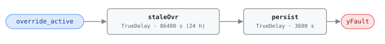

## Description

An override has been active on a control point for longer than any legitimate
troubleshooting session. Overrides are a normal service tool — hold the valve
open, watch the response, release it — but the release is the step that gets
skipped. What was a ten-minute diagnostic becomes the building's permanent
control strategy, invisible to anyone reading the sequence, and it stays that
way until someone audits the priority arrays. Around 10% of buildings carry at
least one; they are a standard retro-commissioning finding (PNNL RetuningOpps
A30, PNNL-27338).

The energy cost is entirely a function of what was overridden — a heating
valve held at 100% is expensive, a nuisance alarm limit is not — so this rule
is rated info severity. Its value is that it turns an invisible condition into
a work order.

## Detection Logic

```
yFault = override_active
     sustained continuously for max_override_duration
     and then held a further alarm_delay
```

Block graph (`rule.cxf.jsonld`):



Two delays in series measure the duration rather than reading it: `staleOvr`
turns true only after `override_active` has been continuously true for
`max_override_duration` (24 h), and `persist` requires a further `alarm_delay`
(1 h) before `yFault` asserts — 25 h total for an override that is never
released. Any release, however brief, drops both timers to false and discards
the accumulated duration, so the alarm only ever describes one continuous
override. An override released and re-applied restarts the full 25 h.

## Possible Diagnoses

1. Temporary override forgotten by the operator after troubleshooting
2. Override set during commissioning and never removed — often predating the
   current operations staff
3. Override set to mask an underlying equipment problem (a failed sensor, a
   stuck actuator), in which case releasing it will expose the real fault

## Energy Impact

EXCESS_CONSUMPTION, LOW confidence, QUALITATIVE_ONLY. There is no per-fault
energy model: the waste depends on which point is overridden and to what
value, spanning from zero (an override that happens to match what the sequence
would command) to the full cost of a disabled control loop. Quantify it after
identifying the point, using the Energy Impact Reference §4.4 framework.
Prevalence ~10% of buildings (PNNL RetuningOpps A30). No PNNL EEM maps to this
fault, which is why detection is worth having: the cost is real but nobody
budgets for it.

## Emissions Impact

Scope 1 or 2, QUALITATIVE_EMISSIONS, LOW confidence, basis N/A. Which scope
applies follows the overridden point: an override on a hot-water valve, boiler
enable, or gas-fired heating stage drives on-site combustion (scope 1), while
an override on a fan, chiller, pump, or electric-heat command drives purchased
electricity (scope 2). An override on a setpoint or damper can drive both at
once. The magnitude range therefore cannot be stated until the point is known.

## Deviations

- **The derived `override_duration` point is dropped.** The reference logic is
  `override_active AND override_duration > max_override_duration`, where
  `override_duration` is a host-computed elapsed time. We measure the duration
  in-rule with a `TrueDelay` chain and consume only `override_active`. This
  keeps the rule deployable against a raw BAS flag with no host-side state
  machine, and it removes a derived point whose semantics (does it reset on
  release? on a value change at the same priority?) would have to be specified
  and trusted. The semantics we implement — continuous override, any release
  resets — match the reference's intent for a stale override.
- The trade-off of in-rule timing is that the duration does not survive a
  controller restart. With `delayOnInit = true` (library stance, see
  AHU-FC-050/052), an override already active for a week re-times from the
  restart and alarms 25 h later. That is the conservative direction — the
  library never asserts a fault it has not observed — but a host that keeps
  its own override history can raise the fault sooner.
- Two delays instead of one: the reference's `AlarmDelay` is separate from
  `max_override_duration`, so we keep both parameters independently tunable
  even though a single 90000 s delay would behave identically at the default
  values. A site that wants a 4 h override limit changes one parameter.
- The reference tags this fault for AHU, RTU, VAV, CHW, and HW. This is the
  AHU-family instance; the block graph is equipment-agnostic and each sibling
  family binds `override_active` from its own point dictionary.

## Notes

Step 2 of the after-hours-operation playbook — release stuck overrides in the
BACnet priority array — is the remote fix for this fault verbatim, which is
why it shares that playbook despite not being a scheduling fault. The two
faults also co-occur: AHU-FC-052 explicitly treats an active override as
justification for after-hours fan operation, so a forgotten override silences
FC-052 while this rule keeps flagging the reason it is silent.

Diagnosis 3 is worth taking seriously before releasing anything. If the
override was masking a failed sensor or a stuck actuator, releasing it will
put the equipment back under a control loop that cannot work — trend the
affected point for a shift after release rather than assuming the fix held.
