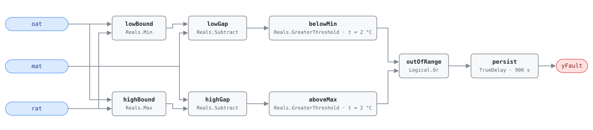

## Description

Mixed air is a blend of outdoor and return air, so its temperature must lie
between the two source temperatures. When MAT falls outside the OAT–RAT
envelope by more than combined sensor accuracy, the physics has been violated
and one of three things is wrong: a temperature sensor is out of calibration,
the MAT sensor is reading a stratified or sun-struck slice of the plenum
rather than the mixture, or the mixing box itself is short-circuiting.

This is APAR Rule 1 (Schein et al. 2006), the sanity check every mixed-air
diagnostic is built on. It is the trigger of cluster CLU-09 (Sensor Integrity
Failure) and the library's first use of the suppression mechanism: while it is
active, the MAT-consuming economizer rules AHU-FC-002 and AHU-FC-003 are
running on data known to be wrong, and their verdicts are worthless. Roughly
15% of buildings have at least one AHU with a mixed-air sensor this far out.

## Detection Logic

```
T_min  = min(oat, rat) − sensor_tolerance
T_max  = max(oat, rat) + sensor_tolerance
yFault = (mat < T_min OR mat > T_max), sustained for alarm_delay
```

Block graph (`rule.cxf.jsonld`):



The graph tests the same condition in gap form: `lowGap` computes
`min(oat, rat) − mat` and `highGap` computes `mat − max(oat, rat)`, and each
gap is compared against `sensor_tolerance` by a strict `GreaterThreshold`. A
gap of exactly 2.0 °C is therefore not a fault; 2.1 °C is. `outOfRange` ORs
the two sides and `persist` requires the excursion to hold for the full
`alarm_delay`, so a MAT that swings out and back during a damper stroke never
alarms. Recovery is immediate: the alarm drops on the tick MAT re-enters the
envelope.

Which bound is which flips with the season — in cooling weather OAT is the
upper bound and RAT the lower — so `Min` and `Max` are used rather than a
fixed OAT-below-RAT assumption. During 100% outdoor-air or 100% return-air
operation the mixture legitimately pins to one bound; `sensor_tolerance`
covers the residual reading error there, which is why the tolerance is a
combined sensor-accuracy allowance and not a mixing-quality threshold.

## Possible Diagnoses

1. MAT sensor out of calibration or failed
2. OAT sensor out of calibration
3. RAT sensor out of calibration
4. MAT sensor in a poor location — plenum stratification or solar gain on the
   sensor rather than the mixed stream
5. Mixing box short-circuiting: OA bypassing the mix and striking the sensor
   directly

## Energy Impact

COMFORT_ENERGY, LOW confidence, QUALITATIVE_ONLY. There is no direct waste
term to compute: a mis-read MAT costs nothing by itself. Its cost is
indirect and can be large — a biased mixed-air reading drives the economizer
to the wrong damper position and can hold a coil open against outdoor air
that would have done the job for free. PNNL EEM-01 (sensor recalibration)
puts the recoverable range at 0–5% of site energy across an entire sensor
population, sensor-dependent and climate-neutral. Prevalence ~15%. The
honest accounting is that this rule's value is the accuracy it restores to
the rules it gates, not savings of its own.

## Emissions Impact

QUALITATIVE_EMISSIONS, LOW confidence; no direct emissions — a sensor reading
neither burns fuel nor draws power. Scope is recorded as `1|2` because it
depends on which subsystem the bad reading distorts: a MAT bias that drives
unnecessary preheat lands in Scope 1 (on-site combustion), while one that
drives mechanical cooling or disables an economizer lands in Scope 2
(purchased electricity). Both can follow from the same drifted sensor in
different seasons, so no single scope is correct year-round. Avoided-emissions
basis: N/A.

## Deviations

- **Bound comparison rewritten as gap comparison.** The reference computes
  `T_min = min(oat, rat) − sensor_tolerance` and `T_max = max(oat, rat) +
  sensor_tolerance`, then compares MAT against them. Implemented directly,
  that needs two parameter values (`−tol` and `+tol`) for one card parameter,
  so a host retuning `sensor_tolerance` via `set_param` would have to know to
  negate one of them. Subtracting instead and comparing the gap against a
  positive threshold keeps a single value on both sides:
  `min − mat > tol ⟺ mat < min − tol`, and `mat − max > tol ⟺ mat > max +
  tol`. Algebraically identical, one number to retune, both paths listed
  under `params.sensor_tolerance.cxf` for hosts to set together.
- **Strict inequality at the threshold.** `GreaterThreshold` is `u > t`, so a
  gap of exactly `sensor_tolerance` reads healthy. This matches the
  reference's strict `mat < T_min` / `mat > T_max` and keeps a sensor sitting
  precisely at its rated accuracy out of the alarm list.
- **Suppression is declared, not encoded.** The reference presents Rule 1 as
  an integrity gate that silences the MAT-consuming rules while it is active.
  The block graph cannot express that — the engine is status-blind and each
  rule is an independent composite — so the relationship lives in
  `suppresses` and in CLU-09, and the host enforces it. Consistent with this
  library's stance that suppression, NO_EVAL, and state gating are runtime
  concerns.
- **Operating-state exclusions are preconditions.** Freeze-protect operation
  and the two-minute window after an economizer mode change are periods when
  MAT legitimately disagrees with the steady-state mixture; the reference
  excludes them, and here they are host-enforced preconditions rather than
  in-rule gates.
- `delayOnInit = true` on `persist`: a controller restart mid-excursion still
  waits out the full 15 min before alarming (startup conservatism per
  AHU-FC-050).

## Notes

The suppression contract matters more than the fault itself. While `yFault`
is true the host must silence every rule that consumes MAT — the eleven
rules in `suppresses` above, spanning the envelope singles, the SAT-vs-MAT
comparisons, the approximate-equality checks, the inactive-coil signatures,
and the outdoor-air-fraction family — the fraction is a ratio
of temperature differences, so a MAT outside its envelope moves it directly —
and per CLU-09 report every MAT-derived verdict as NO_EVAL rather than
healthy; silence is not a clean bill of health. Both halves are necessary: a rule that fires on
garbage sensor data produces noise that erodes operator trust in the whole
FDD system, and a rule that reports "no fault" from the same garbage hides
real problems. This is the rationale behind Step 1.3 of the
[sensor-drift](../../../playbooks/sensor-drift.md) playbook — when several
faults fire on one AHU at once, suspect a shared sensor before you believe
any of them.

Fix is on-site: recalibrate against a NIST-traceable reference, or replace
($30–$80 for a temperature sensor). A BAS offset is a documented stopgap, not
a fix — it papers over a sensor that will keep drifting.
