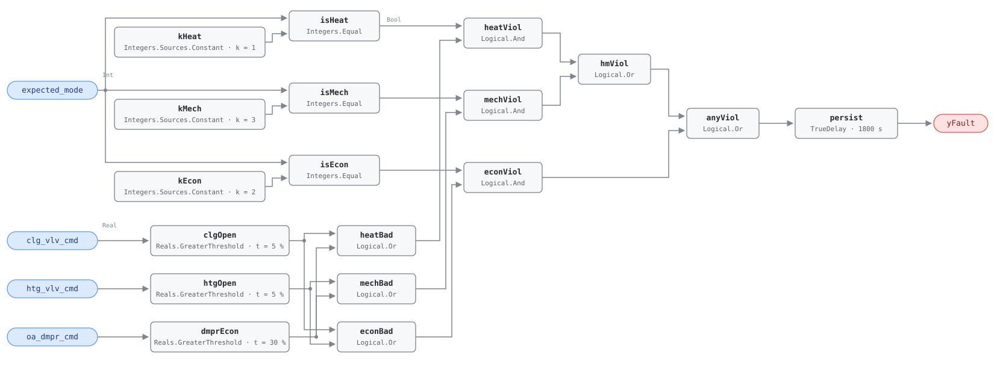

## Description

Valve and damper positions contradict the operating mode the current conditions
call for: the cooling coil open while the unit should be heating, the heating
coil open while it should be economizing, the outdoor damper economizing while
it should hold minimum outdoor air. Each actuator tracks its own loop
faithfully, so nothing looks broken from the equipment side — only the
sequencing that arbitrates between them is wrong, and comfort is usually
maintained while two subsystems run against each other. Within CLU-01 this rule
complements the trigger AHU-FC-050: FC-050 sees both coils fighting each other,
this one sees a single subsystem fighting the mode, and a damper economizing
during minimum-outdoor-air operation is invisible to FC-050 entirely.

## Detection Logic

```
clg_open  = clg_vlv_cmd > valve_open_threshold
htg_open  = htg_vlv_cmd > valve_open_threshold
dmpr_econ = oa_dmpr_cmd > econ_damper_threshold

mismatch = (expected_mode = heating_mode_code      AND (clg_open OR dmpr_econ))
        OR (expected_mode = mech_cooling_mode_code AND (htg_open OR dmpr_econ))
        OR (expected_mode = econ_mode_code         AND (clg_open OR htg_open))

yFault = mismatch sustained continuously for alarm_delay
```

Block graph (`rule.cxf.jsonld`):



`expected_mode` is the host's answer to "what should this unit be doing right
now", per G36 §5.16; the graph only asks whether the actuators agree with it.
Three integer constants (`kHeat`, `kEcon`, `kMech`) decode the mode into three
mutually exclusive booleans, and three threshold tests decode the actuators.
Each mode gate then ANDs its mode flag with the disjunction of the actuators
that contradict it, so each test appears in exactly the two modes where it means
something: an open cooling valve is wrong in HEATING and ECONOMIZER but right in
MECHANICAL_COOLING_MIN_OA, and an open outdoor damper is wrong in HEATING and
MECHANICAL_COOLING_MIN_OA but is the entire point of ECONOMIZER. All three
comparisons are strict, so a valve parked at exactly 5% or a damper at exactly
30% is not a violation. `persist` requires 30 minutes of continuous mismatch,
giving actuators half an hour to catch up after a mode flip; `delayOnInit = true`
holds that window across a controller restart. If `expected_mode` matches none
of the three codes, every mode gate is false and the rule is silent no matter
what the actuators are doing — that silence is NO_EVAL territory, not a health
claim (see Deviations).

## Possible Diagnoses

1. Sequencing logic error in the BAS programming — the mode arbitration itself
   is wrong, so the unit is executing the wrong sequence correctly
2. Mode transition deadband too narrow: the unit hunts between modes and
   actuators never settle where the current mode wants them
3. Valve stuck in the wrong position — actuator or linkage failure, or a
   normally-open valve with no signal
4. Incorrect OAT sensor causing wrong mode selection: the sequence and the
   actuators are both fine and the derived expected mode is the thing that is
   wrong
5. Manual override left on a valve or damper command (BACnet priority array)

## Energy Impact

CRITICAL_WASTE, MEDIUM confidence, PROXY_ESTIMATION. There is no single waste
term, because the cost depends on which subsystem is running against the mode.
The reference gives 5–20% of the affected subsystem's energy while the unit runs
in the wrong mode (PNNL-25985 EEM-38), and the worst case — both coils active —
is bounded by the AHU-FC-050 formula: `waste_kw = htg_vlv_cmd/100 ×
ahu_htg_capacity_kw + clg_vlv_cmd/100 × ahu_clg_capacity_kw`. PROXY rather than
DIRECT because the rule observes commands and a derived mode, not thermal
quantities, and the counterfactual is not measured. Sensitive to both climates.

## Emissions Impact

Scope 1 + 2, PROXY_EMISSIONS, MEDIUM confidence; typical 500–5,000 kg CO₂e/yr.
The split between inventories follows whichever subsystem is running in the
wrong mode — gas at the boiler is scope 1, chiller and fan electricity are
scope 2 — and a mismatch usually engages both. Avoided-emissions basis:
marginal operating emissions rate (MOER).

## Deviations

- This rule consumes `expected_mode` where the reference lists `oat`. The
  reference's own logic opens with
  `expected_mode = determine_g36_mode(OAT, zone_demands, schedule)` and
  annotates it host-side; deriving the mode needs zone demands and the schedule,
  neither of which is an AHU point, so the graph consumes the host's output
  (precedent: AHU-FC-060 and `occ_schedule`). OAT survives as a precondition.
- The integer encoding (1 = HEATING, 2 = ECONOMIZER, 3 =
  MECHANICAL_COOLING_MIN_OA) is this library's convention — the reference names
  the modes without numbering them. The three codes are parameters, so a host
  with its own mode enum rebinds the constants instead of editing the graph.
- An `expected_mode` outside the three codes leaves the rule structurally
  silent: all three gates go false and both coils can be wide open with no fault
  raised. Warmup, cooldown, setback, and unoccupied operation are states this
  rule cannot judge, and the host must report NO_EVAL for them. An explicit
  "unmapped mode" output was rejected — the host already knows which mode it
  derived.
- All three comparisons are strict (`>`); the reference says nothing about
  boundary behavior, so a valve at exactly 5% and a damper on its 30%
  minimum-position setpoint stay out of the alarm.
- `valve_open_threshold` is one card parameter bound to two CXF paths
  (`clgOpen.t`, `htgOpen.t`), matching the reference's single tunable. Hosts
  must set both together; per-coil thresholds are a documented divergence.
- The reference states three independent `IF expected_mode = …` branches; this
  rule ORs them behind one persistence timer, the shape every other card uses.
  Only one gate can be true at a time, so nothing is lost logically, but the
  output does not say which mode or actuator raised it — trend the four points.
- `persist.delayTime = 1800 s` with `delayOnInit = true` (Modelica/CDL default
  is `false`), the library's standing choice: a mismatch already present at
  load waits out the full 30 minutes rather than alarming on the first tick
  after a controller restart.
- Severity 3 (warning) and the MEDIUM/PROXY grades come from the reference's
  chapter 9 card, its only severity statement for this fault (the §5.8.1 index
  carries no severity column). This chapter's README index still shows severity
  2 and needs the same correction AHU-FC-059 received.
- Frontmatter `g36` is null even though G36 §5.16 is in `source`: SCHEMA.md
  reserves that field for the 001–049 G36-derived rules, and this is a
  research-backed 050-range rule citing G36 for the mode definitions only.

## Notes

The rule tests only for actuators open when the mode says they should be shut.
The converse — a damper stuck at minimum in ECONOMIZER, a cooling valve that
will not open under mechanical cooling — is a failure to deliver, not to
sequence, and belongs to AHU-FC-051 and the temperature-control rules. A clear
`yFault` means no actuator is contradicting the mode, nothing more.

Check diagnosis 4 before anyone edits a sequence: this rule consumes a derived
point, so a bad OAT reading arrives pre-laundered as a wrong mode and looks
exactly like a programming error. AHU-FC-062's envelope test is built from
`oat`, so an outdoor sensor bad enough to select the wrong mode often shows up
there too. Within CLU-01, clear the trigger (AHU-FC-050) first — a valve held
open by a fighting control loop also contradicts whichever mode is active
(playbook `simultaneous-hc`, steps 2.1–2.2).
