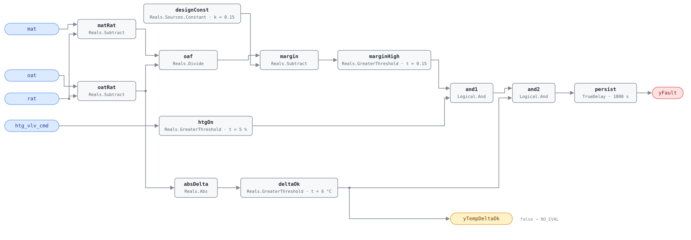

## Description

The heating coil is running and the unit is drawing well over its design
minimum outdoor air. This is the same measurement as AHU-FC-055 narrowed to
the operating state where excess ventilation costs the most: every extra cubic
metre arrives at outdoor temperature and has to be lifted all the way to supply
temperature by the coil the rule is watching. In a −5 °C hour against 22 °C
return air, every extra point of outdoor air fraction hands the coil another
27 °C of lift on that share of the airflow.

The classic cause is an economizer that never handed back. The unit opens its
dampers for free cooling in a mild afternoon, outdoor air turns cold overnight,
and the sequence — or a stuck actuator, or a leaking blade seal — leaves the
dampers where they were while the heating coil quietly compensates. Nothing
about it is uncomfortable, so it survives until someone reads the fuel bill.
Present in roughly 15% of buildings.

## Detection Logic

```
oaf          = (mat − rat) / (oat − rat)
yTempDeltaOk = |oat − rat| > min_delta                (false ⇒ host reports NO_EVAL)
yFault       = (oaf − design_min_oa_fraction > oa_excess_margin)
               AND (htg_vlv_cmd > valve_open_threshold)
               AND yTempDeltaOk,
               sustained for alarm_delay
```

Block graph (`rule.cxf.jsonld`):



The fraction chain is AHU-FC-055's, unchanged: `matRat` and `oatRat` form the
two differences, `oaf` divides them, and `margin` subtracts the design fraction
so `marginHigh` tests the excess against a single positive threshold. Both
reference tunables stay independent single-value parameters — the design
fraction is `designConst.k`, the tolerance is `marginHigh.t` — so a host can
retune either through `set_param` without touching the other and without a
sign flip.

`htgOn` adds the operating condition the reference makes explicit, and `and1`
conjoins it with the excess. `and2` then gates the whole finding on `deltaOk`,
whose output is also the boundary output `yTempDeltaOk`. The gate is what makes
the unguarded division safe: CDL `Divide` follows IEEE-754, so `oat = rat`
yields ±∞ or NaN rather than an error, and a near-zero denominator turns
ordinary sensor noise into a fraction of any magnitude. NaN compares false
everywhere, so it cannot raise `marginHigh` on its own — but ±∞ and a
noise-inflated finite fraction both can, and `and2` stops them. Garbage
arithmetic cannot assert a fault; it can only make the rule report itself
unevaluable.

All three comparisons are strict. A valve parked at exactly 5%, a fraction
sitting exactly at `design_min_oa_fraction + oa_excess_margin`, and a
temperature difference of exactly `min_delta` all read as no-fault. `persist`
requires 30 continuous minutes, which rides out damper strokes and the mixing
transient after a mode change; a valve that closes before the timer expires
resets it.

## Possible Diagnoses

1. OA damper stuck partially open
2. OA damper minimum setpoint configured too high
3. Economizer override not releasing after the transition out of free cooling
4. Leaking OA damper seals

## Energy Impact

EXCESS_CONSUMPTION, HIGH confidence, DIRECT_MEASUREMENT. The waste is
computable from live data: `excess_htg_kw = (actual_oaf −
design_min_oa_fraction) × airflow × cp × (rat − oat)`, with the excess fraction
already on the wire as `oaf − designConst.k`. Correcting it saves 3–15% of
heating energy (PNNL EEM-06, OA damper faults; PNNL-27338), the top of that
range in cold climates where the `(rat − oat)` term is large for months at a
time. This is the same defect AHU-FC-055 finds year-round, priced at its worst
hour, which is why the two share a playbook. Prevalence ~15%.

## Emissions Impact

Scope 1 + 2, DIRECT_EMISSIONS, HIGH confidence; typical 300–2,500 kg CO₂e/yr
for the excess ventilation heating load. Most of it is scope 1 fuel at the
boiler or furnace; the scope 2 share is whatever the site's heating comes from
electrically — heat pumps, electric resistance coils, and the extra fan energy
of moving the air. Avoided-emissions basis: marginal operating emissions rate
(MOER).

## Deviations

- **`min_delta` default adopted, not transcribed.** The reference states the
  fraction is computed only when `|OAT − RAT| > min_delta` but omits the
  parameter from its tunables table. This card adopts 6.0 °C, matching
  AHU-FC-055's `oaf_temp_threshold` so the two rules agree on when the shared
  measurement is meaningful (PNNL-27338 uses 5 °F for the same computation).
  A site that retunes one should retune the other.
- **`valve_open_threshold` default adopted, not transcribed.** Also absent
  from the reference's tunables table. This card adopts 5%, the value chapter
  9 uses everywhere else a valve counts as open (AHU-FC-050, AHU-FC-059), so
  "heating" means the same thing across the chapter.
- **Design fraction as a constant, excess as a threshold.** The reference
  writes the test as `oaf > (design_min_oa_fraction + oa_excess_margin)`.
  Implemented that way, the two tunables would have to be summed into one
  threshold value and a host could no longer retune either alone. Feeding the
  design fraction in as `Reals.Sources.Constant.k` and comparing the remaining
  margin against `oa_excess_margin` keeps both as independent single-value
  `set_param` paths with no sign flips. Algebraically identical.
- **Evaluability is an output, not just a precondition.** The reference's
  third test vector is a NO_EVAL case (`|OAT − RAT| = 2 °C`), and the test is
  computable from this rule's own inputs, so SCHEMA.md requires exposing it as
  a boolean output: `yTempDeltaOk`. It is additionally wired into `and2`, so
  `yFault` reads false throughout a non-evaluable period — but false `yFault`
  under false `yTempDeltaOk` means "unknown", not "healthy", and the host must
  treat it that way.
- **Heating is in-graph; the rest of the mode gating is not.** `htg_vlv_cmd`
  is a measured point, so the reference's `htg_vlv_cmd > valve_open_threshold`
  term is implemented directly. Anything beyond it — occupancy, unit mode,
  whether the AHU is in morning warmup — stays host-side per this library's
  design stance, as in AHU-FC-051 and AHU-FC-055.
- **All three comparisons are strict** (`>`). The reference does not specify
  boundary behavior; strict inequalities keep a valve sitting exactly on its
  open threshold, a fraction sitting exactly on the alarm point, and a
  temperature difference sitting exactly on the evaluability limit out of the
  alarm, and the vectors pin all three choices.
- `persist.delayOnInit = true` (Modelica/CDL default is `false`), the
  library's standing choice: an excess already present at load waits out the
  full 30 minutes instead of alarming on the first tick after a controller
  restart.

## Notes

This rule and AHU-FC-055 share the fraction core and differ in three ways, all
from their respective reference cards: this one adds the `htgOn` term in-graph
where AHU-FC-055 leaves its non-economizer scope entirely to the host, its
excess margin is 0.15 against AHU-FC-055's 0.10, and its energy term uses the
signed `(rat − oat)` rather than `|oat − rat|` because in heating the sign is
known. Deploying both on one unit is not redundant: this one alarms earlier in
winter and carries the sharper cost estimate, AHU-FC-055 keeps watching through
the rest of the year.

Verify AHU-FC-062 is clear before acting on this alarm. It is the explicit
prerequisite in the reference and the reason for the `suppressed_by` entry: a
MAT sensor reading 3 °C low in −5 °C weather manufactures this fault out of
nothing, and it is far cheaper to check a sensor than to send someone onto the
roof.

If the fraction is genuinely high, the fastest discriminator is to command the
OA damper to minimum and watch the mixed-air temperature. It should climb
toward return temperature within a few minutes. If it does not move, the
problem is mechanical — actuator, linkage, or blade seals — and the
[economizer-failure](../../../playbooks/economizer-failure.md) playbook's
on-site steps apply. If it does move, the sequence never commanded minimum
position in the first place, and the fix is at a desk.
