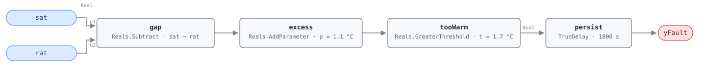

## Description

An air handler in a cooling mode has one job at the air stream: deliver air
colder than the space it serves. Return air is the best available measure of
that space, once the return fan's own heat is taken back off the reading. When
supply air is not below that corrected return temperature, the unit is running
its fans and — in the mechanical modes — its coil, and the building is getting
no cooling out of the exchange. The distinct thing about this rule is the sensor
it does not need: nine of APAR's 28 rules drop out entirely on a unit with no
mixed-air sensor, and G36 marks the equivalent MAT test (AHU-FC-012) `omit if
no MAT sensor`, so on that large population a SAT-versus-RAT comparison is the
only whole-unit temperature check left. The trade is resolution — this one
brackets the whole loop, return path included, so a dead coil, a heating source
that never shut off, a warm-air economizer, or either sensor being wrong all
land in the same alarm. Library extension: the reference's AHU index stops at
AHU-FC-065, so the logic and both threshold defaults come from APAR rules 6, 12
and 17 and the graph shape from AHU-FC-012.

## Detection Logic

```
gap    = sat − rat
excess = gap + return_fan_rise      (= sat − (rat − return_fan_rise))
yFault = excess > epsilon_t,
         sustained continuously for alarm_delay
```

Block graph (`rule.cxf.jsonld`):



APAR writes the rule as `Tsa > Tra − ∆Trf + εt`, a threshold on supply air that
moves with the return temperature. Moving ∆Trf to the other side turns it into a
threshold on a difference — `(Tsa − Tra) + ∆Trf > εt` — and that is what the
graph computes: `gap` for the difference, `excess` to credit the return-fan rise
back, `tooWarm` against the 1.7 °C allowance. The two source constants stay
separate parameters rather than collapsing into one 0.6 °C threshold, because
they are retuned for unrelated reasons: `return_fan_rise` is a fact about the
installation and is 0 on any unit without a return fan, while `epsilon_t` is a
sensor-uncertainty allowance. The comparison is strict, as in APAR, and at the
shipped defaults the boundary is not decidable in floating point (see
Deviations) — an ambiguity of femtokelvins on instruments rated to ±0.5 K.
`persist` requires 30 continuous minutes, which separates a unit that cannot
cool from a chilled-water valve still stroking after a mode change; recovery is
immediate, and `delayOnInit = true` holds the window across a restart.

## Possible Diagnoses

Library-authored. APAR detects rather than diagnoses; §4.2.2's broad classes
read against this comparison give:

1. Cooling coil valve stuck closed, or an actuator that no longer strokes
2. Chilled water unavailable or too warm at the coil — a plant problem, and the
   case where every AHU on the plant reports together
3. DX stage or compressor not running when the sequence says it should be
4. Coil fouled, air-bound, or too small for the load it now serves
5. Heating source still active in a cooling mode — a leaking valve or a stage
   that never shut off; the simultaneous-heating-and-cooling diagnosis
6. Economizer holding outdoor air warmer than the building (AHU-FC-009 tests
   that directly against setpoint)
7. SAT sensor reading high, or RAT sensor reading low — nothing in the rule
   says which of the two moved
8. Return-air sensor not measuring the space: ceiling-plenum mounted, or on a
   unit whose zones no longer return through the path it sits in

## Energy Impact

EXCESS_CONSUMPTION, MEDIUM confidence, PROXY_ESTIMATION. The first cost is the
whole fan energy of a unit conditioning nothing; in Modes 3 and 4 mechanical
cooling is being paid for on top, and downstream VAV boxes that never see their
zones satisfied drive dampers open and reheat on.
`undelivered_cooling_kw = supply_airflow_m3s × 1.2 × 1.005 ×
(sat − (rat − return_fan_rise))` sizes the sensible capacity the unit should be
removing from the return stream and is instead adding to it; design airflow
standing in for a measured one is what keeps it a proxy. The 2–5% savings range
is carried across from AHU-FC-012's reference row, since APAR publishes no
savings figures. MEDIUM because the rule cannot separate its waste diagnoses
from its sensor diagnoses — a SAT sensor reading 3 K high draws this trace and
wastes nothing. Cooling-dominant.

## Emissions Impact

Scope 2, PROXY_EMISSIONS, MEDIUM confidence. The dominant term is purchased
electricity — fans moving air that does no work, plus chiller or compressor
energy in the mechanical modes — so a marginal operating emissions rate is the
right basis, and the load lands across occupied daytime hours where that rate is
highest in most grids. Diagnosis 5 is the exception: a gas or electric heating
source that never shut off gives the fault a scope 1 half, matching AHU-FC-012's
`1+2`. The frontmatter records the scope this rule usually carries.

## Deviations

- This rule is a library extension, not a transcription: the reference's AHU
  index (§5.8.1) stops at AHU-FC-065. The rule expression and both threshold
  defaults are APAR's; the ID, name, severity, phase, category, energy figures
  and diagnosis list are authored here, as in HW-FC-053.
- The scope is cooling-only and there is no heating mirror to write. APAR places
  the return-air comparison in Modes 2–4 and nowhere else, and Mode 1 has no
  return-air rule at all. The neighbouring coil-subsystem group (rules 1, 7, 11,
  16) *does* flip its relational sign by mode, which makes a signed-by-mode
  reading of this rule a natural but wrong guess.
- Three APAR rules, one card: rules 6, 12 and 17 differ only in the mode they
  are evaluated under, and mode applicability is host-side here. Precedent —
  AHU-FC-012 spans rules 11 and 16, AHU-FC-013 spans 13 and 19.
- Rearranged into gap form with the two constants kept separate rather than
  pre-composed into a single 0.6 °C threshold (as AHU-FC-012 composes its
  three). One of the two terms is 0 for an entire population — units with no
  return fan, and units whose return-air sensor sits upstream of it — and asking
  a host to recompute `1.7 − 0.0` by hand is worse than one extra block.
- The strict `>` is APAR's own, but at the shipped defaults the boundary is not
  decidable: near room temperature the difference of two doubles moves in steps
  of ~3.6 × 10⁻¹⁵ K, so reachable values of `excess` straddle `fl(1.7)` without
  hitting it and a nominal 0.60 K gap reads healthy or faulted depending on
  which operands produced it. Both sides are pinned as vectors so the behaviour
  cannot change silently; the ambiguity is femtokelvin-scale.
- Instantaneous samples with a persistence timer, against APAR's hourly
  evaluation. The two are not equivalent: a supply temperature oscillating about
  the allowance never alarms here, because persistence restarts on every
  compliant tick. A steady offset — what a dead coil and a drifted sensor both
  produce — reads the same either way.
- `alarm_delay = 1800 s` is adopted; APAR specifies no alarm persistence. 30
  minutes is what AHU-FC-005, AHU-FC-012 and AHU-FC-013 use for the same class
  of comparison, and rides out a chilled-water valve stroking after a mode
  change.
- Mode gating is host-side, matching the source's own architecture: APAR
  classifies its five modes from the valve and damper signals alone, then
  selects rules by mode and evaluates them on temperatures. Nothing about the
  mode appears in this graph, and a verdict outside Modes 2–4, outside
  occupancy, or inside a transition window is NO_EVAL rather than healthy.
- Severity 3 and phase 2 are the library's; APAR assigns no severities. Warning
  matches every other temperature-comparison rule in this chapter and is honest
  for a finding whose most likely single cause is a sensor.
- The energy profile is authored and its savings range borrowed: `category`,
  `confidence` and `estimation_method` are this card's judgment, `savings_range`
  is AHU-FC-012's reference row carried across — the weakest number on the card,
  labelled as such in its own field.
- No evaluability output. The rule is a single comparison with no in-rule gate,
  so `yFault` is the only boundary output; everything that makes a verdict
  untrustworthy is a host precondition and none of it is separable in the graph.
- APAR publishes rule expressions and threshold values, not test cases, so every
  scenario in `vectors.json` is authored.
- The alarm-delay edge is asserted on the boundary tick rather than a step away,
  against SCHEMA.md's usual margin, because `Logical.TrueDelay` asserts at
  exactly `T + delayTime` at the pinned engine revision and that is the fact
  worth pinning.
- `persist.delayOnInit = true` (the Modelica/CDL default is `false`), the
  library's standing choice: a violation already present at load waits out the
  full 30 minutes instead of alarming on the first tick after a controller
  restart.
- `clusters: [CLU-01]` on the strength of diagnosis 5, the same grounds on which
  AHU-FC-012 is a member. The dominant reading remains cooling not delivered —
  CLU-01 groups the investigation, it does not redefine the fault.
- `playbooks` cites two: `sensor-drift` first, because diagnoses 7 and 8 are the
  cheapest to eliminate and among the most likely to be right, then
  `simultaneous-hc` for diagnosis 5.
- No suppression edge to AHU-FC-062. The MAT-based rules are silenced while the
  mixing-box rule is active; this rule never reads MAT, which is the same
  property that makes the card worth having.

## Notes

Read this rule and AHU-FC-012 as one test with two instruments: FC-012 brackets
the coil section and localises better, this one brackets the whole unit and
covers more. A MAT fault does not disturb it, so on a unit whose mixing-box
sensor has failed this rule still reports while the rest of the temperature
family has gone quiet.

Check the two sensors first — a portable reference against SAT and RAT costs an
hour and eliminates diagnoses 7 and 8 ([sensor
drift](../../../playbooks/sensor-drift.md) playbook). Note where the return
sensor sits: plenum-mounted, it picks up lighting and roof heat, reads high, and
biases this comparison toward silence. If the sensors check out, the cooling
valve command discriminates — wide open with no temperature drop points at
diagnoses 1–4 and the plant, closed with the air warming anyway at diagnosis 5
and the [simultaneous-hc](../../../playbooks/simultaneous-hc.md) playbook.
