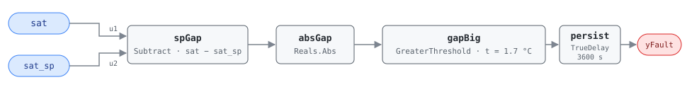

## Description

The supply air is not at its setpoint, and no actuator is at its stop. That
second half is what makes this rule worth having separately. A loop whose valve
has saturated is an easy fault to state — the controller has asked for
everything it has and the air is still wrong — and AHU-FC-007 and AHU-FC-013
state it, one per coil. A loop that sits 3 K off setpoint with its valve
modulating around 60% is the harder case: the controller is not
out of capacity, it is out of tune, or its valve has no authority left, or its
actuator does not move until the ask gets large. Both of those cards test the
valve command first, so neither can ever report it. This rule tests the
tracking error alone and therefore can.

APAR states it as rule 25, in every occupied mode, and its own grouping is the
argument for the design: rule 25 sits with rules 3, 13 and 19 in the comfort
requirements family, all four meaning comfort has been sacrificed, with only
the other three additionally establishing that the loop has run out of control
authority. This library already ships those three as AHU-FC-007 (rule 3) and
AHU-FC-013 (rules 13 and 19). The fourth was missing, and it is the one that
covers the modes and the failure modes the other three cannot reach.

The fault is quiet by nature. Zones compensate — boxes open, reheat picks up,
someone's office is cold every afternoon and nobody files a ticket about a
supply temperature. It is found by asking the simplest question available: is
the unit delivering the air the sequence asked for.

## Detection Logic

```
APAR rule 25, applicable in every defined occupied mode:

    | Tsa − Tsa,s | > εt          εt = 1.7 °C (3 °F)

as implemented:

    sp_gap = sat − sat_sp
    yFault = (|sp_gap| > sat_error_threshold), sustained continuously for alarm_delay
```

Block graph (`rule.cxf.jsonld`):



Four blocks, the same shape AHU-FC-010 uses for its equality test: `spGap`
subtracts the setpoint from the measurement, `absGap` folds the two signs
together, `gapBig` compares the magnitude against `sat_error_threshold`, and
`persist` requires 60 continuous minutes before reporting.

There is no fifth block, and the absence is the whole point of the card. Every
other SAT rule in this library carries a second conjunct — a saturated valve on
AHU-FC-007 and AHU-FC-013, a reheat fraction on AHU-FC-053, a baseline
comparison on AHU-FC-056 — and each of those conjuncts is what makes its rule
specific and also what makes it blind. Rule 25 buys generality by spending
specificity: it says the unit is not delivering what it was asked for and says
nothing at all about why. Persistence and the host's mode gate are the only
things keeping that statement from being noise, which is why both are set
conservatively.

`gapBig` is strict, so a miss sitting exactly on 1.7 K reads healthy. The
source's own rule 25 is written strict too, so unlike its comfort-family
siblings — rules 3, 13 and 19 write `≥` on the temperature term — this port
involves no boundary rewrite. Exact equality is not reachable in doubles from a
realistic temperature pair anyway: 1.7 needs mantissa bits that a difference of
two values in the 8-16 range cannot carry, so the vectors pin the closest
achievable approach from below (14.7 − 13.0, which lands one ulp under the
line and reads healthy) and 10 mK either side of it.

## Possible Diagnoses

APAR names no per-rule causes; §4.2.2 lists the fault classes the rule set as a
whole can surface, and this is that list read through rule 25 and ordered by
what an ungated tracking test finds first:

1. Control-loop tuning. A proportional band too wide, an integral term too
   slow, or a loop detuned at some point to stop it hunting and left sitting
   off setpoint ever since. The signature case: nothing else here reports a
   loop that is simply parked off setpoint — AHU-FC-056 finds the loop that
   oscillates instead — and the fix is a technician's afternoon.
2. Valve or damper authority. A control valve sized to pass design flow at 20%
   open has no resolution left around setpoint, which is §4.2.2's design-fault
   class showing up as a control symptom.
3. Actuator stiction, hysteresis, or a slipping linkage — the loop asks, and
   nothing moves until the ask gets large. AHU-FC-054 catches the frank version
   where command and feedback diverge; this rule catches the version where the
   actuator does move, eventually, and never quite enough.
4. Coil or plant capacity short of saturation. Hot or chilled water off
   temperature, low flow, a fouled coil — degraded enough to miss setpoint,
   not degraded enough to drive the valve to its stop, so AHU-FC-007 and
   AHU-FC-013 stay silent through the whole degradation.
5. Sequencing logic errors. A reset schedule stepping the setpoint faster than
   the unit can follow, two sequences writing the same coil output, or a
   changeover that leaves the unit chasing a setpoint appropriate to the mode
   it just left.
6. SAT sensor error. The air is at setpoint and the reading is not. Cheapest to
   rule out and the reason sensor health is a precondition on this card.
7. Operator intervention — a valve in hand, a coil output overridden at the
   controller. AHU-FC-061 reports the override directly, and a unit tripping
   both is telling you which one to read first.
8. A coil fighting the other coil. Simultaneous heating and cooling holds SAT
   off setpoint at part-open commands on both valves, which is exactly the
   regime this rule sees and the gated cards do not; AHU-FC-050 names it.

## Energy Impact

COMFORT_ENERGY, MEDIUM confidence, PROXY_ESTIMATION. The category follows the
source's own reading: rule 25 belongs to APAR's comfort-requirements group, and
what it establishes first is that the building is not getting the air it asked
for. The energy consequence is real but secondary and branch-dependent, which
is why the runtime estimate is written as an imbalance rather than a waste:
`imbalance_kw = supply_airflow_m3s × 1.2 × 1.005 × |sat − sat_sp|` sizes the
conditioning gap in either direction, and the host supplies the airflow.

Which direction it is decides whether that number is money. Air colder than a
cooling setpoint is over-cooling: paid once at the coil and frequently a second
time at terminal reheat, the same double payment AHU-FC-053 prices when the
setpoint itself is the problem rather than the loop's ability to hold it. Air
warmer than a cooling setpoint is under-delivery: the coil spends less, and the
cost migrates downstream to boxes driving toward maximum flow and a fan working
to make up degrees the coil did not remove. Both invert in heating. A loop that
oscillates around setpoint without holding either side of it long enough to
alarm here spends valve and damper actuation instead, which is AHU-FC-056's
finding.

No savings range is published. APAR states no energy figures for any of its 28
rules, and the reference's 2-5% of AHU energy belongs to AHU-FC-007 and
AHU-FC-013, whose population is the subset where a coil has already saturated.
This rule's population is broader and its typical member is a smaller miss, so
treat that range as a ceiling on what any single instance is worth and expect
the median instance to sit well below it. Confidence is MEDIUM for the same
reason it is on the two sibling cards: the symptom is measured directly and
unambiguously, and the cause — which decides the cost, and even its sign — is
not in the rule's two inputs. Climate sensitivity is neutral; the rule runs in
every occupied mode and both directions of miss are available all year.

## Emissions Impact

PROXY_EMISSIONS, MEDIUM confidence. Scope is recorded as `1|2` because this
rule spans every occupied mode and cannot tell which coil is involved: a
heating-side miss made up by a gas boiler, a furnace section, or a steam coil
is Scope 1, while a cooling-side miss, electric resistance or heat-pump
heating, and all of the fan energy that moves make-up air are Scope 2. A site
with a gas plant and electric reheat pays into both from the same alarm.
Avoided-emissions basis: static combustion factor for the fuel half, marginal
operating emissions rate (MOER) for the electric half. As on AHU-FC-013, the
honest accounting is that fixing an under-delivery instance can raise site
emissions rather than lower them — a loop that finally holds setpoint delivers
conditioning the building has been going without — and the claim that survives
is the over-conditioning branch plus whatever downstream compensation stops.

## Deviations

- **This card is a library extension, not a transcription of the reference.**
  The HVAC FDD Reference v1.0 §5.8.1 indexes 31 AHU codes, ending at
  AHU-FC-065; this ID is beyond that set and no reference card exists behind
  it. The detection logic is APAR rule 25 from the 2001 NIST/CEC PIER Project
  2.3 report (Bushby, Castro, Schein, House), §4.2 Table 1, with its threshold
  from §4.2.3. Everything the source does not state — severity, phase, energy
  and emissions grades, persistence, the diagnosis list, the prose — is
  authored here and argued in this section. The source report is
  personally licensed and is not redistributed with this library; the citation
  points at the public document.
- **The valve-position gate is absent on purpose, and that absence is the
  card.** APAR's comfort-requirements family pairs a SAT miss with a saturated
  coil in rules 3, 13 and 19 (`|u − 1| ≤ ε` and a SAT miss together), and
  states rule 25 with the temperature term alone. The report's own Table 2
  reads all four as comfort sacrificed and only the other three as evidence
  that the system is out of control. AHU-FC-007 and AHU-FC-013 port those
  three, and both cards argue in their prose that a SAT miss at a part-open
  valve is an ordinary loop working through a load change and therefore not
  reportable. That argument is right for a rule that fires in
  half an hour on any miss and wrong as a general claim: a loop that has been
  30 minutes — or six months — off setpoint at 60% valve command is not
  working through anything. This rule takes the other half of the trade, and
  pays for it with a longer persistence and a stricter host gate rather than
  with a second conjunct.
- **The overlap with AHU-FC-007 and AHU-FC-013 is real and is not suppressed.**
  A saturated valve missing setpoint by more than 1.7 K trips this rule as well
  as its gated sibling, an hour later. Neither `suppresses` nor
  `suppressed_by` is populated, because the two findings are different
  statements — one says the unit is not delivering, the other says it has
  nothing left to deliver with — and the second is strictly more informative
  when both are true. A host that wants one alarm instead of two should rank
  the gated card above this one in its own presentation rather than silence
  either.
- **εt = 1.7 °C is shipped flat, as the source states it, not composed.** The
  report calls its thresholds heuristic and names a composition approach as
  future work, giving `εt = εToa + εTma` for rule 10 as the example. The
  G36-lineage cards here do compose their bands (AHU-FC-010 in quadrature,
  AHU-FC-005 linearly as `eSAT + eMAT − dTSF`), so shipping a flat number is a
  departure from local practice in favour of source fidelity. It is also the honest reading: the
  band here has to absorb sensor error *and* the tracking error a healthy
  proportional loop shows at partial load, and only the first half has a
  published budget.
- **Same parameter name as AHU-FC-007 and AHU-FC-013, different default and
  different meaning.** `sat_error_threshold` is 1.0 °C on both of those cards
  (G36's eSAT, one-sided) and 1.7 °C here (APAR's εt, two-sided). The name is
  kept so that a host retuning "how far SAT may stray" finds one vocabulary
  across the three cards; the difference is stated in the parameter
  description so nobody copies a value across without noticing. Retuning this
  card to 1.0 is defensible on a unit with a calibrated sensor and makes the
  three alarm on the same band.
- **`alarm_delay = 3600 s` is library-chosen.** APAR states no persistence for
  any rule. The implementation described in §4.3 evaluated the rule set on
  hourly data and counted faults per hour of operation, which is the closest
  the source comes to naming a time constant, and an hour also matches this
  chapter's treatment of chronic conditions (AHU-FC-053, AHU-FC-004,
  AHU-FC-061 all use 3600 s). The specific argument for doubling the sibling
  cards' 30 minutes is that they can afford to be quick: their second conjunct
  is rare on its own, so most transients never reach the timer. Here the timer
  is the only defence, and the vectors pin what it is defending against — a
  setpoint reset step that leaves 40 minutes of genuine tracking error behind
  it and correctly reports nothing.
- **No boundary rewrite, but no reachable boundary either.** Rule 25 is written
  with a strict `>`, so CDL's `GreaterThreshold` (`u > t`) reproduces it
  exactly — unlike AHU-FC-007 and AHU-FC-013, which had to record G36's `≥`
  becoming a strict `>`. What the vectors cannot do is pin exact equality: the
  double nearest 1.7 needs mantissa bits down to 2⁻⁵², and the difference of
  two temperatures in the 8-16 binade is a multiple of 2⁻⁴⁹, so no realistic
  pair lands on the line. `edge_positive_gap_at_the_threshold` pins the closest
  approach from below (1.6999999999999993, one ulp under) and the just-over
  vectors sit 10 mK past it, on both signs. Same class of finding as
  HW-FC-053's 5.55 K trip line.
- **Mode scope follows Table 2, not Table 1's heading.** Table 1 files rule 25
  under "all occupied modes", which would include the unknown mode APAR
  defines for occupied periods whose actuator signature matches none of Modes
  1-4. Table 2 lists the rule's modes as 1, 2, 3, 4. This card follows Table 2
  and scopes the host gate to the four defined modes, because the unknown mode
  is where the report puts mode transitions and simultaneous heating and
  cooling, and a SAT miss there is already reported with its cause attached by
  AHU-FC-050 and AHU-FC-063. A host that would rather see the miss anyway can
  widen the gate; the hour of persistence already absorbs the transition case.
- **Mode gating is host-side, and the source agrees with the library here.**
  APAR classifies its five modes from coil-valve and damper command signals
  alone, with no mode sensor, and then evaluates only the rules applicable to
  the classified mode — which is exactly this library's `operating_states` plus
  `preconditions` convention, arrived at independently and two decades earlier
  than the G36 sequences the 001-range cards follow. Nothing about the gate is
  in the block graph, per the standing design stance: the graph computes
  fault-given-valid-data, and a verdict produced outside the four modes, in a
  transition window, or with the fan off is NO_EVAL and never healthy.
- **Instantaneous samples against an hourly source.** APAR as implemented
  evaluated rules on hourly data; this rule consumes instantaneous points and
  requires the miss continuously for an hour. The two are not equivalent, and
  the difference is the usual one: an average tolerates a signal that keeps
  crossing back while its mean stays outside the band, and persistence does
  not. `oscillating_miss_never_alarms` pins that blind spot — SAT alternating
  between 3 K over and 0.2 K over every 20 minutes never accumulates a full
  hour and never alarms, though hourly averaging would have caught it. That
  case is AHU-FC-056's to report, and it is the reason to deploy the two
  together rather than either alone.
- **The sign of the miss is computed and then discarded.** `spGap` knows
  whether the unit is running warm or cold, and `absGap` throws it away because
  the source's expression is a magnitude. Direction is diagnostic — over-cooling
  and under-cooling have different costs and different causes — so it would be
  defensible to expose it as a sub-condition flag in the SCHEMA.md sense. It is
  not exposed here: it would add a block and an output to a rule whose value is
  its bluntness, and a host holding `sat` and `sat_sp` already has the sign for
  free. Same treatment and same reasoning as AHU-FC-010.
- **`outputs` carries `yFault` alone, and that is deliberate.** SCHEMA.md asks
  for an evaluability output when the reference semantics include a test the
  rule can compute from its own inputs. Nothing here qualifies: every
  evaluability question this rule has — occupancy, mode, fan status, whether
  the setpoint is the live one, whether the SAT sensor is trustworthy — needs a
  signal the rule does not bind. They are all in `preconditions`, and a host
  must not read `yFault = false` as healthy without them.
- **Severity 3, phase 2, and the whole energy block are library-assigned.** No
  reference row exists to copy. Severity 3 matches every comparison rule in
  this chapter, including the two cards this one complements, and nothing about
  a tracking error is more urgent than the saturated-coil version it
  generalises. Phase 2 matches the other research-backed AHU rules. The energy
  grades are argued in Energy Impact rather than inherited, and
  `savings_range` deliberately declines to invent a number.
- **No published test vectors.** APAR publishes an expression and a threshold,
  not cases. All twelve scenarios in `vectors.json` are authored: a healthy
  tracking case, the warm and cold mistuned-loop cases, both sides of the
  threshold on both signs, both sides of the TrueDelay edge (asserting at
  exactly 3600 s, and clearing one step short of it), a setpoint-reset
  transient, a recovery, and the oscillation blind spot.
- `persist.delayOnInit = true` (the CDL default is `false`), the library's
  standing choice: a miss already present at load waits out the full hour
  rather than alarming on the first tick after a controller restart.
- **`playbooks: []`, `clusters: []`, and both suppression lists empty.**
  `playbooks/` has no loop-tuning or coil-capacity playbook, which is what this
  rule's first four diagnoses dispatch; `sensor-drift` and `missing-reset`
  each cover one diagnosis apiece and neither is the fault's centre of gravity,
  so listing them would over-claim. Cluster membership is likewise arguable —
  a chronically mistuned SAT loop is a plausible member of a comfort-and-reset
  syndrome — but `clusters/clusters.json` and playbook Applies-To rows are the
  index owner's edits, not this card's, and this batch adds no cluster.

## Notes

Read this card as the complement to AHU-FC-007 and AHU-FC-013, not as a
replacement. The three of them partition the SAT-miss space by what the
actuator is doing: those two cover the saturated end, where the diagnosis list
is short and the fix is usually mechanical, and this one covers everything
below saturation, where the diagnosis list is long and the fix is usually at a
keyboard. A unit that trips this rule alone is a tuning, authority, or sequence
problem until proven otherwise. A unit that trips this rule and one of the
gated pair together is the gated card's fault, and this one is just repeating
it an hour later.

Check the setpoint before the loop. AHU-FC-057 finds units whose SAT reset was
never commissioned, and a unit holding a design setpoint through a mild
afternoon can miss it for reasons that have nothing to do with the loop — the
sequence is asking for something the load cannot justify and the coil cannot
reach. The same caution applies to any host binding a design constant to
`sat_sp`: this rule is only as meaningful as the setpoint it is handed.

Then read the sign, which the rule computes and does not report. Consistently
warm in a cooling mode points at capacity, authority, or a coil fighting
another coil; consistently cold in a cooling mode points at over-cooling, and
is worth checking against AHU-FC-053 and the terminal reheat it prices. A miss
that changes sign through the day is a tuning problem or a hunting loop, and
AHU-FC-056 is the rule that says which.
