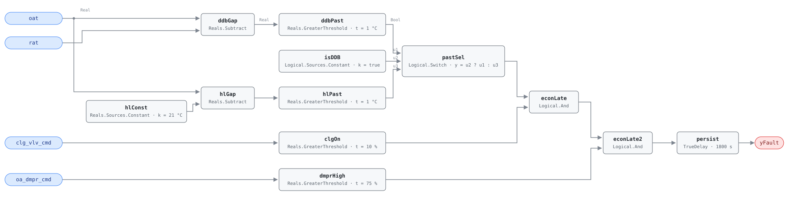

## Description

Outdoor air stopped being worth having and the dampers never found out. The unit
opened wide for free cooling on a mild morning, the afternoon turned hot, and
the sequence that should have stepped the dampers back to minimum did not run —
so the coil carries the load plus the load the open dampers keep importing. On a
30 °C afternoon against 22 °C return air, every point of outdoor air fraction
above the ventilation minimum hands the coil another 8 °C of sensible lift on
that share of the airflow, and more once the outdoor air is humid. This is
AHU-FC-051 run backwards: same four points, same three conjuncts, same graph
with the temperature and damper comparisons both reversed, and because both
cards use the same deadband around the same comparison they cannot assert on one
unit at the same time. It is the quieter of the two failures — until the coil
runs out of capacity the unit holds setpoint and looks healthy. Library
extension: chapter 9 does not specify it, and the logic comes from APAR Rule 9
with the graph shape and parameter set taken from AHU-FC-051.

## Detection Logic

```
past_changeover = (oat - rat)          > temp_deadband   when econ_type_is_ddb
                = (oat - econ_hl_temp) > temp_deadband   otherwise

yFault = past_changeover
     AND clg_vlv_cmd > cooling_enabled_threshold
     AND oa_dmpr_cmd > econ_damper_high_threshold
     sustained continuously for alarm_delay
```

Block graph (`rule.cxf.jsonld`):



Both changeover branches are computed on every tick and `pastSel`
(`Logical.Switch`, `y = u2 ? u1 : u3`) picks one: `isDDB` selects the
differential branch (`oat - rat`, the default) or the fixed-changeover branch
(`oat - econ_hl_temp`). The two are the two sources' two forms — APAR Rule 9 is
written against a fixed changeover temperature Tco, which is `hlPast`;
PNNL-27338 §3.4 gates on a differential dry-bulb comparison, which is `ddbPast`.
Thresholding the difference is what lets one `temp_deadband` serve both, and it
is the operand order — `oat` on `u1` in both subtractions — that makes this the
reverse of AHU-FC-051, where `oat` sits on `u2`. `clgOn` and `dmprHigh` carry
the APAR Mode-3 actuator signature in-graph, so the finding is self-evident from
the rule rather than dependent on how a host classified the mode; the cooling
conjunct is load-bearing, since with the coil shut there is no mechanical
cooling being paid for and an open damper is a purge cycle or a comfort problem
instead. All three comparisons are strict, so a damper commanded to exactly 75%,
a cooling valve at exactly 10%, or an excess of exactly 1.0 °C does not trip the
rule. `persist` requires 30 continuous minutes, long enough to ride out the
damper stroke and the marginal minutes either side of the changeover point;
`delayOnInit = true` holds that window across a controller restart.

## Possible Diagnoses

APAR establishes no fault set for its rules (§4.2.2), so this list is authored
from the mechanisms that raise an outdoor-air damper *command* past changeover:

1. Changeover setpoint too high, or a fixed high limit left at a factory default
   that does not fit the climate
2. Economizer enable logic with no disable path — the sequence opens on a
   favorable comparison and never re-tests it
3. OAT sensor reading low (sun-shielded, soffit-mounted, over a warm roof, or
   drifted), so outdoor air still looks worth importing
4. A changeover device — dry-bulb or enthalpy switch — failed in its
   "economize" state, a single point of failure with no other symptom
5. A mixed-air low-limit or freeze-protection loop holding the damper open past
   changeover, its setpoint never re-tuned for cooling weather
6. An override left in place after service (AHU-FC-061 finds the flag itself)

A damper commanded to minimum but mechanically stuck open never raises
`oa_dmpr_cmd` and is invisible here — that is AHU-FC-054 and AHU-FC-062
territory, recorded as a blind spot under Deviations.

## Energy Impact

EXCESS_CONSUMPTION, HIGH confidence, DIRECT_MEASUREMENT. The waste is the
sensible load the unit imports above its ventilation minimum,
`(oa_dmpr_cmd/100 − design_min_oa_fraction) × supply_airflow × ρ·cp ×
(oat − rat)`, and every term but the design fraction and the airflow is already
on this rule's wires. It is a floor rather than a total: sensible-only, and in a
humid climate the latent load of the excess outdoor air is the larger half.
PNNL-27338 §3's 5–20% of cooling energy covers economizer faults as a class,
including AHU-FC-051's direction and AHU-FC-055's, so read `savings_range` as
the size of the family rather than of this member. Cooling-dominant and sharply
seasonal — born on a mild shoulder-season afternoon, billed in July.

## Emissions Impact

Scope 2, DIRECT_EMISSIONS, HIGH confidence; typical 1,000-6,000 kg CO₂e/yr,
scaled from AHU-FC-051's range for the same equipment and the same mechanical
cooling. The whole impact is electric compressor or chiller work, so it lands in
purchased electricity, and the hours are the grid's worst: this fault bills
during hot afternoons coincident with cooling peaks, so use the marginal
operating emissions rate (MOER), not an average grid factor.

## Deviations

- This rule is a library extension, not a transcription: chapter 9 specifies
  AHU-FC-001..065 and stops. The name, severity 3, phase 2 and `method: rule`
  are assigned here — severity 3 to match AHU-FC-051 and AHU-FC-064, phase 2
  because the rule presupposes a site that has already configured a changeover
  type and threshold for AHU-FC-051. The graph, parameters, diagnosis list and
  energy claim are authored from APAR Rule 9, PNNL-27338 §3.4 and FC-051.
- APAR Rule 9 is a Mode 3 rule, so `clgOn` tests cooling *active*, not closed:
  Mode 3 is mechanical cooling with 100% outdoor air, a modulating cooling coil
  with the damper fully open. The intuitive reading — "economizing" as Mode 2,
  both coils closed — is the wrong mode here and would invert the conjunct.
- Differential dry-bulb is the shipped default even though Rule 9 is literally
  a fixed-changeover test (`Toa > Tco + εt`, which is `hlPast`). AHU-FC-051
  ships DDB, a mirrored pair configured two ways is worse than either, and
  PNNL-27338 §3.4 gates on the differential comparison. A site running APAR
  literally sets `econ_type_is_ddb = false` and `econ_hl_temp` to its Tco.
- `temp_deadband` ships at 1.0 °C, not APAR's flat εt = 1.7 °C, and the reason
  is the pair rather than the physics: one deadband on both cards brackets a
  symmetric ±1.0 °C dead zone around the changeover point, where 1.0 against
  1.7 would be lopsided for no gain. The cost is real — 1.0 °C is inside the
  combined error of two commodity sensors, which is what 1.7 °C was sized to
  clear — so a site with untrimmed sensors must raise it on *both* cards.
- `econ_damper_high_threshold = 75%` sits between the two sources. APAR's
  "fully open" is above 98%, which would miss every damper hanging at 80%;
  PNNL-27338 §3.4's 30% would make this a damper-position restatement of
  AHU-FC-055. 75% is above any plausible minimum-position setting and mirrors
  AHU-FC-051's 25% line. Retuning to 30% buys PNNL's sensitivity and FC-055's
  overlap with it.
- The rule reads the damper command, not its position — what AHU-FC-051 reads
  and what APAR's `ud` is — so a damper commanded to minimum and mechanically
  stuck open produces the whole physical fault and none of this signature. Run
  AHU-FC-054 on the OA damper alongside this rule; the pairing is the coverage.
- The evaluability gate `|oat - rat| >= ∆Tmin` is a precondition, not an
  in-graph output: APAR attaches such a gate to Rules 2 and 18 and to Rule 9
  not at all, so there is no NO_EVAL semantics to expose as a `y…Ok` output the
  way AHU-FC-064 does. It is declared for host enforcement with APAR's own
  ∆Tmin = 5.6 °C, placed exactly as AHU-FC-051 places its gate.
- All three comparisons are strict (`>`); neither source specifies boundary
  behaviour, and the engine's `Reals` comparisons are strict in any case.
- `alarm_delay = 1800 s` is adopted from AHU-FC-051; neither source specifies a
  persistence. APAR evaluates per sample, PNNL-27338 averages a 15–60 minute
  window — a different mechanism with a similar effect — and 30 minutes keeps
  the pair's alarms comparable in latency.
- `persist.delayOnInit = true` (Modelica/CDL default is `false`), the library's
  standing choice: a unit already past changeover with its damper open when the
  controller restarts waits out the full 30 minutes instead of alarming on the
  first tick.
- CLU-03 is deliberately not claimed. Its contract is that fixing the trigger
  (AHU-FC-051) clears the members within 24-48 h, and that does not hold here —
  a damper stuck open is not cleared by repairing one stuck closed, and the two
  cannot be true of one unit at once. This card shares CLU-03's playbook and
  none of its clearing semantics.
- `suppresses` and `suppressed_by` are empty. AHU-FC-055 is the nearest
  candidate, since a damper open past changeover also inflates the outdoor-air
  fraction it measures, but both findings are true and separately actionable,
  and any edge would be an index-level decision declared on both cards.
- Neither source publishes test cases — APAR gives a rule table and threshold
  list, PNNL-27338 an algorithm — so every scenario in `vectors.json` is
  authored.
- Operating states and preconditions are declared in frontmatter for host
  enforcement rather than encoded in the block graph, per the library's design
  stance. APAR derives its five modes from coil-valve and damper signals alone
  with no mode sensor, which is the same host-side derivation this library's
  `operating_states` convention already assumes.

## Notes

Read this card and AHU-FC-051 as one policy. They bind the same four points and
carry the same six parameters with the same names and defaults, differing only
in the direction of the temperature and damper comparisons. Retuning one without
the other is the mistake to guard against: raise `temp_deadband` here alone and
the dead zone between the two rules goes lopsided; change `econ_type_is_ddb` on
one and the pair answers two different questions about the same unit.

With default parameters the shipped vectors exercise only the DDB branch —
`vectors/v1` stages inputs, not parameters, so `hlConst`, `hlGap` and `hlPast`
are structurally verified but never reach `yFault` through `u3`. A host setting
`econ_type_is_ddb = false` should commission that path itself.

Do not deploy on a unit without a return-air path: a 100%-outdoor-air or
makeup-air unit has its damper open by design and every conjunct will hold every
hot afternoon. When the alarm is real, command the OA damper to minimum and
watch MAT fall toward return temperature. If it moves, the sequence never
commanded minimum and the fix is at a desk; if it does not, AHU-FC-054 on the OA
damper is the rule that will say so. Check the OAT sensor before either — a
sensor reading 4 °C low manufactures this fault out of working economizer logic.
