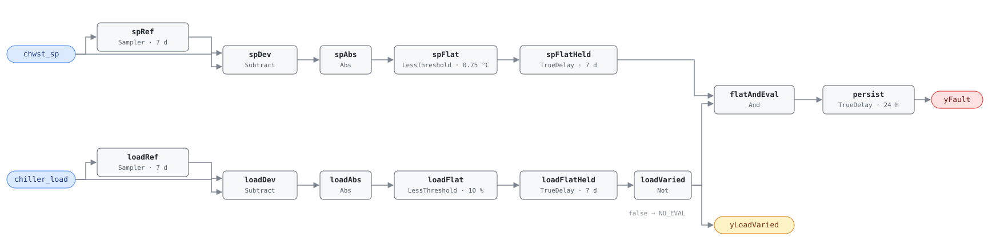

## Description

The chilled water supply temperature setpoint sits at one value week after week
while the plant's load moves underneath it. A working CHWST reset raises the
setpoint as cooling demand falls, and a chiller making 8 °C water instead of
6 °C does the same job for 4–6% less power, because the compressor lifts against
a smaller temperature difference. PNNL's 151-building study found this in more
than 30% of buildings — the plant-side half of the story AHU-0023 and
AHU-0024 tell about air handlers, and the fix is desk work.

What the rule cannot do is distinguish a plant that will not reset from one that
has nothing to reset against. A hospital chiller pinned at full load all week has
a defensible reason to hold its setpoint, so the load signal must move before a
flat setpoint is evidence — that is `yLoadVaried`, and why the host reads it
first.

## Detection Logic

```
baseline(x)  = x sampled and held every evaluation_window (7 days)
sp_flat      = |chwst_sp − baseline(chwst_sp)| < sp_flat_tolerance,
               continuously for evaluation_window
load_flat    = |chiller_load − baseline(chiller_load)| < load_variation_tolerance,
               continuously for evaluation_window

yLoadVaried  = NOT load_flat      (false ⇒ host reports NO_EVAL)
yFault       = sp_flat AND yLoadVaried, sustained for alarm_delay
```

Block graph (`rule.cxf.jsonld`):



This is AHU-0023's detector with the plant's points bound to it. Two symmetric
chains compare each signal against a weekly `Discrete.Sampler` baseline, which
emits the live input on its first tick, so there is no startup artifact.
`spFlatHeld` asserts only after the setpoint has stayed within tolerance
continuously for a full window, and any reset activity of 0.75 °C or more
restarts it. `loadFlatHeld` does the same for load, and its negation is
`yLoadVaried` — "not varied" means a full window of continuous flatness, so the
signal is optimistically true during the first window after startup, which is
harmless because `yFault` needs that same window.

Both dwell timers fire on the same tick when the plant is flat in both signals,
so the fault conjunction is false by construction on that tick and there is no
boundary race. `persist` (24 h) filters the remainder and every `TrueDelay`
carries `delayOnInit = true`. Worst-case time to alarm from cold start is
`evaluation_window + alarm_delay` — 8 days. Comparisons are strict, so a signal
sitting exactly on a tolerance falls on the *not-flat* side.

## Possible Diagnoses

1. CHWST reset never programmed
2. CHWST reset disabled by operator
3. Reset overridden to fixed value
4. Valve request signals not reaching the plant controller

## Energy Impact

EXCESS_CONSUMPTION, HIGH confidence, PROXY_ESTIMATION (EEM-11, PNNL-25985).
Raising CHWST by 1 °C typically improves chiller efficiency by 2–3%; the
whole-site figure is 0.5–2%, cooling-dominant. Prevalence is above 30% of
buildings (PNNL 151-building study). The savings are pure sequence work, but
they are capped by the coils — raise CHWST past what they can still dehumidify
with and the plant trades chiller kW for humidity complaints, which is why the
reference's estimate is parameterised on a `potential_chwst_increase` the host
supplies rather than on the fault alone.

## Emissions Impact

Scope 2, PROXY_EMISSIONS, HIGH confidence; typical 500–5,000 kg CO₂e/yr for a
suboptimal reset strategy. Avoided-emissions basis: MOER (marginal).

## Deviations

- **Windowed range → deviation from a weekly sampled baseline.** The reference
  computes `max(CHWST_SP) − min(CHWST_SP)` over the window; CDL's elementary
  library has no windowed min/max, so both chains compare against a
  `Discrete.Sampler` hold with tolerances at half the reference ranges.
  Detection is equivalent for signals that move and return, and slightly
  conservative for monotonic drift inside one window: a setpoint ramping by
  1.4 °C across the week clears the dwell where a range test would still call it
  flat. AHU-0023 is the precedent and the mechanism is copied unchanged.
- **`Reals.MovingAverage` rejected, and the tick band that follows.** The engine
  implements it with a fixed 64-checkpoint ring, so a seven-day window would
  need `dt ≥ 9,600 s` before it stops silently dropping its oldest samples. No
  BAS ticks that slowly; AHU-0023 found this and this card inherits it. The
  sampler-and-dwell chain has no lower bound on tick period, and its upper bound
  is the one to watch — a reset excursion shorter than one tick is invisible to
  the flatness test, so trend at 5–15 min.
- **`min_load_range` is adopted, not transcribed.** The chapter names it in the
  equation but its tunables line lists only `evaluation_window`,
  `min_expected_sp_range` and `AlarmDelay`, so the parameter has no published
  default. The shipped 20% (as `load_variation_tolerance = 10 %`, half-range)
  follows AHU-0023's `min_oat_range_for_eval` in shape and intent: a low bar a
  real plant clears easily, not a discriminating threshold. A chiller that never
  swings 20 points across seven days is base-loaded — NO_EVAL is the right
  answer — or its load point is dead.
- **Strict comparisons on both tolerances.** `Reals.LessThreshold` is `u < t`,
  so a setpoint deviating exactly 0.75 °C clears the flatness dwell and a load
  deviating exactly 10% counts as varied. Equality is measure-zero in continuous
  data but perfectly reachable in a BAS that scales setpoints to fixed
  increments, so both boundaries are pinned from both sides.
- **NO_EVAL is surfaced as `yLoadVaried`.** Boolean block logic has no
  tri-state, so evaluability is a second boundary output the host consults
  before interpreting `yFault` — false means NO_EVAL, never healthy. Same
  inverted-flat semantics as AHU-0023's `yOatVaried`.
- **`AlarmDelay` = 24 h implemented as `TrueDelay` on the fault conjunction**;
  the evaluation window itself is enforced by the two flatness dwells.
  `delayOnInit = true` on every `TrueDelay` (startup conservatism per
  AHU-0016), so a rule loaded into an already-faulted plant still waits the
  full window plus delay.
- **Transcription gaps in the source.** The chapter gives CHW-0002 no
  description paragraph, no operating-states line and no test vectors, so
  `operating_states`, `preconditions` and every scenario in `vectors.json` are
  this card's judgement. The chapter's heading is "Chilled water supply
  temperature reset not functioning"; `name` carries the shorter index spelling
  from `faults/chw/README.md`, which owns names.
- **Blind spots.** The rule reads the setpoint, never the water: a plant whose
  setpoint moves while the chillers ignore it is CHW-0001's problem.
  Diagnoses 1–3 are one signature. A reset driven by something other than plant
  load — an OAT-scheduled CHWST reset in stable weather, or a demand-limited
  plant — is flat for legitimate reasons and reads as a fault whenever the load
  happens to move. And a plant flat in both signals because it is off is
  indistinguishable from a healthy idle plant; the host's operating-state gate,
  not the graph, keeps that quiet.

## Notes

Fix path is the [missing-reset](../../../playbooks/missing-reset.md) playbook:
verify by plotting CHWST setpoint against plant load over the window, then
program the reset in the plant controller. The playbook's worked examples are
the AHU-side pair (SAT and DSP); the plant-side procedure is the same shape one
system upstream.

`clusters` is deliberately empty. CLU-02 ("Missing Reset Strategy") is currently
an AHU-scoped cluster triggered by AHU-0023, and membership is
`clusters/clusters.json`'s to declare — `faults/chw/README.md` calls this pair
the CLU-02-style root cause one system further upstream. A plant failing both
CHW-0002 and CHW-0003 has one root cause, no reset strategy ever
commissioned, and should be dispatched as one visit.
