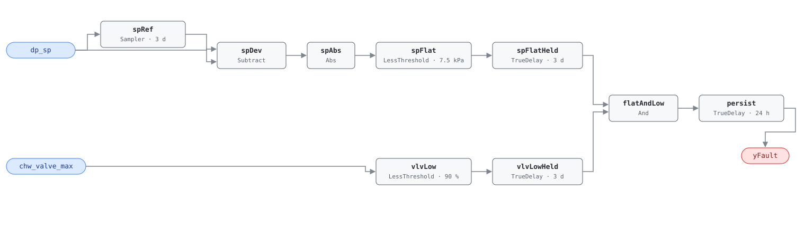

## Description

The chilled water loop differential-pressure setpoint never moves while every
coil valve on the loop is throttling. The pumps hold a design-day pressure
against a building that is not asking for one, and the valves burn the
difference across their seats. Pump power goes with the cube of pressure, so
this is the cheapest large number in the plant: a 20% setpoint reduction is
about half the pump energy, and the reset that achieves it is a sequence, not a
purchase. The valve conjunct is what makes the finding safe to act on — a flat
setpoint alone is also what a working reset looks like when a starving coil has
pinned it at its upper limit. Found in more than 30% of buildings (PNNL
151-building study), usually alongside its supply-temperature twin CHW-0002
and for the same reason.

## Detection Logic

```
baseline(dp_sp) = dp_sp sampled and held every evaluation_window (3 days)
sp_flat         = |dp_sp − baseline(dp_sp)| < sp_flat_tolerance,
                  continuously for evaluation_window
low_demand      = chw_valve_max < high_valve_threshold,
                  continuously for evaluation_window

yFault = sp_flat AND low_demand, sustained for alarm_delay
```

Block graph (`rule.cxf.jsonld`):



The setpoint chain is AHU-0024's sampled-baseline flatness detector with the
plant's points bound to it: a `Discrete.Sampler` refreshed once per window
supplies the reference value, and `spFlatHeld` asserts only after the setpoint
has stayed within `sp_flat_tolerance` of it continuously for a full window.

The demand condition needs no baseline. The reference's
`max(chw_valve_positions) < high_valve_threshold` over the window is exactly
equivalent to "the most-open valve stays below the threshold continuously" —
one `LessThreshold` plus a dwell, an exact transformation rather than an
approximation. Both comparisons are strict, so a valve at exactly 90% is not low
demand and a setpoint deviating exactly 7.5 kPa is not flat; both boundaries
fall on the no-fault side. Every `TrueDelay` carries `delayOnInit = true`, and
worst-case time to alarm from cold start is `evaluation_window + alarm_delay` —
4 days.

## Possible Diagnoses

1. DP reset never programmed
2. DP reset disabled or overridden
3. Valve position feedback not connected
4. DP sensor at wrong location

## Energy Impact

EXCESS_CONSUMPTION, HIGH confidence, PROXY_ESTIMATION (EEM-10, PNNL-25985).
Savings 0.5–2% of site energy, climate-neutral, through the cubic pump law:
`pump_waste_kw = chw_pump_kw × [1 − (1 − DP_reduction/100)³]`. Prevalence above
30% of buildings. Diagnosis 4 changes the economics — moving a DP sensor to the
hydraulically most remote coil is a pipe-fitting job rather than a desk job, and
the reference lists it because a sensor at the pump discharge makes a correct
reset impossible rather than merely absent.

## Emissions Impact

Scope 2, PROXY_EMISSIONS, HIGH confidence; typical 300–3,000 kg CO₂e/yr of
excess pump energy. Avoided-emissions basis: MOER (marginal).

## Deviations

- **`chw_valve_positions` (vector) → host-derived `chw_valve_max` (scalar).**
  Library v1 has no vector boundary points, so the host aggregates and feeds one
  scalar (`derived: true` in the point dictionary). AHU-0024's
  `zone_dmpr_pos_max` is the precedent, and the cost is in `preconditions`: the
  graph cannot tell a maximum over ten coils from a maximum over three.
- **Windowed range → deviation from a sampled baseline** on the setpoint chain,
  with `sp_flat_tolerance = min_expected_sp_range/2`, exactly as AHU-0023/AHU-0024;
  CDL has no windowed min/max block. Detection is equivalent for a setpoint that
  moves and returns and slightly conservative for monotonic drift inside one
  window. The valve chain is not an approximation.
- **`Reals.MovingAverage` rejected, and the tick band that follows.** Its fixed
  64-checkpoint ring needs `dt ≥ evaluation_window/63` — 4,114 s at three days —
  before the window stops silently dropping its oldest samples, and no BAS ticks
  that slowly. The sampler-and-dwell replacement has no lower bound on tick
  period; its upper bound is what you need to see, since an excursion shorter
  than one tick is invisible to the dwells. Trend at 5–15 min.
- **`high_valve_threshold` is adopted, not transcribed.** The chapter names it
  in the equation but its tunables line lists only `evaluation_window`,
  `min_expected_sp_range` and `AlarmDelay`. The shipped 90% is deliberately
  permissive on the fault side — the conjunct's only job is to exclude a loop
  genuinely pinned at maximum demand, and a modulating two-way valve at 90% is
  within a hair of having no authority left. It is looser than AHU-0024's
  chapter-supplied 70% damper analog, so a site wanting that margin should set
  70–80. Note the direction: raising this number makes the rule fire more often.
- **No evaluability output.** The valve test is a conjunct of the reference's
  fault condition, not an evaluability gate (contrast CHW-0002's
  `yLoadVaried`, which mirrors the reference's own NO_EVAL semantics). An output
  carrying `chw_valve_max < high_valve_threshold` would only echo one boundary
  input through a threshold, so the rule ships `yFault` alone and the staleness
  question stays in `preconditions`.
- **`AlarmDelay` = 24 h implemented as `TrueDelay` on the fault conjunction**;
  the evaluation window itself is enforced by the two dwells. `delayOnInit =
  true` on every `TrueDelay` (startup conservatism per AHU-0016).
- **Transcription gaps in the source.** The chapter gives CHW-0003 no
  description paragraph, no operating-states line and no test vectors, so all
  vectors here are constructed. Its Required Points line reads
  "DP_SP, chw_valve_positions"; canonical names come from
  `points/chw.points.json`. The chapter's heading is "CHW loop differential
  pressure reset not functioning"; `name` carries the shorter index spelling
  from `faults/chw/README.md`, which owns names.
- **Blind spots.** The rule sees the setpoint, not the pressure: a loop whose
  setpoint resets correctly while the pumps fail to track it is a different
  fault. Diagnosis 4 is invisible here — a badly placed sensor produces a
  plausible flat setpoint this rule reports as a missing reset, which is why the
  playbook's first step is to check where the sensor is. Diagnosis 3 is worse
  than invisible: it corrupts the input the rule leans on, and a defaulted-to-zero
  feedback reads as a permanent low maximum. And a loop whose pumps are off for
  the window holds both signals flat, which only the host's operating-state gate
  can suppress.

## Notes

Fix path is the [missing-reset](../../../playbooks/missing-reset.md) playbook.
Its worked examples are the AHU-side pair; the plant-side procedure is the same
shape one system upstream — plot `dp_sp` against the most-open coil valve over
the window, confirm the DP sensor is at the hydraulically most remote coil, then
program the reset.

`clusters` is deliberately empty: CLU-02 ("Missing Reset Strategy") is currently
AHU-scoped and triggered by AHU-0023, and membership is
`clusters/clusters.json`'s to declare. A plant failing both CHW-0002 and
CHW-0003 has one root cause and should be dispatched as one visit. Expect
CHW-0004 (low delta-T) nearby for the opposite reason: low delta-T drives flow
up and can hold coil valves open, which is the condition that legitimately
suppresses this fault.
