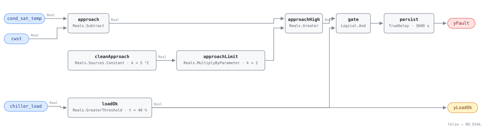

## Description

A condenser rejects heat through a temperature difference. Saturated condensing
temperature sits above the water leaving the condenser by an approach a clean
machine holds nearly constant at a given load, and everything that gets between
refrigerant and water widens it: scale and biofilm on the tubes, non-condensables
collected in the shell, oil carryover, condenser water flow below design. None of
it looks like a breakdown — the chiller still makes its chilled water setpoint,
it just lifts further to do it, and the compressor pays for the extra lift at
roughly 2-4% of its power per degree. This rule watches the approach while the
machine is loaded and alarms when it stays above that machine's commissioned band.

## Detection Logic

```
approach   = cond_sat_temp − cwst
band_limit = clean_approach × approach_fault_multiple   (5.0 × 2.0 = 10.0 K)

yLoadOk = chiller_load > min_load_for_eval        (false ⇒ host reports NO_EVAL)
yFault  = approach > band_limit AND yLoadOk,
          sustained continuously for alarm_delay
```

Block graph (`rule.cxf.jsonld`):



`cleanApproach` and `approachLimit` assemble the band inside the graph rather
than shipping a pre-multiplied 10.0: the commissioned approach is measured on the
machine and the multiple is a tolerance, and they are retuned separately.

`approachHigh` is strict, and the boundary is bit-exact — 5.0 doubled is exactly
10.0, which a realistic temperature pair reaches exactly — so a machine sitting
on the band reads healthy by the strictness rather than by rounding. `loadOk` is
the whole NO_EVAL story: approach scales with heat flux, so at 20% load a fouled
condenser and a clean one both look fine, and `yLoadOk` is what lets a host tell
that silence from a verdict. `persist` requires 60 continuous minutes and carries
`delayOnInit = true`.

Being differential is what makes this rule worth having next to the tower cards:
warm condenser water raises condensing temperature and leaving water together, so
a tower that cannot make its setpoint is TOWER-0001's finding, not this one.

## Possible Diagnoses

1. Condenser tube fouling — scale, biofilm, or silt on the water side, the
   mechanism both cited sources name first, and the one a tube cleaning fixes
2. Non-condensable gas in the shell, from a leaking seal or an evacuation that
   was cut short; it raises condensing pressure and separately degrades the
   heat-transfer coefficient, and on this signal alone it is indistinguishable
   from fouling (BEE 2006 §3.10). A purge unit that runs constantly is the tell
3. Condenser water flow below design — a throttled or failing pump, a fouled
   strainer, a mis-positioned balancing or isolation valve. Same symptom, a
   different repair, and CHW-0004's low delta-T sibling on the condenser side
4. Oil carried over into the condenser, coating tubes; no point observes it
5. Water treatment lapsed — the cause behind cause 1, and the one that decides
   how soon the tubes foul again after cleaning
6. Neither: a wrong-refrigerant P-T lookup, a mis-bound cwst, or a drifting
   sensor. Rule this out first, because it costs nothing and it is common

## Energy Impact

EFFICIENCY_LOSS, MEDIUM confidence, PROXY_ESTIMATION. The estimator is
`waste_kw ≈ chiller_kw × lift_sensitivity × (approach − clean_approach)`: the
share of compressor power spent lifting across a resistance that should not be
there. A machine 5 K past its commissioned approach spends roughly 11-16% of its
compressor power on it, which brackets BEE 2006 §3.10's report of about 20% at
four times the design fouling factor. MEDIUM because the sensitivity ratio is
well corroborated while the excess it multiplies is only as good as the
commissioned baseline. Cooling-dominant, worst on design days.

## Emissions Impact

Scope 2, PROXY_EMISSIONS, MEDIUM confidence; the same order as CHW-0001's
1,000-10,000 kg CO₂e/yr, since both findings are compressor electricity on one
machine, and toward the lower end of it because this rule accuses one heat
exchanger rather than the whole machine. Marginal operating emissions rate
basis. The timing works against the building: condenser fouling costs most on
hot afternoons, which are also the hours the dirtiest generator is dispatched.

## Deviations

- **The band is a commissioning placeholder, not a threshold.** Three deep-read
  sources — BEE 2006, PNNL-13890, and the DOE/PNNL O&M Best Practices Guide 3.0 —
  corroborate the mechanism and supply no fault-grade approach magnitude for a
  chiller condenser; ASHRAE RP-1043 is the pending primary source for that number.
  Until a site commissions `clean_approach`, this rule runs against a placeholder
  in the same sense HP-0001's shipped regression coefficients do.
- **The shipped 5.0 K spans an order of magnitude of real machines.** BEE §3.8
  gives shell-and-tube condensers a 5-10 °C approach and plate condensers 1-5 °C,
  while the reference's remediation playbook quotes 1-2 °F design for a chiller
  condenser; neither defines the difference precisely enough to reconcile them,
  and the playbook writes it in the order that cannot be right physically. The
  shipped pair reproduces BEE's shell-and-tube band (5 K clean, 10 K trip) and is
  therefore biased toward silence: on a machine whose true clean approach is 1 K,
  an uncommissioned instance never alarms. That is the intended direction.
- **`approach_fault_multiple = 2.0` is the one fault-side number any source
  supplies.** The reference's remediation playbook states that an approach more
  than 2x design indicates fouling on that side; the deep-read literature offers
  nothing to compare it against. It is also the band shape batch 18's tower cards
  adopt, so the condenser side and the tower side read the same way — a design
  consistency choice, not a second derivation.
- **The simulation study grounds the band's shape, not its magnitude.** The
  4-climate healthy envelope committed in `tools/simharness/README.md` measures a
  tower's leaving-water-to-wet-bulb approach (healthy p50 1.6-11.5 °C, fan-speed
  dependent). This card's approach is refrigerant-to-water inside the chiller
  barrel — a different quantity that the study does not bound — so the honest
  claim is the 2x band form the study argued for, and nothing numeric.
- **The energy model applies an evaporator-side sensitivity to the condenser
  side.** The DOE/PNNL guide's 1.7%/°F centrifugal and 1.2%/°F reciprocating split
  is stated for chilled-water supply temperature; both sources argue lift
  symmetrically and BEE §2.5.2 states the symmetric form directly, so the split
  crosses over as a lift sensitivity — an approximation, which is why
  `runtime_estimation` writes it as one.
- **The same document family's condenser-side numbers disagree by about 2x.** Its
  chiller chapter puts condenser water lowered 2-3 °F at 2-3% efficiency; its
  cooling-tower chapter puts 2.5-3.5% per °F of condenser temperature. Neither
  cites a derivation. This card uses the chiller-chapter figure, which is
  consistent with BEE's independent 2-4%/°C band, and treats the tower-chapter
  number as a loose ceiling rather than a second measurement.
- **`min_load_for_eval` is entirely adopted; no source gates this test.** 40% is
  CHW-0004's floor on the same `chiller_load` point, so the two chiller rules
  read the load axis identically. The gate matters more here than there: approach
  shrinks with heat flux, so a low-load machine hides a fouled condenser rather
  than faking one, and the failure it prevents is a host reading silence as health.
- **A fixed band across the whole load range is a simplification.** Approach rises
  with load on a clean machine too, so one line evaluated anywhere above 40% is
  loose at 90% load and tight at 45%. A load-normalized band is the RP-1043-shaped
  successor; nothing in the sources says how approach should scale, so it is not
  expressible as a placeholder.
- **Strict `>` at the band and at the load floor.** CDL `Reals` has no
  `GreaterEqual`; a machine exactly on the band reads healthy, one at exactly 40%
  load reads NO_EVAL. Both disagreements are measure-zero and err toward silence.
- **`yLoadOk` is an evaluability output, not an echo of an input** — a boundary
  input compared against a parameter, which is what SCHEMA.md asks. Same stance as
  CHW-0004's `yLoadOk` and HP-0001's `yPowerOk`.
- **Nothing guards the mis-binding in either direction.** Bound to the entering
  (cold) condenser water, the rule adds the condenser range to every reading and
  alarms forever; fed a saturation temperature from the wrong refrigerant table,
  it goes quiet on a fouled machine. Both are pinned as vectors and left to
  `preconditions`, because the graph cannot see a derivation it does not perform.
  Commissioning check: read the approach once on a machine known clean and confirm
  it lands where the manufacturer's data says it should.
- **Persistence stands in for averaging.** The rule consumes instantaneous points,
  so an approach oscillating either side of the band never accumulates the hour.
  Fouling is steady and reads the same either way; a hunting condenser water valve
  does not, and is a finding this rule cannot make.
- `persist.delayOnInit = true` (CDL default `false`), the library's standing
  choice: a machine already above its band at controller restart waits out the
  full hour rather than alarming on the first tick.
- **`clusters: [CLU-06, CLU-10]` with CLU-06 the obvious candidate.** `clusters/clusters.json`
  groups the chilled water plant syndrome behind CHW-0001 as trigger, and a
  fouled condenser drives kW/ton up exactly as that cluster describes. Membership
  is the cluster owner's edit.
- **`playbooks` cites two and only one names this card back.**
  `cooling-tower-performance`'s Applies-To row already carries CHW-0005 and its
  Step 1 describes this test correctly; `chiller-efficiency`'s row does not yet,
  and that edit belongs to the index owner — the sequencing CHW-0004 and
  HW-0004 both recorded.
- **No published test vectors exist.** No source specifies cases for this test, so
  every scenario in `vectors.json` is authored from the equation and replayed
  against the pinned engine rev.
- Operating states and preconditions are declared in frontmatter for host
  enforcement, not encoded in the block graph. Severity 3 and `method: rule` are
  this card's own, matching the CHW chapter's efficiency-loss cards.

## Notes

Read `yLoadOk` before `yFault`, and read this rule next to CHW-0001. A fouled
condenser raises kW/ton, so the efficiency alarm usually fires first and says
only that the machine costs more than it should; the approach says which heat
exchanger to open. If both are quiet and kW/ton is still high, the evaporator
side is the remaining candidate and no card covers it — the `evap_sat_temp`
route HP-0004 takes on packaged equipment. Trend approach against load for a
week before scheduling a cleaning: an approach that widens with load points at
fouling or at flow, while one flat and wide across the range points at
non-condensables or at a mis-set `clean_approach`.
