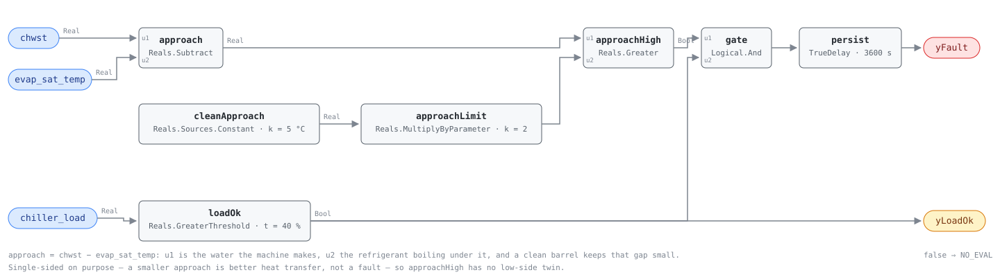

## Description

An evaporator absorbs heat through a temperature difference. Refrigerant boils
below the water leaving the barrel by an approach a clean machine holds nearly
constant at a given load, and everything that gets between water and refrigerant
widens it: scale and biofilm on the tubes, oil that has drained out of the
compressor and coats them, a charge too low to wet the bundle, chilled water flow
below design. The machine still makes its chilled water setpoint — it just boils
colder to do it, and the compressor pays for the extra lift at roughly 2-4% of its
power per degree. This rule watches the approach while the machine is loaded and
alarms when it stays above that machine's commissioned band. It is the evaporator
half of the pair CHW-0005 opens on the condenser side.

## Detection Logic

```
approach   = chwst − evap_sat_temp
band_limit = clean_approach × approach_fault_multiple   (5.0 × 2.0 = 10.0 K)

yLoadOk = chiller_load > min_load_for_eval        (false ⇒ host reports NO_EVAL)
yFault  = approach > band_limit AND yLoadOk,
          sustained continuously for alarm_delay
```

Block graph (`rule.cxf.jsonld`):



The subtraction is water-minus-refrigerant, so a working chiller makes a positive
approach and a widening one moves toward the trip. The test is single-sided: an
approach smaller than commissioned is better heat transfer, not a fault.

`cleanApproach` and `approachLimit` assemble the band inside the graph rather than
shipping a pre-multiplied 10.0 — the commissioned approach is measured on the
machine, the multiple is a tolerance, and they are retuned separately.

`approachHigh` is strict and the boundary is bit-exact (5.0 doubled is exactly
10.0), so a machine sitting on the band reads healthy. `loadOk` is the whole
NO_EVAL story: approach scales with heat flux, so at 20% load a fouled evaporator
and a clean one both look fine, and `yLoadOk` is what lets a host tell that silence
from a verdict. `persist` requires 60 continuous minutes and carries
`delayOnInit = true`.

## Possible Diagnoses

1. Evaporator tube fouling — scale, biofilm, or silt on the water side; the
   playbook's evaporator-side branch, and the one a tube cleaning fixes
2. Low refrigerant charge — undercharge starves the barrel, leaving tube surface
   dry and pulling suction pressure down, which reads here as a widened approach.
   The playbook's own "most common root cause" behind an expensive chiller, and
   BEE 2006's case study 1 is the same fault at plant scale
3. Chilled water flow below design — a throttled or failing pump, a fouled
   strainer, a mis-positioned balancing valve. Same symptom, a different repair,
   and the sibling reading of CHW-0004's low delta-T on the same loop
4. Excess oil in the evaporator, drained out of the compressor and filming the
   tubes; no point observes it (BEE 2006 §3.10)
5. Water treatment lapsed — the cause behind cause 1, and the one that decides
   how soon the tubes foul again after cleaning
6. Neither: a wrong-refrigerant P-T lookup, chwst bound to the return water, or a
   drifting sensor. Rule this out first, because it costs nothing and it is common

## Energy Impact

EFFICIENCY_LOSS, MEDIUM confidence, PROXY_ESTIMATION. The estimator is
`waste_kw ≈ chiller_kw × lift_sensitivity × (approach − clean_approach)`: the share
of compressor power spent boiling colder than the machine should have to. A machine
5 K past its commissioned approach spends roughly 11-16% of its compressor power on
it, bracketing BEE 2006 §3.10's report of about 20% at four times the design
fouling factor. Both source families state the sensitivity for this side of the
machine, so the ratio is firmer here than on the condenser side; MEDIUM stands
because the excess it multiplies is only as good as the commissioned baseline.
Cooling-dominant, worst on design days.

## Emissions Impact

Scope 2, PROXY_EMISSIONS, MEDIUM confidence; the same order as CHW-0001's
1,000-10,000 kg CO₂e/yr, since both findings are compressor electricity on one
machine, and toward the lower end of it because this rule accuses one heat
exchanger rather than the whole machine. Marginal operating emissions rate basis.
The timing works against the building: the approach costs most at high load, which
is when the dirtiest generator on the grid is dispatched.

## Deviations

- **This card resolves half of a dangling reference.** The HVAC FDD Reference
  v1.0's chiller-efficiency playbook (pp. 161-163) has the technician compare both
  approaches to design and cites rule IDs CHW-FC-008/009 for them, but its ch.13
  rule set defines CHW-FC-050 through 053 only — those two IDs are named and never
  specified anywhere in the reference. This library resolves the pair as CHW-0005
  (condenser) plus this card (evaporator), in its own `{EQUIP}-{NNNN}` namespace
  rather than adopting the dangling legacy codes.
- **The band is a commissioning placeholder, not a threshold — and more so than on
  the condenser side.** BEE 2006 §3.8 gives approach bands for condensers by
  heat-exchanger type (plate 1-5 °C, shell-and-tube 5-10 °C) and states no
  evaporator equivalent anywhere; symmetry is engineering judgment, not something
  that text supports. ASHRAE RP-1043 is the pending primary source. Until a
  site commissions `clean_approach`, this rule runs against a placeholder in the
  same sense HP-0001's shipped regression coefficients do.
- **The shipped 5.0 K is CHW-0005's condenser number carried across, and it is
  deliberately silent.** The one evaporator-specific magnitude in the grounding is
  the reference playbook's "design typically 1-2 °F", which would put the trip near
  2 K and alarm on healthy barrels that run 2-3 K. Rather than ship a line that
  fires on clean machines, this card ships the sibling's baseline: a 10 K
  evaporator approach is past where a water chiller's own freeze protection would
  have tripped it, so an uncommissioned instance says nothing at all.
- **`approach_fault_multiple = 2.0` is the one fault-side number any source
  supplies**, and it is literally the same sentence CHW-0005 cites — the playbook
  states it for whichever side the approach was measured on. Shipping the same
  value on both cards is what makes the pair readable as a pair, not a second
  derivation.
- **The playbook's sign order is corrected.** It writes the evaporator approach as
  "refrigerant evaporating temp − chilled water leaving temp", which is negative on
  every working chiller; this card computes `chwst − evap_sat_temp`. Same
  correction CHW-0005 made to the condenser half of the same paragraph, which is
  written backwards in the same way.
- **Single-sided, and the low side is not a fault.** A smaller-than-commissioned
  approach is better heat transfer — a cleaned barrel, a machine below the load its
  baseline was taken at, a conservative `clean_approach`. Pinned by
  `low_approach_is_never_a_fault`. The corollary is a real blind spot: an approach
  reported *negative* is thermodynamically impossible and can only be a bad
  derivation, and this rule reads it as healthy (`negative_approach_reads_healthy`).
  A host wanting that check reads the approach itself, not `yFault`.
- **The energy model uses its sensitivity in the native direction.** BEE §2.5.2
  states the 2-4%/°C rule for the evaporating side and the DOE/PNNL split
  (1.7%/°F centrifugal, 1.2%/°F reciprocating) is stated for chilled-water supply
  temperature, so this card borrows nothing across the machine the way CHW-0005 had
  to — a firmer ratio at the same MEDIUM confidence.
- **`min_load_for_eval` is entirely adopted; no source gates this test.** 40% is
  CHW-0004's and CHW-0005's floor on the same `chiller_load` point, so the three
  chiller rules read the load axis identically. Approach shrinks with heat flux, so
  a low-load machine hides a fouled evaporator rather than faking one, and the
  failure the gate prevents is a host reading silence as health.
- **A fixed band across the whole load range is a simplification.** Evaporator
  approach rises with load on a clean machine too, so one line evaluated anywhere
  above 40% is loose at 90% load and tight at 45%. A load-normalized band is the
  RP-1043-shaped successor; nothing in the sources says how approach should scale,
  so it is not expressible as a placeholder.
- **Strict `>` at the band and at the load floor.** CDL `Reals` has no
  `GreaterEqual`; a machine exactly on the band reads healthy, one at exactly 40%
  load reads NO_EVAL. Both disagreements are measure-zero and err toward silence.
- **`yLoadOk` is an evaluability output, not an echo of an input** — a boundary
  input compared against a parameter, which is what SCHEMA.md asks. Same stance as
  CHW-0004's and CHW-0005's `yLoadOk`.
- **Nothing guards the mis-binding in either direction.** Bound to the chilled
  water return, the rule adds the evaporator range to every reading and alarms
  forever; fed a saturation temperature from the wrong refrigerant table, it goes
  quiet on a starved barrel. Both are pinned as vectors and left to
  `preconditions`, because the graph cannot see a derivation it does not perform.
  Commissioning check: read the approach once on a machine known clean and confirm
  it lands where the manufacturer's data says it should.
- **`related: [CHW-0001, CHW-0005]`.** CHW-0001 is the symptom this rule explains
  (kW/ton up, one heat exchanger named) and CHW-0005 is the other half of the pair;
  no suppression either way, because both approach rules can be true at once and
  each names a different repair.
- **Persistence stands in for averaging.** The rule consumes instantaneous points,
  so an approach oscillating either side of the band never accumulates the hour.
  Fouling and a lost charge are steady and read the same either way; a hunting
  expansion device does not, and is a finding this rule cannot make.
- `persist.delayOnInit = true` (CDL default `false`), the library's standing
  choice: a machine already above its band at controller restart waits out the full
  hour rather than alarming on the first tick.
- **`clusters: [CLU-06]`, and CLU-10 is deliberately not mirrored from CHW-0005.**
  CLU-06 (chilled water plant inefficiency, trigger CHW-0001) fits: a fouled
  evaporator drives kW/ton up exactly as that cluster describes. CLU-10 is named
  Condenser-Side Degradation and its trigger is TOWER-0001 — an evaporator finding
  shares neither its causes nor its investigation path, so claiming membership
  would be a false lead. Membership is the cluster owner's edit either way.
- **`playbooks: [chiller-efficiency]` and its Applies-To row names this card only
  as one of "the reference's CHW-FC-008/009, not yet authored".** Step 3.2 is
  already the correct remediation branch for this finding; updating the row to the
  authored IDs belongs to the index owner — the sequencing CHW-0004, CHW-0005, and
  HW-0004 each recorded.
- **No published test vectors exist.** No source specifies cases for this test, so
  every scenario in `vectors.json` is authored from the equation and replayed
  against the pinned engine rev.
- Operating states and preconditions are declared in frontmatter for host
  enforcement, not encoded in the block graph. Severity 3, `method: rule`, and
  MEDIUM confidence match CHW-0005 and the CHW chapter's other efficiency-loss
  cards.

## Notes

Read `yLoadOk` before `yFault`, and read this card next to CHW-0005 and CHW-0001.
When kW/ton is high, the two approach rules are the split — condenser, evaporator,
or neither — and "neither" is the playbook's cue to check the charge and the
compressor. Even then the split is not clean: an undercharged machine widens the
evaporator approach too. To commission `clean_approach`, trend approach against
load for a week on a machine known clean, take the baseline at the load the alarm
will be evaluated at, and re-measure after every tube cleaning.
