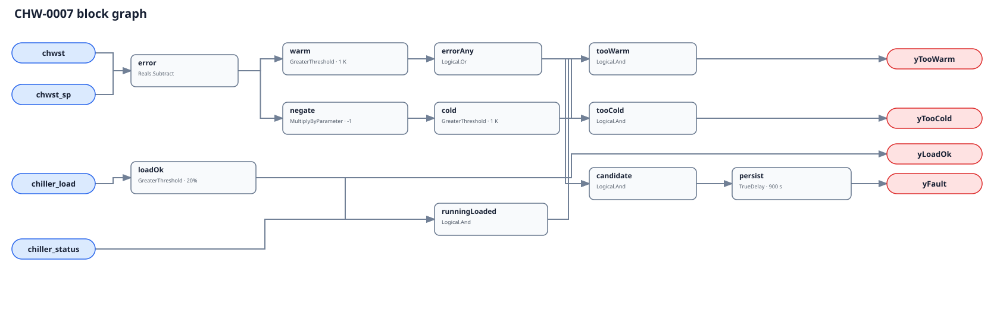

## Description

This rule reports a chiller or genuinely representative plant leaving-water
temperature that cannot hold its active target under meaningful load. A warm
direction can mean insufficient capacity, lost flow, fouling, refrigerant or
sensor trouble, or a current/lift limit. A cold direction can mean aggressive
staging, a misapplied setpoint, or a control loop driving below target. The
direction narrows investigation; it does not identify the failed component.

## Detection Logic

```
error          = chwst - chwst_sp
load_ok        = chiller_load > minimum_load
running_loaded = chiller_status AND load_ok
warm           = error > tracking_error
cold           = -error > tracking_error

yLoadOk  = load_ok
yTooWarm = running_loaded AND warm
yTooCold = running_loaded AND cold
yFault   = running_loaded AND (warm OR cold), sustained for sustained_duration
```



Both directional comparisons are strict. The diagnostic flags are gated by
machine status and load but are not persistence outputs. The single
`TrueDelay(delayOnInit=true)` follows their OR, so a sampled direct handoff from
too warm to too cold preserves timing: the machine never re-entered its band.
Any in-band, stopped, or low-load tick resets the timer, and recovery clears
immediately.

## Possible Diagnoses

1. Insufficient evaporator flow, closed isolation valve, or failed pump proof
2. Fouled evaporator tubes or low refrigerant charge
3. Compressor current, demand, surge, lift, or freeze-limit operation
4. Incorrect staging or a machine too small for the present load
5. Leaving-water sensor bias, stale value, or machine/header misbinding
6. Active setpoint not delivered to the chiller controller
7. Over-responsive local control, bad tuning, or unexcluded setpoint reset
8. Intentional ice-making or other non-comfort operating mode not host-gated

## Energy Impact

COMFORT_ENERGY and QUALITATIVE_ONLY. Overcooling normally increases compressor
lift; water that is too warm can force more air/water flow and can miss space or
humidity targets. This graph has no causal baseline or flow/power measurement,
so it does not turn temperature error into claimed savings.

## Emissions Impact

Scope 2, qualitative. Any avoided electrical energy is established only after
the host quantifies the chiller, pump, and air-side response.

## Deviations

- **All three defaults require commissioning.** PNNL supports the control and
  low-load context, not a universal 1 K error, 20% load floor, or 900 s delay.
- **Confidence is MEDIUM rather than the brief's proposed HIGH.** The signature
  is direct, but operating limits, setpoint transitions, and machine/header
  topology can produce the same evidence until binding and host gates are
  commissioned.
- **Common-header binding is conditional.** A mixed-header temperature can be a
  real plant target, but cannot validate an individual barrel by name alone.
- **Direction handoff preserves persistence.** One timer after the OR measures
  continuous out-of-band operation; an actual in-band sample resets it.
- **No automatic suppression is added.** CHW-0008 cannot suppress only its
  fail-to-start direction in current rule-wide metadata, and tracking during an
  unexpected run remains useful evidence. Hosts order diagnosis by direction.
- **CLU-06 is unchanged.** This control-capability signature is related to
  efficiency and approach findings, but the existing cluster is not broadened
  into a mixed staging/proof cluster in this slice.
