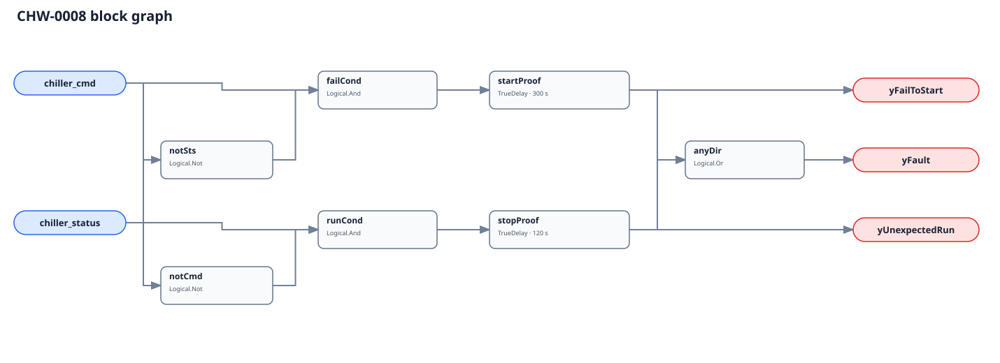

## Description

This rule asks whether an individual chiller did what its final stage command
requested. Commanded but unproved operation can indicate a failed permissive,
locked-out machine, starter/drive fault, missing flow, or bad status. Proven
operation after command removal can indicate manual/local control, welded
hardware, a second controller, or a command bound upstream of the real owner.

## Detection Logic

```
fail_to_start  = chiller_cmd AND NOT chiller_status
unexpected_run = NOT chiller_cmd AND chiller_status

yFailToStart   = fail_to_start sustained for start_proof_time
yUnexpectedRun = unexpected_run sustained for stop_proof_time
yFault         = yFailToStart OR yUnexpectedRun
```



The two conditions are structurally mutually exclusive and each has its own
`TrueDelay(delayOnInit=true)`. A mismatch that reverses direction therefore
clears the old flag and serves the new direction's complete timer; time never
accumulates across lanes.

## Possible Diagnoses

`yFailToStart`:

1. Chilled/condenser-water flow, valve, or pump permissive not established
2. Active anti-recycle, oil-system, freeze, lift, current, or safety lockout
3. Starter, VFD, compressor, control transformer, or disconnect failure
4. Final stage command landed on the wrong machine
5. Run-proof sensor, integration, or point freshness failure

`yUnexpectedRun`:

6. Local/manual mode, service override, or second plant controller
7. Welded contactor or command output stuck active
8. Command bound upstream of chiller-internal logic
9. Normal unload/coast-down longer than the configured stop window

## Energy Impact

PROTECTIVE with a direction-dependent proxy. Failure to start threatens cooling,
humidity control, and low-flow/freeze protection but is not excess chiller kW.
Unexpected operation can be sized host-side from the same machine's measured
power and mismatch duration; the graph itself reads no power.

## Emissions Impact

Scope 2, proxy-only for unexpected run. Do not assign avoided electricity to
the fail-to-start direction.

## Deviations

- **The timers are adopted, not source-transcribed.** Chiller permissive and
  coast-down sequences vary materially; 300/120 s are commissioning starts.
- **No rule-wide suppression targets CHW-0007.** Fail-to-start makes tracking
  non-evaluable, but unexpected run can still be loaded and meaningfully fail
  tracking. Current metadata cannot express one directional suppression safely.
- **The final command is downstream of ordinary anti-recycle behavior.** If a
  BAS request is bound upstream, correct machine protection looks like failure.
- **`delayOnInit=true` on both lanes** prevents immediate alarms when commands
  are re-driven and statuses repopulate after a runtime restart.
- **One card severity/category cannot describe both directions perfectly.**
  Severity 2 PROTECTIVE follows failure-to-start; hosts may route unexpected run
  as a lower urgency energy/override finding using the direction output.
- **No EnergyPlus validation is claimed.** Part-load ratio or power can proxy
  status, but the current model exposes no independent final per-chiller BAS
  stage command; fabricating it from status would make proof tautological.
- **CLU-06 is unchanged.** A command/proof disagreement is diagnosis ordering,
  not a member of the existing efficiency-triggered cluster.
