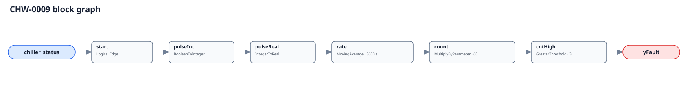

## Description

This rule counts starts of one chiller over a trailing window. PNNL identifies
low-load inability to turn down as a common mechanism: the machine quickly
overshoots its internal target and shuts off, then restarts when load returns.
Unstable staging, narrow deadbands, missing storage, safety trips, or unreliable
proof can create the same observable signature.

## Detection Logic

```
start = rising edge of chiller_status
count = MovingAverage(start, evaluation_window) × count_scale

yFault = count > max_starts
```



`Logical.Edge` counts OFF-to-ON proof transitions. The initialization pulse has
zero area, but the partially filled moving-average window extrapolates a pace;
the first complete window is therefore host-NO_EVAL. The fourth observed start
inside the default trailing hour raises the immediate raw verdict, with no
additional delay.

## Possible Diagnoses

1. Chiller oversized for shoulder-season or process load
2. Staging/deadband or minimum on/off timers configured too narrowly
3. Insufficient loop volume or thermal storage
4. CHWST reset/control causing low-load setpoint overshoot
5. Compressor, starter/drive, oil, flow, freeze, or safety trip and auto-reset
6. Chattering or stale run proof and communication replay
7. Multiple chiller statuses incorrectly ORed into one point
8. Approved exercise/test sequence not host-gated

## Energy Impact

PROTECTIVE and QUALITATIVE_ONLY. Short cycling can waste transient energy and
accelerate component wear, but a Boolean start counter cannot quantify either.
Use machine power, OEM start limits, and plant staging history host-side.

## Emissions Impact

Scope 2, qualitative. Avoided transient electricity and premature component
replacement are not inferable from status edges alone.

## Deviations

- **The three-start limit is adopted, not source-transcribed.** The OEM minimum
  on/off and starts-per-hour limits are authoritative for each machine.
- **`count_scale` is added to the brief's parameter table.** MovingAverage
  returns pulse rate; multiplying by `evaluation_window/tick` recovers count.
- **The first full window is NO_EVAL.** Partial-window event pace and reload
  history loss are exposed in vectors rather than hidden.
- **The legal evaluator band is `[evaluation_window/63,
  evaluation_window/(2×max_starts))`.** The lower edge protects the 64-sample
  ring; the upper edge preserves observability of the first integer count above
  a strict threshold. Real OFF/ON dwell may require faster acquisition still.
- **Confidence is MEDIUM rather than the brief's proposed HIGH.** Edge counting
  is direct, but the shipped count and status quality require commissioning.
- **A fleet OR is invalid.** Two chillers can cycle independently while the OR
  remains continuously true, making every lag-machine start invisible.
- **CLU-06 is unchanged.** Cycling relates to efficiency but does not share the
  cluster's current efficiency trigger/fix semantics, so the cluster is not
  broadened in this slice.
