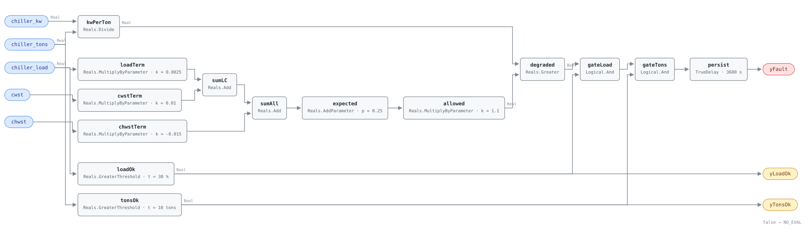

## Description

Kilowatts per ton is the chiller trade's efficiency number, and on its own it
diagnoses nothing. The same machine that turns in 0.45 kW/ton on a mild morning
with cold condenser water turns in 0.75 on a design afternoon, and both figures
can be perfectly healthy: what changed was the lift the compressor had to work
against and the load it was carrying. A fixed threshold on kW/ton alarms all
summer or never alarms at all.

What is stable is the relationship. For a given machine, kW/ton is close to a
plane in three variables — how loaded it is, how warm the condenser water is,
and how cold it is being asked to make the chilled water. Fit that plane over a
month of ordinary operation and the next reading is predictable to within a few
percent. This rule evaluates the plane. The host fits it (the reference specifies
a Ridge regression retrained periodically over 30 days) and writes the four
coefficients in as parameters; the graph computes what the machine should be
drawing at today's conditions and asks whether it is more than 10% above that.

The fault it finds best is the one nobody notices: condenser tube fouling. It
develops over months, it never trips an alarm on the chiller's own panel, and it
costs on every ton the machine makes. Chillers are the largest single electrical
load in most commercial buildings, so the reference's arithmetic is worth keeping
in mind — 0.1 kW/ton above baseline is roughly 15% excess chiller energy, which
on a large plant is a five-figure annual number.

## Detection Logic

```
measured_kw_per_ton = chiller_kw / chiller_tons
expected_kw_per_ton = kw_per_ton_load_coeff  × chiller_load
                    + kw_per_ton_cwst_coeff  × cwst
                    + kw_per_ton_chwst_coeff × chwst
                    + kw_per_ton_intercept
allowed_kw_per_ton  = degradation_ratio_threshold × expected_kw_per_ton

yLoadOk = chiller_load > min_chiller_load       (false ⇒ host reports NO_EVAL)
yTonsOk = chiller_tons > min_chiller_tons       (false ⇒ host reports NO_EVAL)
yFault  = measured_kw_per_ton > allowed_kw_per_ton AND yLoadOk AND yTonsOk,
          sustained continuously for alarm_delay
```

Block graph (`rule.cxf.jsonld`):



`loadTerm`, `cwstTerm`, `chwstTerm`, the two `Reals.Add` blocks and `expected`
are the fitted plane — three multiplies and three adds, and the whole statistical
content of the rule at runtime. `allowed` scales it by the tolerance, so the
comparison is against a second plane parallel to the first rather than against a
number. At the shipped placeholders, a machine at 50% load with 30 °C condenser
water making 6 °C chilled water is expected at 0.585 kW/ton and allowed 0.6435;
move the condenser water to 35 °C and the same machine is expected at 0.635 and
allowed 0.6985. The `same_kw_per_ton_is_a_fault_on_cool_condenser_water` and
`same_kw_per_ton_is_healthy_on_warm_condenser_water` vectors are the regression
test for that: identical power and tonnage, opposite verdicts, decided entirely
by where the regressors put the plane. `raised_chwst_tightens_the_allowance` does
the same job for the third regressor, whose coefficient is the negative one.

`kwPerTon` is the only division in the rule and its denominator is a live signal
that goes to zero whenever the machine unloads or its tons calculation fails.
That is what `tonsOk` is for. With tons at zero the quotient is infinite, the
comparison against the allowance is true, and without the guard a dead flow meter
would produce a permanent alarm — `zero_tons_holds_the_quotient_down` is that
case pinned. `tonsOk` drives both the boundary output `yTonsOk` and the second
input of `gateTons`, so a machine below the floor holds `yFault` down and the
host knows the silence means "not evaluated". `loadOk` does the same job for the
reference's own `min_chiller_load` gate, which is about comparability rather than
arithmetic: at 20% load a chiller is inefficient because it is a chiller at 20%
load.

The comparison at the allowance is strict, so a machine sitting exactly on the
allowed plane reads healthy and one 0.001 kW/ton above it alarms. The boundary is
bit-exact rather than approximate: `measured_exactly_at_the_allowance` puts a
power of two in the divisor, so the quotient is the same double the graph
computes for `allowed`. `persist` then requires 60 continuous minutes, which
rides out a capacity step, a condenser water reset, and the recovery after a
stage change.

## Possible Diagnoses

Transcribed from the reference's CHW-FC-050 card:

1. Condenser tube fouling — scale, biofilm, or silt from an open cooling tower
   loop. The most common cause and the one this rule is really for. Check the
   condenser approach temperature: it widens as the tubes foul, long before
   anything else complains
2. Evaporator tube fouling, which is rarer because the chilled water loop is
   closed, and usually means the loop's water treatment has been neglected or
   the system has been opened for work
3. Low refrigerant charge — a leak. Degrades kW/ton across the whole operating
   range without producing a single reading that looks wrong on its own
4. Compressor degradation: worn bearings, damaged impellers, failing unloader
   mechanisms. Elevated draw for the same delivered capacity
5. Non-condensable gases in the refrigerant, which raise condensing pressure
   directly. On a low-pressure machine this is usually the purge unit's runtime
   telling the story before the efficiency does

The discriminator between 1 and 2 is the approach temperature on each side, which
this rule does not read — a plant that trends both approaches alongside this
alarm separates the two causes for free. The chapter's introduction promises
"condenser and evaporator fouling through approach temperature analysis", but
none of its four specified rules performs it and neither does this library; on
this evidence the alarm names the degradation and the approaches name the side.

## Energy Impact

EFFICIENCY_LOSS, HIGH confidence, BASELINE_COMPARISON. The estimator is the ratio
the rule already computes:
`waste_kw = chiller_kw × (1 − expected_kw_per_ton / measured_kw_per_ton)`. A
machine drawing 358 kW at 0.70 kW/ton against a 0.585 baseline is spending about
59 kW on the degradation and the rest on cooling. The reference's range is 5–15%
of chiller energy, and its own yardstick — 0.1 kW/ton above baseline ≈ 15%
excess — is the one to quote to an operator, because it is in the units the
plant's own trend screen already shows.

The reference rates confidence HIGH and this card keeps that rating, with a
caveat that belongs on every self-learned baseline: the line is fitted from this
machine's own recent history, so the rule measures degradation *since the
learning period* and is blind to anything already wrong when the fit was taken.
A chiller with fouled tubes at commissioning learns a fouled baseline and reads
healthy forever. HP-FC-050 rates the same structural blindness MEDIUM; the
difference here is that a chiller is instrumented, trended, and periodically
tested against a factory performance curve in a way a rooftop heat pump is not,
so the fit has an independent reference to be checked against.

Climate sensitivity is cooling-dominant. The waste exists only while the machine
runs, and it is largest on the hottest days, when the plant runs longest and the
condenser water is warmest.

## Emissions Impact

Scope 2, PROXY_EMISSIONS, HIGH confidence; the reference's typical range is
1,000–10,000 kg CO₂e/yr for a degraded chiller, on a marginal operating emissions
rate (MOER) basis. All of it is purchased electricity at the compressor. The
range is wide because it spans a small machine with a slight charge loss and a
large one with fouled tubes, and because the marginal emissions rate at the hours
a chiller runs hardest is well above the annual average — a cooling peak is when
the dirtiest generator on the system is dispatched, so the CO₂e saved by cleaning
tubes is worth more than the kWh figure alone suggests.

## Deviations

- **All four baseline coefficients ship as documented PLACEHOLDERS.** The
  reference does not give numbers and could not: it specifies
  `expected_kw_per_ton = baseline_model.predict([chiller_load, cwst, chwst])`
  with "sklearn Ridge regression, retrained periodically" and a
  `learning_period_days` of 30. This library's split puts the fitting in the host
  and the fitted plane in the graph, so the coefficients are ordinary `set_param`
  targets. The shipped set (0.0025 /%, 0.01 /°C, −0.015 /°C, 0.25) describes a
  generic water-cooled centrifugal machine — 0.585 kW/ton at 50% load with 30 °C
  condenser water and 6 °C chilled water — and exists so the document is runnable
  as delivered. **They are not site values, and a wrong set fails silently in
  both directions**: fit the plane 15% high and nothing ever alarms, fit it low
  and every hour does. Precedent: HP-FC-050's `cop_baseline_slope` /
  `cop_baseline_intercept` and VAV-FC-050's `ventilation_requirement`.
- **The reference publishes no fit-quality bar for this fault, and this card does
  not invent a number.** HP-FC-050's chapter specifies `R² > 0.6`; chapter 13
  specifies only "retrained periodically" over 30 days. The frontmatter
  precondition therefore asks the host to confirm the fit is good enough to hold
  the plant to, without pretending the reference set a threshold. A site adopting
  HP-FC-050's 0.6 by analogy is making a defensible choice, not following the
  reference.
- **`kw_per_ton_chwst_coeff` is negative, and this is the documented exception to
  the library's no-negative-parameters rule.** The standing convention expresses
  a negative constant as `Sources.Constant` plus `Subtract` so no parameter
  carries a sign. A regression coefficient is inherently signed: for a normal
  machine raising the chilled water supply temperature reduces lift and improves
  kW/ton, so the fitted value is negative, and a host that re-fits on odd data
  could legitimately get any sign on any of the three. Forcing the signs into the
  topology would mean a different graph per machine. Precedent and identical
  reasoning: HP-FC-050's `cop_baseline_slope`.
- **The degradation test is expressed as a multiplier, not as the reference's
  fraction.** The reference writes `(measured − expected) / expected >
  degradation_threshold` with a 10% default. This rule computes
  `measured > 1.1 × expected`, the same predicate for any positive `expected`,
  and it avoids a second division whose denominator is a fitted plane that can
  cross zero. The consequence for hosts is the units: `degradation_ratio_threshold`
  is a multiplier of the baseline (1.1), not a percentage of degradation (10).
  Writing `10` into it does not tighten the rule — it silences it, because no
  real machine draws ten times its baseline kW/ton. HP-FC-050 carries the mirror
  image of this warning, where the same mistake produces a permanent alarm
  instead.
- **`min_chiller_tons` and `yTonsOk` are adopted, not transcribed.** The
  reference names no tonnage floor; its only evaluability gate is
  `min_chiller_load`. But the graph divides by a live signal, and per SCHEMA.md a
  test computable from the rule's own inputs belongs in the graph as a boundary
  output rather than as prose. Same stance as HP-FC-050's `elec_power_min` /
  `yPowerOk`.
- **The tonnage floor guards zero, not a wrong reading.**
  `tons_just_above_the_divide_floor_still_alarms` pins the limit: 10.1 tons
  against 20 kW is 1.98 kW/ton and alarms, because the guard only asks whether
  the denominator is near zero, not whether it is right. A tons signal that has
  collapsed to a small non-zero value — a flow meter reading 5% of actual, a
  delta-T calculation using a failed sensor — produces a believable-looking
  quotient and a false alarm on a healthy machine. Set `min_chiller_tons` from
  the machine's real minimum output rather than from zero, and read `yFault`
  beside the plant's own tonnage trend.
- **The tons unit hazard is the biggest single way to deploy this rule wrong.**
  The point dictionary marks `chiller_tons` provisional for exactly this reason:
  the reference and the kW/ton convention use refrigeration tons, while most BAS
  trend kW thermal or derive tons from flow × delta-T. Feeding kW thermal instead
  of tons scales the quotient by 3.517 — and because the host fits the
  coefficients against the same wrong signal, the baseline scales with it and the
  rule keeps working while every number in it is meaningless to a human reading
  the alarm. Nothing in the graph can detect this; it is a binding-time check.
- **Strict `>` at the allowance and strict `>` at both floors.** CDL `Reals` has
  no `GreaterEqual`, and the reference's degradation test is strict too, so
  nothing is lost there. The load floor is a different case: `min_chiller_load`
  appears only in the reference's tunables table ("Min chiller load to
  evaluate") and never in its equation block, so the operator is this card's
  choice and strict is the conservative one — exactly-at-the-floor is NO_EVAL.
  A machine exactly on the allowed plane reads healthy; a chiller at exactly 30%
  load or exactly 10 tons is not evaluated. All three boundaries are pinned
  from both sides, and the allowance boundary is bit-exact because
  `measured_exactly_at_the_allowance` uses 512 tons — a power of two, so the
  division is exact and the quotient is the same double `allowed` computes.
- **`learning_period_days` (30 d) stays a host precondition, and re-fitting is
  the dangerous part.** The fit happens offline, outside anything the graph can
  see. Whatever schedules it must refuse to re-fit while this fault is active:
  re-fitting a degraded machine bakes the degradation in as the new normal, and
  the rule then reports healthy on a chiller everybody agrees is fouled. Same
  caution as HP-FC-050, and it matters more here because the reference asks for
  periodic retraining rather than a one-time fit.
- **The fitted plane is extrapolated without limit.** Nothing in the graph knows
  the range of load, condenser water or chilled water temperature the regression
  was fitted over. Far enough outside it the expected value drifts into figures
  the fit never supported and, with the negative CHWST coefficient, can be driven
  non-positive — at which point `allowed` is non-positive too, every measured
  quotient exceeds it, and the rule alarms permanently rather than going quiet.
  (This is the opposite failure from HP-FC-050's, because the comparison runs the
  other way.) The block set has no domain guard to express this, so it is a
  frontmatter precondition; a host that wants it enforced can clamp the
  regressors with `Reals.Limiter` upstream.
- **One instance per chiller.** The reference's points are per-machine and so is
  the fit; a plant with three chillers runs three instances with three coefficient
  sets, and the host enables each while its machine is running. The library has
  no plant-level aggregate rule, and averaging machines would hide exactly the
  one that is degraded.
- **`method: statistical` describes the baseline's provenance, not the runtime.**
  The graph performs one division, four multiplies, three adds, three comparisons
  and a delay. The classification is the reference's and it is honest: the
  coefficients come from a regression. HP-FC-050 and RTU-FC-051 carry the same
  note.
- **`AlarmDelay` is renamed `alarm_delay`**, matching every other card in this
  library and unchanged at 60 min. `persist.delayOnInit = true` (the CDL default
  is `false`), the library's standing choice: a machine already above its plane
  when the controller restarts waits out the full hour rather than alarming on
  the first tick.
- **The reference publishes no test vectors for this fault, so all twenty-one in
  `vectors.json` are authored** from the equation and replayed against the pinned
  engine rev. Every threshold boundary is pinned from both sides and on it (the
  allowance, the load floor, the tonnage floor), both delay edges are pinned
  exactly at T + delayTime (init at 3600 s, mid-run at 5400 s), and both
  evaluability outputs have a release scenario.
- **The chapter's Notes line for this fault is truncated in the source
  extract.** It reads "Chen et al. (2024) showed data-driven chiller FDD degrades
  under" and stops mid-sentence. The missing clause is presumably about
  generalisation to unseen conditions, which is the standard finding in that
  literature, but this card does not transcribe what it cannot read: `source`
  cites the paper and the extrapolation deviation above states the blind spot in
  the terms this rule can actually support.
- **`clusters: [CLU-06]` is the existing cluster set's membership, not this
  card's authorship** — `clusters/clusters.json` already names this fault as the
  trigger of "Chilled Water Plant Inefficiency", with CHW-FC-051, 052 and 053 as
  members. That entry's `playbook` slug now resolves: the index owner
  transcribed the reference's "Chiller Efficiency Degradation" playbook to
  `playbooks/chiller-efficiency.md` (pp. 161–163) after this card first
  shipped, and the frontmatter cites it.
- **`playbooks` cites `chiller-efficiency`.** The reference's own playbook for
  this fault; its Applies-To row names CHW-FC-050 and CLU-06 directly (it also
  names CHW-FC-008/009, IDs from the reference's numbering that this library
  does not carry).
- Operating states and preconditions are declared in frontmatter for host
  enforcement rather than encoded in the block graph, per the library's design
  stance. Severity 3, `method: statistical`, `confidence: HIGH` and the fault
  name are the reference's chapter 13 card, transcribed through
  `faults/chw/README.md`.

## Notes

Read `yLoadOk` and `yTonsOk` before reading `yFault`. Three scenarios in
`vectors.json` — `degradation_clears_after_service`, `load_drops_after_alarm` and
`tons_signal_drops_after_alarm` — drop `yFault` at the same tick and mean
completely different things: a cleaned condenser, a chiller that unloaded, and a
dead tonnage signal. A host that treats the falling edge of `yFault` as a repair
will close this fault every time the plant stages down.

Where to look, in the order that costs least. The condenser approach temperature
is the first trend to pull: it is free, it is already on the chiller's panel, and
a widening approach with a rising kW/ton is tube fouling with enough confidence to
schedule a cleaning. If the approach is normal on both sides, the loss is inside
the machine — charge, compressor, or non-condensables — and that is a service
visit rather than a maintenance task. Purge unit runtime, on a low-pressure
machine, is the cheapest test for non-condensables and worth reading before
anyone connects gauges.

CHW-FC-053 (low delta-T) shares this rule's cluster and is worth checking first
when both are firing. Low delta-T forces early chiller staging, and a plant
running two machines at low load where one would do has a kW/ton problem whose
cause is not in either machine. The cluster's direction says this rule is the
trigger and 053 a member; on the physics the influence runs both ways, and the
plant-level reading is more useful than either alarm alone.

CHW-FC-051 (CHWST reset not functioning) is `related` for a reason visible in
this rule's own arithmetic: the CHWST coefficient is negative, so a plant that
raises its chilled water setpoint moves this rule's expected line *down* and is
held to a tighter kW/ton allowance afterwards. That is the physics working
correctly — the machine really should be more efficient at a higher evaporator
temperature — but a site that switches its reset on mid-baseline should re-fit
rather than let the old plane judge the new operating regime.

HP-FC-050 is the same detector one equipment family over: a fitted efficiency
baseline, host-supplied coefficients, an evaluability output guarding the
division. Anything learned about deploying one applies to the other, including
the failure that neither can see — a machine that was already degraded when its
baseline was taken.
