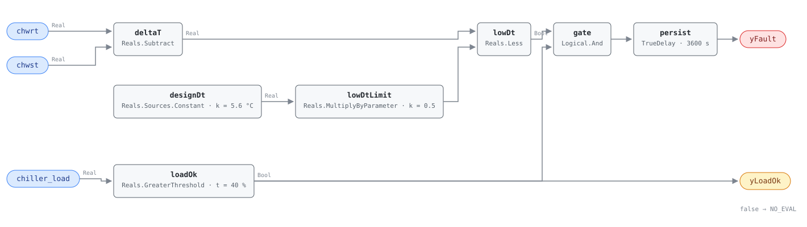

## Description

A chilled water plant is sized on a temperature difference, not on a flow. Design
the coils for 5.6 K between supply and return and the pumps move a certain number
of litres per second to carry the building's peak load. Let that difference fall
to 2 K and the same load needs nearly three times the flow — so the pumps run
faster, the second pump starts, and eventually a second chiller comes on to make
water that the first chiller could have made if the water had come back warm
enough to use.

That is low delta-T syndrome, and its signature is that nothing looks broken.
Every zone is comfortable, every chiller is running, and the only symptom is a
plant working much harder than the building it serves. It is measured at the
plant because that is where it shows: the individual causes — a three-way valve
bypassing, a fouled coil, a filter nobody changed, a control valve that will not
close — are each too small to see from the AHU that owns them, and they add up in
the return header.

The rule is the direct test the reference specifies: return minus supply, against
half of design, while the chiller is loaded enough for the number to mean
anything. What it cannot do is say which of the causes is responsible, or how
many of them are. It says the return water is too cold, which is one finding
about the whole plant.

## Detection Logic

```
delta_t   = chwrt − chwst
low_limit = design_delta_t × low_dt_fraction        (5.6 × 0.5 = 2.8 K)

yLoadOk = chiller_load > min_load_for_eval          (false ⇒ host reports NO_EVAL)
yFault  = delta_t < low_limit AND yLoadOk,
          sustained continuously for alarm_delay
```

Block graph (`rule.cxf.jsonld`):



`designDt` and `lowDtLimit` assemble the trip line inside the graph rather than
shipping a single pre-multiplied 2.8. Both of the reference's numbers survive as
separate `set_param` targets, which matters because they are retuned for
different reasons: `design_delta_t` changes when the plant does, and
`low_dt_fraction` changes when the site decides how much of design counts as
failure. VFD-FC-051 assembles its speed floor the same way for the same reason.

`lowDt` is a strict `Reals.Less`, so a plant sitting exactly on the trip line
reads healthy. The boundary is bit-exact rather than approximate: 5.6 halved is
the double nearest 2.8, and the `delta_t_exactly_at_the_threshold` vector reaches
the same double from 7.8 − 5.0, so the comparison is decided by the strictness
and not by rounding. `delta_t_just_below_the_threshold` and
`delta_t_just_above_the_threshold` pin 10 mK either side.

`loadOk` is the reference's `min_load_for_eval`, and it is also the rule's whole
NO_EVAL story — its published third vector (6 °C / 7 °C / 20% load) is a plant
whose delta-T is 1 K and whose verdict is "not evaluated", because at 20% load a
1 K delta-T is what a healthy plant produces. Exposing it as `yLoadOk` lets the
host tell that apart from a plant that is loaded and fine.

`persist` then requires 60 continuous minutes. Low delta-T is a syndrome, not an
event; an hour of it is a plant condition, and anything shorter is a valve
stroking or a coil catching up.

## Possible Diagnoses

Transcribed from the reference's CHW-FC-053 card:

1. Three-way valve bypass allowing CHW to short-circuit — the classic cause, and
   the one that gets worse as the building unloads, because that is when the
   bypass port is open widest
2. AHU/FCU coil fouling, which reduces heat transfer so the water leaves the coil
   colder than it should. AHU-FC-014 and FCU-FC-004 see the coil-side version of
   this from the air side, one unit at a time
3. Low airflow across cooling coils — dirty filters, a fan running slow, a closed
   damper. Less water-side heat transfer per pass for the same reason
4. CHW valve leaking or stuck partially open: the coil is passing water it is not
   using, which is the same arithmetic as a bypass valve with a different part
   number
5. Oversized CHW system relative to actual load — the case with no repair. The
   plant was designed for a load the building never reached, and the delta-T is
   telling the truth about that

Causes 1 through 4 are local defects that this plant-level rule aggregates; a
building with forty coils can reach the trip line with four of them misbehaving
and thirty-six fine. That is what makes the finding hard to chase and worth
having: nothing at the coil level is far enough out of range to alarm on its own.

## Energy Impact

EXCESS_CONSUMPTION, MEDIUM confidence, PROXY_ESTIMATION. The reference's estimator
is `excess_pump_kw ≈ chw_pump_kw × (design_dt − actual_dt) / design_dt`, which
reads the delta-T shortfall as the fraction of pumping that buys nothing: a plant
at 2.8 K on a 5.6 K design is spending about half its pump energy on water that
comes back too cold to be worth moving. The reference's range is 5–15% of pump
energy.

That understates the real cost and the card should say so. Pump energy is the
part the formula can see; the expensive consequence is staging — a plant that
cannot make its delta-T starts a second chiller to serve a load the first one
could have carried, and the compressor energy that follows dwarfs the pumps.
The reference names it ("staging inefficiency") in the affected-subsystem row
without putting a number on it, and neither does this card, because the number
depends on the plant's staging logic rather than on anything the rule measures.

Confidence is MEDIUM because the finding is plant-level and the repair is not:
the rule is reliable about the symptom and says nothing about which of five
causes to send someone after. Climate sensitivity is cooling-dominant — the
syndrome exists only when the plant is running, and it costs most in the hours
when it is running hardest.

## Emissions Impact

Scope 2, PROXY_EMISSIONS, MEDIUM confidence; the reference's typical range is
200–2,000 kg CO₂e/yr for the pump and staging inefficiency together, on a
marginal operating emissions rate (MOER) basis. All of it is purchased
electricity — pumps and compressors — so the scope assignment does not vary by
site the way a heating fault's does. The timing works against the building: low
delta-T bites hardest on the hottest afternoons, which are also the hours when
the marginal generator is dirtiest.

## Deviations

- **The trip line is assembled in the graph rather than folded into a
  threshold.** A single `Reals.LessThreshold` with `t = 2.8` would compute the
  same verdict with one block instead of three, and would lose both of the
  reference's tunables: a site with a 6.7 K design delta-T could no longer change
  the design value without recomputing the product, and the 50% fraction would
  stop being visible at all. `designDt` (`Reals.Sources.Constant`) feeding
  `lowDtLimit` (`Reals.MultiplyByParameter`) keeps them independent `set_param`
  targets. Precedent: VFD-FC-051's `minSpd` + `tol` speed floor. The shape
  differs from that precedent in one respect — VFD-FC-051 adds two constants,
  this rule multiplies a constant by a parameter — because the reference's
  composition is a product, not a sum.
- **Strict `<` at the trip line.** The reference writes `<` too, so nothing is
  lost, and CDL `Reals` has no `LessEqual` in any case. A plant at exactly
  2.8 K reads healthy. The disagreement is measure-zero and all three sides are
  pinned: `delta_t_exactly_at_the_threshold` reaches the boundary double exactly
  (7.8 − 5.0 is the double nearest 2.8, and so is 5.6 × 0.5), with
  `delta_t_just_below_the_threshold` and `delta_t_just_above_the_threshold`
  10 mK either side. The exactly-at vector uses a 5 °C supply temperature rather
  than the published vectors' 6 °C for that reason alone: 8.8 − 6.0 lands one
  ulp above 2.8 and would have pinned the wrong side of the boundary.
- **Strict `>` at the load floor, same treatment.** The reference writes
  `chiller_load > min_load_for_eval`, so a chiller at exactly 40% is NO_EVAL.
  `load_exactly_at_the_evaluability_floor`, `load_just_below_…` and
  `load_just_above_…` pin all three, and the last of them differs from the second
  by one tenth of a percent of chiller load.
- **`yLoadOk` is the library's shape for the reference's NO_EVAL row.** The
  reference writes the load test as a conjunct of the fault condition and
  publishes a NO_EVAL test vector for it; the graph computes exactly that
  conjunct and additionally exposes it as a boundary output, which adds no logic
  and changes no verdict. It is a comparison of an input against a parameter
  rather than an echo of an input, which is what SCHEMA.md asks an evaluability
  output to be. Same stance as HP-FC-050's `yPowerOk`.
- **Nothing guards against an inverted delta-T.** A swapped supply/return pair,
  or a sensor pair mounted on the wrong side of a decoupler, produces a negative
  delta-T, which is below any positive trip line and alarms permanently.
  `supply_and_return_sensors_swapped` pins that behaviour at −6 K so it cannot
  change silently. The reference has no such test and the block set could express
  one (`Reals.Limiter`, or a second comparison against zero), but a rule that
  suppressed negative delta-T would also suppress the genuine short-circuit case
  on a plant whose sensors are fine, so the honest answer is a documented blind
  spot rather than a guard. Commissioning check: swap the leads and watch the
  sign, once, before trusting the rule.
- **The rule is blind to which coil is responsible, and to how many.** The
  reference's diagnosis list is five local defects; the detector is a plant-level
  aggregate. This is the reference's design, not a simplification — the
  individual coil faults are usually too small to detect one at a time, which is
  why the syndrome is measured in the return header. AHU-FC-014 and FCU-FC-004
  are the coil-side rules worth running alongside it; neither is wired to this
  one.
- **Persistence stands in for averaging.** The rule consumes instantaneous
  points; the reference specifies no averaging. `intermittent_low_delta_never_alarms`
  pins the miss — delta-T alternating between 2 K and 6 K every 20 minutes never
  accumulates the full hour and never alarms, though a plant spending half its
  day below the line is a genuine finding. A steady syndrome, which is what a
  bypassing valve or a fouled coil produces, reads the same either way.
- **`AlarmDelay` is renamed `alarm_delay`.** The reference's tunables table
  spells the fault-persistence parameter in G36's PascalCase while spelling its
  three neighbours in snake_case; the library uses `alarm_delay` throughout and
  the value is unchanged at 60 min.
- `persist.delayOnInit = true` (the CDL default is `false`), the library's
  standing choice: a plant already below the line when the controller restarts
  waits out the full hour rather than alarming on the first tick.
- **`chiller_load` is the load proxy and it is per-chiller while the delta-T is
  per-loop.** The point dictionary flags this: on a multi-chiller plant the load
  signal belongs to one machine and the header temperatures belong to the loop,
  so a plant running two chillers at 45% each is evaluated on one of them. The
  reference names the same single point and does not address the multi-chiller
  case. Sites with several machines should bind the load signal from the lead
  chiller or a host-computed plant load.
- **Three published test vectors, eleven authored.** The reference publishes
  normal delta-T (6 °C / 12 °C / 60%, NO_FAULT), low delta-T (6 °C / 8 °C / 60%,
  FAULT) and low load (6 °C / 7 °C / 20%, NO_EVAL); all three are transcribed
  into `vectors.json` under the names `normal_delta_t`, `low_delta_t` and
  `low_load`, and all three pass. The other eleven — three sides of the trip
  line, three of the load floor, the mid-run collapse and recovery edges, the
  evaluability release, the intermittent case, and the swapped-sensor blind spot
  — are library-authored.
- **The chapter's Notes line for this fault is truncated in the source
  extract.** It reads "One of the most common and costly CHW plant issues.
  Forces" and stops. Nothing in this card depends on the missing clause; the
  "forces extra pumping" reading in `energy_impact.savings_range` comes from the
  chapter's own Savings Range row, which is complete, and not from the truncated
  sentence.
- **`clusters: [CLU-06]` is the existing cluster set's membership, not this
  card's authorship.** `clusters/clusters.json` already lists this fault as a
  member of "Chilled Water Plant Inefficiency" with CHW-FC-050 as the trigger.
  That cluster's `playbook` slug now resolves — the index owner transcribed
  `playbooks/chiller-efficiency.md` after this card first shipped.
- **`playbooks` cites `low-delta-t`.** The reference's own "Low Chilled Water
  Delta-T" playbook (pp. 163–164), whose Applies-To row names this card
  directly; transcribed by the index owner alongside the chiller playbook.
- Operating states and preconditions are declared in frontmatter for host
  enforcement rather than encoded in the block graph, per the library's design
  stance. Severity 3, `method: rule` and the fault name are the reference's
  chapter 13 card, transcribed through `faults/chw/README.md`.

## Notes

- Source-pointer precision: the reference's ch.13 card cites "PNNL-27338 §3";
  in PNNL-27338's own numbering the low delta-T algorithm sits in the
  hot-water-distribution chapter (§4.6), and that document's summary names
  chilled-water diagnostics as future work — so the citation is an
  analog/pattern source (the HW delta-T algorithm mirrored to CHW), not a
  CHW-specific specification (deep-read audit, 2026-08-17).

Read `yLoadOk` before reading `yFault`. A plant that is off, or coasting through
a mild morning at 25% load, holds `yLoadOk` false for hours at a time, and every
`yFault = false` underneath it means "not evaluated" rather than "delta-T is
fine". `load_drops_after_alarm` is the vector that makes the distinction
concrete: `yFault` falls at 5400 s in that scenario exactly as it does in
`delta_t_recovers_after_alarm`, and only the second output says which of the two
happened.

Where to look first, in the order that costs least. Trend the delta-T against
plant load for a week before sending anyone: a delta-T that degrades as the
building unloads points at bypass valves and leaking control valves, while one
that is flat and low across the whole range points at fouling or at a plant
oversized for the building. Then check the largest coils, because the syndrome is
a sum and the big AHUs dominate it. Filters and coil cleanliness are the cheap
end; three-way valve conversion is the expensive one.

CHW-FC-050 is the other half of the plant picture and shares this rule's cluster.
The two failures reinforce each other: extra pumping and a second chiller staged
early both push the plant's kW/ton up, so a site seeing both should treat the
delta-T as the trigger and the efficiency alarm as its consequence. CHW-FC-052
(DP reset not functioning) is `related` for the same reason from the pump side —
a plant that cannot make delta-T runs its pumps hard, and a DP setpoint that
never resets keeps them there.
