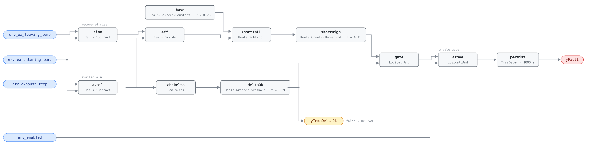

## Description

An energy recovery device is a heat exchanger between two air streams, and its
whole value is the fraction of the available temperature difference it manages
to move. That fraction is measurable from three temperatures: how far the
incoming outdoor air was dragged toward the exhaust temperature, over how far it
could have been dragged. A wheel that has stopped turning, a plate core packed
with dust, a bypass damper stuck open, a run-around loop that lost its pump —
all read the same way, and none of them shows anywhere else. Ventilation is
still delivered and the extra load lands on the downstream coils looking like
ordinary weather. Nehasil et al. (2021) report a 90% detection rate for this
diagnostic; the reference cites Mattera et al. (2020) alongside it.

## Detection Logic

```
effectiveness = (erv_oa_leaving_temp − erv_oa_entering_temp)
                / (erv_exhaust_temp − erv_oa_entering_temp)
shortfall     = baseline_effectiveness − effectiveness

yTempDeltaOk  = |erv_exhaust_temp − erv_oa_entering_temp| > min_delta_for_eval
                                                    (false ⇒ host reports NO_EVAL)
yFault        = shortfall > effectiveness_threshold AND yTempDeltaOk AND erv_enabled,
                sustained for alarm_delay
```

Block graph (`rule.cxf.jsonld`):



`rise` is the temperature the device actually delivered, `avail` the temperature
it had to work with, and `eff` divides them. `base` carries the design
effectiveness as a constant so `shortfall` can subtract the measured value from
it and `shortHigh` can test the remainder against one positive threshold — the
AHU-0021 arrangement. The ratio needs no seasonal branch: in summer both
numerator and denominator go negative and the quotient reads as it does in
winter.

`avail` fans out into `absDelta` and `deltaOk`, which does two jobs — the
reference's `min_delta_for_eval` precondition, exposed as the boundary output
`yTempDeltaOk` because it is computable from this rule's own inputs, and the
guard on the division. CDL `Divide` follows IEEE-754, so an exhaust temperature
equal to the entering temperature yields ±∞ or NaN rather than an error, and a
near-zero denominator turns a tenth of a degree of sensor noise into an
effectiveness of any magnitude. Because `deltaOk` also drives `gate`, arithmetic
garbage can make this rule unevaluable; it cannot make it fire.

`armed` adds the enable state, so a unit that is switched off is not accused of
recovering nothing. Both comparisons are strict — the temperature-difference
boundary is exact, the effectiveness boundary is not representable at all (see
Deviations) — and `persist` requires 30 continuous minutes, long enough to ride
out a brief frost-control excursion.

## Possible Diagnoses

1. Energy recovery wheel fouled or contaminated — dust bridging the media, the
   most common cause and the cheapest to correct ($200–$1,000 for cleaning)
2. Energy recovery wheel motor stopped — a failed drive motor or broken belt
   leaves the wheel stationary and produces the most extreme readings this rule
   sees
3. Bypass damper stuck open, routing air around the core entirely
4. Plate heat exchanger fouled — same failure, no moving parts to check
5. Run-around coil pump failure or glycol degradation, on the loop-type
   installations where the two air streams never meet

## Energy Impact

EFFICIENCY_LOSS, MEDIUM confidence, BASELINE_COMPARISON. The reference gives
10–30% of recovery energy lost and the estimator `lost_kw = (baseline_eff −
actual_eff) × airflow × cp × |exhaust − entering|`, whose first factor is the
shortfall this rule already computes; airflow and `cp` are not rule inputs, so
the conversion to kilowatts is the host's. PNNL EEM-37 (optimized heat recovery
wheel) is the related measure. A wheel at half its rated effectiveness is not
saving half as much energy — it is handing the coils half of the ventilation
load it was bought to eliminate. Both climates, and worth most where the
outdoor-to-exhaust difference is largest, which is when the rule is most
evaluable.

## Emissions Impact

Scope 1 + 2, PROXY_EMISSIONS, MEDIUM confidence; typically 400–3,000 kg CO₂e/yr
for lost recovery. The split follows the season and the plant: the unrecovered
winter load usually burns scope 1 fuel at a heating coil, the summer load draws
scope 2 electricity at a chiller, and an all-electric building puts both in
scope 2. Avoided-emissions basis: marginal operating emissions rate (MOER).

## Deviations

- **`min_delta_for_eval` is 5.0 °C, and the reference disagrees with itself
  about that number.** The chapter's tunables table gives 5 °C; the
  `erv-effectiveness` playbook gives the same gate as |OAT − RAT| > 10 °F
  (5.56 °C), a Fahrenheit rule of thumb the reference never reconciles with its
  metric restatement. This card adopts the tunables value, the library's standing
  precedent when a chapter card and its playbook disagree numerically (RTU-0002
  does the same). The cost is a narrow 5.0–5.56 °C band where this rule evaluates
  and the playbook would not; hosts preferring the playbook set `deltaOk.t =
  5.56`. The playbook's |OAT − RAT| is this rule's |exhaust − entering| — exhaust
  air entering the ERV *is* return air measured at the device.
- **The evaluability gate is also the divide guard, deliberately.** SCHEMA.md
  requires exposing an in-rule evaluability test as a boolean output, which is
  `yTempDeltaOk`; wiring the same signal into `gate` is the second, independent
  reason it exists. NaN compares false everywhere and can never raise the alarm,
  but +∞ can and does, so a host that read `yTempDeltaOk` as advisory and ignored
  the gate would be relying on arithmetic with no defined answer.
- **The effectiveness boundary is not representable, and the nominal case lands
  on the fault side.** With the shipped 0.75 and 0.15 as IEEE-754 doubles, no
  measured effectiveness makes the shortfall exactly equal the threshold: near
  0.6 the subtraction `0.75 − eff` is exact (Sterbenz), so equality would require
  `0.75 − 0.15` to be a double, and it is not. An effectiveness of exactly 60.0%
  computes 0.15000000000000002, one ulp above the threshold, so the strict `>`
  fires where paper arithmetic says it should not. Both sides of the machine
  crossing are pinned. Invisible in practice — sensors resolve 0.1 °C at best —
  but "exactly 15 points below baseline is safe" is wrong by one ulp, toward
  alarming.
- **`erv_enabled` is in the block graph, not only the frontmatter.** Operating
  states are normally host-side here, but the enable half is a dictionary point
  ERV-0002 already consumes and the failure mode is nightly: a disabled unit
  recovers nothing by construction, so an ungated rule alarms every unoccupied
  period on every healthy ERV. Precedent: RTU-0006 consumes `sf_status` and
  `occ_schedule`. The fans-running half stays a host precondition — the
  dictionary has no ERV fan-status point.
- **`baseline_effectiveness` ships the reference's default, which is a
  population value.** 75% is reasonable for a well-specified wheel and it is what
  the reference publishes, so it carries more authority than a placeholder — but
  it is not this unit's rating. Devices in service run 50–80%, and the
  interaction with the threshold is unforgiving at the low end: a unit rated 60%
  operating exactly at its rating alarms. Set `base.k` to the certified sensible
  effectiveness at design airflow, or to the commissioning measurement.
- **The comparison is written `baseline − measured > threshold`, not `measured <
  (baseline − threshold)`.** Algebraically identical to the reference's form;
  implemented this way so both tunables stay independent single-value parameters
  and the threshold stays positive, clear of the library's prohibition on
  negative parameters.
- **`method: statistical` describes where the baseline comes from, not what the
  graph does.** Two subtractions, a division, a comparison — nothing statistical
  happens on a tick. The classification is the reference's and it is fair: the
  baseline is a design or commissioning figure, and the detection literature
  behind the card (Nehasil et al. 2021, Mattera et al. 2020) is statistical. Same
  stance as RTU-0002.
- **Latent recovery is out of scope.** The reference specifies sensible
  effectiveness and this rule computes only that, so an enthalpy wheel whose
  desiccant coating has failed while sensible transfer is intact passes. Humidity
  points are not in the ERV dictionary; the gap is recorded, not papered over.
- **Frost protection is not excluded in-graph.** A unit in its frost sequence is
  recovering less on purpose. The 30-minute `alarm_delay` rides out short
  excursions, but a long cold snap with frost control active for hours will
  alarm; hosts with sustained frost operation should gate on `erv_frost_prot`,
  which exists in the dictionary for ERV-0002. Not added as a fourth input
  because the reference does not list it for this fault.
- **Strict `>` on both comparisons**, as CDL requires — there is no
  `GreaterEqual` in Reals. The temperature-difference boundary is exactly
  representable and pinned from both sides: 5.0 °C is not evaluable, 5.1 °C is.
- `persist.delayOnInit = true` (CDL default is `false`), the library's standing
  choice: a wheel already degraded when the controller starts waits out the full
  30 minutes rather than alarming on the first tick.
- All three of the reference's published test vectors are reproduced and their
  computed effectiveness matches its stated values to the digit — the cheapest
  available confirmation that the ratio is wired the right way up. The remaining
  scenarios in `vectors.json` are authored.

## Notes

The [erv-effectiveness](../../../playbooks/erv-effectiveness.md) playbook starts
with operating/frost state, proves any active recovery device, and compares the
two air streams before recalculating effectiveness or cleaning the core. That
order avoids condemning heat-transfer media for a stopped wheel, intentional
frost sequence, bypass condition, or airflow problem. Its resolution target is
effectiveness back within 15 percentage points of the commissioned value, the
same absolute 0.15 shortfall this rule alarms at. A device restored just inside
the alarm point has therefore met the target by exactly the margin that clears
the alarm and is worth re-measuring next season.
