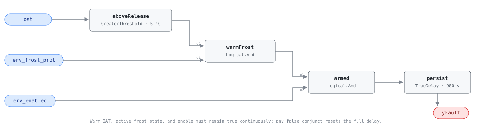

## Description

Frost protection is supposed to trade recovery efficiency for equipment safety
only while icing is credible. A preheat stage, bypass, wheel slowdown, or
airflow-unbalance strategy that stays active in mild weather continues paying
that trade after its benefit has disappeared. This rule watches the sequence's
reported active state against a commissioned outdoor-air release boundary. It
does not judge how the unit protects itself or redesign its frost sequence.

## Detection Logic

```text
above_release = oat > release_oat
candidate     = erv_enabled AND erv_frost_prot AND above_release

yFault = candidate sustained continuously for sustained_duration
```

Block graph (`rule.cxf.jsonld`):



Both the temperature comparison and timer are strict in their own ways: OAT at
exactly `release_oat` is clear, and the alarm appears only after the full
continuous duration. `delayOnInit = true` serves that duration after a restart.
Any release of frost mode, OAT return to the boundary, or ERV disable clears the
alarm and discards elapsed time immediately.

## Possible Diagnoses

1. Frost-mode software latch, timer, or state machine failed to release
2. OAT sensor biased high/low, stale, or installed where it does not represent
   the ERV intake
3. Preheat valve/relay, bypass damper, or wheel-speed command left overridden
4. BAS point bound to a frost permissive rather than the sequence's active state
5. `release_oat` configured above the installed sequence's true release point

## Energy Impact

EXCESS_CONSUMPTION, MEDIUM confidence, QUALITATIVE_ONLY. The cost depends on the
frost technology: preheat can consume fuel or electricity, bypass/wheel slowdown
hands ventilation load back to downstream coils, and airflow imbalance adds fan
and envelope load. The rule measures duration but no power or recovered heat.

## Emissions Impact

Scope 1 + 2, QUALITATIVE_EMISSIONS. Electric fan/preheat and cooling effects are
scope 2; fuel-fired preheat or downstream heat is scope 1. Quantification needs
the host's power, airflow, and temperature measurements rather than this state
flag alone.

## Deviations

- **Library-authored complement, not a transcribed reference card.** The HVAC
  FDD Reference publishes ERV-0002's missing-protection direction; this card
  mirrors its point contract for the opposite operational failure.
- **`release_oat = 5 °C` is ADOPTED_TUNABLE.** It is intentionally distinct
  from ERV-0002's `-10 °C` engagement default, leaving a 15 K neutral band in
  which neither rule asserts. The installed sequence remains authoritative.
- **Public examples do not establish a generic OAT release line.** PNNL-19004
  controls an exhaust-leaving temperature and DOE's VICS prototype tempers
  core-entering air; Greenheck combines its own permissive with wheel pressure.
- **The roadmap classified 900 s as precedent; this card classifies it as
  ADOPTED_TUNABLE.** The library uses 15-minute rejection windows, but no cited
  source establishes that duration for every frost technology.
- **The optional `release_margin` is omitted.** With no configured release
  input, a zero-default margin duplicates `release_oat` without adding behavior.
- **`erv_enabled` remains in-graph.** ERV-0001/0002 already use this boundary
  point to avoid nightly raw alarms; fan proof, tests, and overrides remain host
  preconditions.
- **No suppression or cluster.** Excessive frost protection can genuinely cause
  low effectiveness, so ERV-0001 remains useful; shared remediation is carried
  by the playbook rather than a new taxonomy entry.
- **No empirical validation claim.** Required synthetic vectors ran; the
  current EnergyPlus harness has no defensible frost-state mapping for this PR.

## Notes

Confirm the point meaning before tuning the threshold. A flag that means
"frost protection available" rather than "frost protection active" will hold
this rule on all year and no temperature adjustment will fix the binding.
